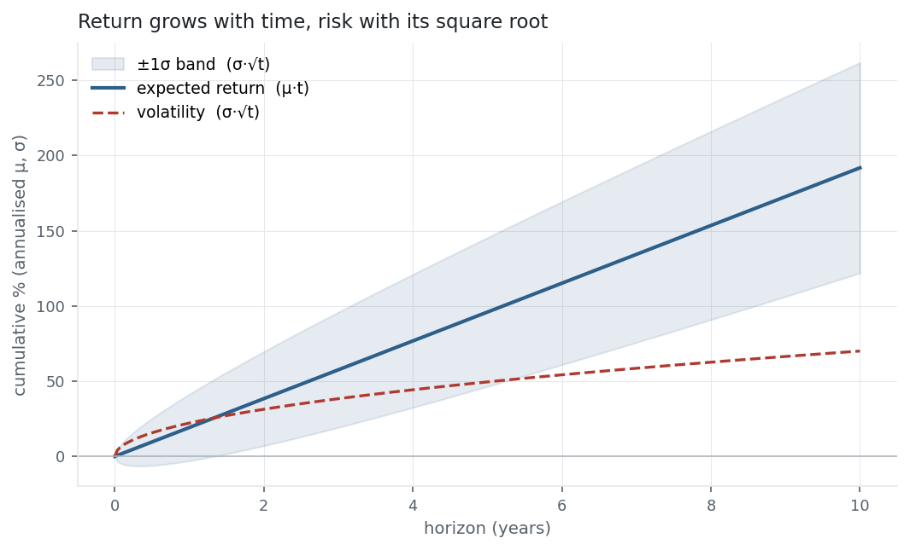

Returns and risk are measured at whatever frequency the data arrives — daily,
usually — but they are quoted *per year*, so everything must be scaled to a common
horizon. The scaling hides a subtle, important fact: **return grows with time, but
volatility grows with the square root of time.** That one asymmetry is behind the
×252 and √252 in almost every entry so far, and it is the reason long horizons
quietly favour the investor.

## The equation

$$\mu_{\text{annual}} = N \cdot \mu_{\text{period}}
\qquad
\sigma_{\text{annual}} = \sqrt{N}\,\cdot \sigma_{\text{period}}$$

where $N$ is the number of periods in a year (252 trading days, 52 weeks, 12
months). The mean scales linearly; the standard deviation scales with the square
root — because it is **variance**, not σ, that adds over time:

$$\sigma^2_{\text{annual}} = N \cdot \sigma^2_{\text{period}}.$$

## What each symbol means

| Symbol | Meaning |
|---|---|
| $N$ | periods per year — 252 (daily), 52 (weekly), 12 (monthly) |
| $\mu_{\text{period}},\ \mu_{\text{annual}}$ | the per-period and annualised mean return |
| $\sigma_{\text{period}},\ \sigma_{\text{annual}}$ | the per-period and annualised volatility |
| $\sigma^2$ | variance — the quantity that adds *linearly* with time |

"Volatility," in finance, almost always means the **annualised** standard deviation
of returns.

## Plain-English explanation

Say a stock earns 0.12% a day on average, with a daily standard deviation of 1.15%.
To quote these per year:

- **Return:** multiply by 252. $0.12\% \times 252 \approx 31\%$. Returns pile up linearly — twice the time, twice the expected return.
- **Volatility:** multiply by $\sqrt{252} \approx 15.9$, *not* 252. $1.15\% \times 15.9 \approx 18\%$. Risk grows more slowly than time.

Why the difference? Because the thing that adds cleanly over time is *variance*, not
standard deviation. Over two independent days the variances add
($\sigma^2 + \sigma^2 = 2\sigma^2$), so the standard deviation grows by $\sqrt{2}$,
not 2. Extend that to a year and you get $\sqrt{252}$. Expected return has no such
square root — it simply sums.

## Why it matters in markets

This is the most-used and most-misused rule in the toolkit. Three consequences:

- **The Sharpe ratio scales with √time.** Numerator $\times N$, denominator $\times\sqrt{N}$, so $\text{SR}_{\text{annual}} = \tfrac{N\mu}{\sqrt{N}\sigma} = \sqrt{N}\,\text{SR}_{\text{period}}$. A daily Sharpe of 0.11 becomes an annual 1.7 — the same edge looks far grander annualised, which is why you must always know the frequency behind a quoted [Sharpe](../sharpe-ratio/).
- **Time favours return over risk.** Return grows like $t$, the ±σ band like $\sqrt{t}$ (see the figure), so over long horizons the expected return pulls away from the volatility and the probability of a loss shrinks — the mathematical core of "time in the market." The band still widens, so terminal *dollar* outcomes remain more dispersed even as the odds of loss fall.
- **The rule assumes independence.** $\sigma_{\text{annual}} = \sqrt{N}\,\sigma$ holds only if returns are uncorrelated across time. Real returns aren't quite: momentum (positive autocorrelation) lifts true long-horizon vol above √time, mean-reversion pulls it below. √252 is a *convention*, not a law.

## A simple worked example

A daily mean of $\mu = 0.05\%$ and daily volatility $\sigma = 1\%$:

$$\mu_{\text{annual}} = 0.05\% \times 252 = 12.6\%,
\qquad
\sigma_{\text{annual}} = 1\% \times \sqrt{252} = 15.9\%.$$

Watch the ratio: the daily $\mu/\sigma = 0.05$ becomes $12.6/15.9 = 0.79$ annually —
multiplied by $\sqrt{252} = 15.9$, not by 252. Get that one factor wrong and your
annual Sharpe is off by a factor of 16.

## Python implementation

```python
import numpy as np
import pandas as pd

r = (pd.read_csv("../multi_daily.csv", index_col="Date", parse_dates=True)["NDX"]
       .pct_change().loc["2025-07-01":"2026-06-30"].dropna())

A = 252
ann_return = r.mean() * A                      # returns scale LINEARLY
ann_vol    = r.std(ddof=1) * np.sqrt(A)         # volatility scales with the SQRT
ann_sharpe = (r.mean() / r.std(ddof=1)) * np.sqrt(A)
print(round(ann_return*100, 1), round(ann_vol*100, 1), round(ann_sharpe, 2))
#   -> 30.7  18.2  1.68
```

The only trap is $\sqrt{A}$ for volatility (and Sharpe) versus $A$ for the mean.
Everything else follows.

## Manual / Excel calculation

| Task | Formula |
|---|---|
| Annualised return | `=daily_mean * 252` |
| Annualised volatility | `=daily_vol * SQRT(252)` |
| Annualised Sharpe | `=daily_sharpe * SQRT(252)` |

Use 252 for daily data, 52 for weekly, 12 for monthly — match $N$ to the frequency.

## Financial-market example — Nasdaq 100

For NDX over the year, the daily mean of 0.12% annualises to 30.7% (×252) and the
daily volatility of 1.15% to 18.2% (×√252) — the numbers behind every ratio in this
library. You can watch the √time rule work by measuring volatility at different
frequencies over the full history and scaling each back to a daily figure:

| Frequency | measured σ | ÷ √(periods) | implied daily σ |
|---|---:|---|---:|
| daily | 1.39% | — | 1.39% |
| weekly | 2.79% | ÷ √5 | 1.25% |
| monthly | 5.39% | ÷ √21 | 1.18% |

{fig-alt="Line of expected return rising linearly with a square-root volatility band around it over ten years"}

If the rule were exact, every row's implied daily σ would match. They are close —
1.39%, 1.25%, 1.18% — but drift *down* as the horizon lengthens, a mild sign that
NDX's daily moves partly reverse (weekly and monthly vol come in a touch below
√time). The √time rule is an excellent approximation, not a law; that small gap is
exactly the autocorrelation the i.i.d. assumption ignores — which is why every desk
uses √252 and every careful quant caveats it.

::: {.status-note}
Same `multi_daily.csv` as the previous entries (yfinance, adjusted closes). Code
blocks are illustrative — every figure was computed and checked against that file.
:::

## Common mistakes

- **Annualising volatility with ×N.** The single most common error — use ×√N. Multiplying daily vol by 252 overstates it ~16×.
- **Annualising the Sharpe with the wrong factor.** Sharpe scales with √N (numerator ×N, denominator ×√N); a daily Sharpe ×252 is nonsense.
- **Comparing figures at different frequencies.** "20% volatility" means nothing without the horizon; never compare a monthly σ to an annual one directly.
- **Assuming √time is exact.** It relies on i.i.d. returns; autocorrelation, fat tails, and volatility clustering all bend it. Fine as a convention, dangerous as a certainty.
- **Using calendar days instead of trading days.** Volatility accrues on ~252 trading days, not 365 — mixing them mis-scales everything.
- **Forgetting arithmetic vs compound.** ×252 annualises the *arithmetic* mean; the compounded figure is the [CAGR](../cagr/), lower by the volatility drag.
