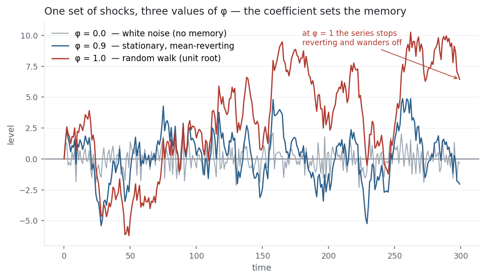

[Autocorrelation](../autocorrelation/) measured how a series relates to its own past.
The autoregressive model turns that measurement into a forecast: it *regresses* the
series on its own lagged values, so the past becomes an explicit prediction of the
present. One number — the AR(1) coefficient $\phi$ — decides almost everything: whether
the series mean-reverts, drifts as a random walk, or explodes. It is the model sitting
underneath the two entries you just read, [autocorrelation](../autocorrelation/) and
[stationarity](../stationarity-adf/), and the base that [MA](../ma-model/index.qmd), [ARIMA](../arima/index.qmd) and [GARCH](../garch/index.qmd) build on.

## The equation

An **AR(1)** regresses today on yesterday; the general **AR(p)** uses the last $p$ values:

$$y_t = c + \phi\, y_{t-1} + \varepsilon_t \qquad\qquad y_t = c + \sum_{i=1}^{p}\phi_i\, y_{t-i} + \varepsilon_t$$

$\varepsilon_t$ is white noise. For AR(1) the long-run mean is $\mu = c/(1-\phi)$ and the
autocorrelation function decays geometrically, $\rho_k = \phi^{\,k}$.

## What each symbol means

| Symbol | Meaning |
|---|---|
| $y_t$ | the series at time $t$ |
| $c$ | constant (intercept) — sets the long-run mean, $c/(1-\phi)$ |
| $\phi,\ \phi_i$ | the AR coefficient(s) — the weight on past values |
| $y_{t-1}$ | the previous value (lag 1) |
| $\varepsilon_t$ | white-noise shock (mean 0, constant variance) |
| $p$ | the order — how many lags the model uses |

$\phi$ is the memory dial: $0$ means no memory, near $1$ means long memory, exactly $1$
is a random walk, and above $1$ explodes.

## Plain-English explanation

An autoregressive model says the next value is a scaled copy of the last one plus a fresh
random shock. The scale factor $\phi$ is the memory of the series. If $\phi$ is 0 the past
is irrelevant — pure white noise, every step a coin flip. If $\phi$ is between 0 and 1 the
series is pulled back toward its mean: a shock fades geometrically, and the closer $\phi$
is to 1 the longer the memory. At $\phi = 1$ the pull vanishes entirely — shocks never
fade and the series wanders with no home. That is a random walk, and it is exactly the
unit root the [ADF test](../stationarity-adf/) hunts for. Push $\phi$ above 1 and the
series explodes.

So the whole behaviour of an AR(1) lives on a single dial. $\phi = 0.9$ means "mostly
persistent but slowly reverting"; $\phi = 1$ means "random walk"; $\phi = -0.5$ means
"overshoot and alternate." The figure runs one set of random shocks through three values
of $\phi$ so you can watch the dial work.

## Why it matters in markets

The AR coefficient is the bridge between the last three entries and the forecasting ones
ahead, and its most important reading is the knife-edge at $\phi = 1$: below it the series
is stationary and mean-reverting (worth modelling in levels); at it the series is a random
walk (model the *differences* instead). That is no coincidence with the
[stationarity](../stationarity-adf/) entry — the ADF regression *is* an AR model
rearranged to test whether $\phi = 1$. And the AR(1) autocorrelation function
$\rho_k = \phi^{\,k}$ is exactly the geometric decay the
[autocorrelation](../autocorrelation/) entry drew: AR is the generative model behind that
correlogram.

In markets the reading is sobering. Fit an AR(1) to index returns and $\phi$ comes out
near zero — the efficient-market result that returns barely predict themselves. Fit it to
a price and $\phi$ is essentially 1 — the random walk. The interesting cases are the
constructed ones: a stationary spread (from [cointegration](../cointegration/)), a
volatility series, a rate — series with $0 < \phi < 1$ and a finite mean-reversion
**half-life**, $\ln(0.5)/\ln(\phi)$, which is what pairs and mean-reversion strategies
actually trade.

## A simple worked example

Take AR(1) with $c = 0.1$, $\phi = 0.6$, starting at $y_0 = 2$, and ignore the shocks to
see the pull. Each step multiplies the last value by 0.6 and adds 0.1:
$2 \to 1.30 \to 0.88 \to 0.63 \to 0.48 \to 0.39$, converging on the long-run mean
$\mu = c/(1-\phi) = 0.1/0.4 = 0.25$. The gap to the mean shrinks by a factor 0.6 each
step, so the half-life is $\ln(0.5)/\ln(0.6) = 1.36$ steps — after about 1.4 steps half of
any shock is gone. That geometric pull toward a fixed level is the essence of a stationary
AR process.

## Python implementation

```python
from statsmodels.tsa.ar_model import AutoReg
import numpy as np, pandas as pd

px = pd.read_csv("../multi_daily.csv", index_col="Date", parse_dates=True)["NDX"]
r  = px.pct_change().dropna()

fit    = AutoReg(r.values, lags=1, old_names=False).fit()   # AR(1) on returns
c, phi = fit.params                                          # -> phi = -0.121
half   = np.log(0.5) / np.log(abs(phi))                      # mean-reversion half-life
print(round(phi, 3), round(c, 5))                            # coefficient, constant
```

`AutoReg(y, lags=p)` fits AR(p) by OLS; `.predict()` forecasts. A $\phi$ near 0 means the
lag adds almost nothing — for returns, that is the whole story.

## Manual / Excel calculation

AR(1) is a single regression of the series on its own one-step lag: put $y_t$ in one
column and $y_{t-1}$ beside it (the same column shifted down a row), then:

| Task | Formula |
|---|---|
| $\phi$ (AR-1 coefficient) | `=SLOPE(B3:B1000, B2:B999)` |
| $c$ (constant) | `=INTERCEPT(B3:B1000, B2:B999)` |
| long-run mean | `=c/(1-phi)` |
| half-life | `=LN(0.5)/LN(phi)` |

For AR(p), regress on $p$ lagged columns at once with `LINEST`.

## Financial-market example — Nasdaq 100

The AR(1) coefficient tells the same story the earlier entries told, now compressed into
one number:

| Series | AR(1) $\phi$ | reading |
|---|---:|---|
| NDX daily returns | −0.12 | barely predictable; mild one-day reversal |
| NDX price level | 1.00 | random walk — a unit root, non-stationary |
| NDX price − 200-day mean | 0.99 | mean-reverting, ~61-day half-life |

Fit to **returns**, $\phi = -0.12$ ($t \approx -6.6$): statistically real thanks to 2,900
observations, but tiny — the same faint one-day mean-reversion the
[autocorrelation](../autocorrelation/) entry measured, and far too small to beat costs.
Fit to the **price**, $\phi = 1.00$: the textbook random walk, the unit root that made the
price [non-stationary](../stationarity-adf/). Neither is tradable as-is. The middle row is
where AR earns its keep — the deviation of price from its 200-day mean has $\phi \approx
0.99$, a stationary series with a ~61-day half-life, the kind of mean-reverting
construction (like a cointegrated spread) that mean-reversion strategies are built on.

{fig-alt="Three AR(1) paths from the same shocks: white noise, mean-reverting, and a random walk"}

The three simulated paths share one set of shocks. At $\phi = 0$ the series is white
noise; at $\phi = 0.9$ it takes long mean-reverting excursions; at $\phi = 1$ it stops
reverting and wanders off. That last step — from 0.9 to 1.0 — is the entire difference
between a stationary series you can model in levels and a random walk you must difference
first.

::: {.status-note}
Same `multi_daily.csv` as the previous entries (yfinance, adjusted closes); AR fits via
`statsmodels` `AutoReg`. The three paths are simulated AR(1) processes sharing one set of
shocks. Code blocks are illustrative — every number was computed and checked against the
data.
:::

## Common mistakes

- **Fitting AR to a non-stationary series in levels.** If $\phi \approx 1$ the series has a unit root; model the differences (returns), not the level, or the estimates mislead.
- **Reading a significant $\phi$ as a tradable edge.** The −0.12 on returns is real but tiny; statistical significance from a huge sample is not economic significance after costs.
- **Confusing order $p$ with fit quality.** More lags fit the past better but overfit; pick $p$ with AIC/BIC or the partial ACF, don't just pile on lags.
- **Forgetting $\phi = 1$ is the boundary.** $\phi$ just below 1 mean-reverts slowly; $\phi = 1$ never reverts. Tiny differences near the boundary change everything.
- **Dropping the constant.** The long-run mean is $c/(1-\phi)$, not $c$; forcing no intercept forces mean zero.
- **Expecting AR to capture volatility.** AR models the level of returns (nearly unpredictable); the predictable part is the *variance* — that is what GARCH is for.
