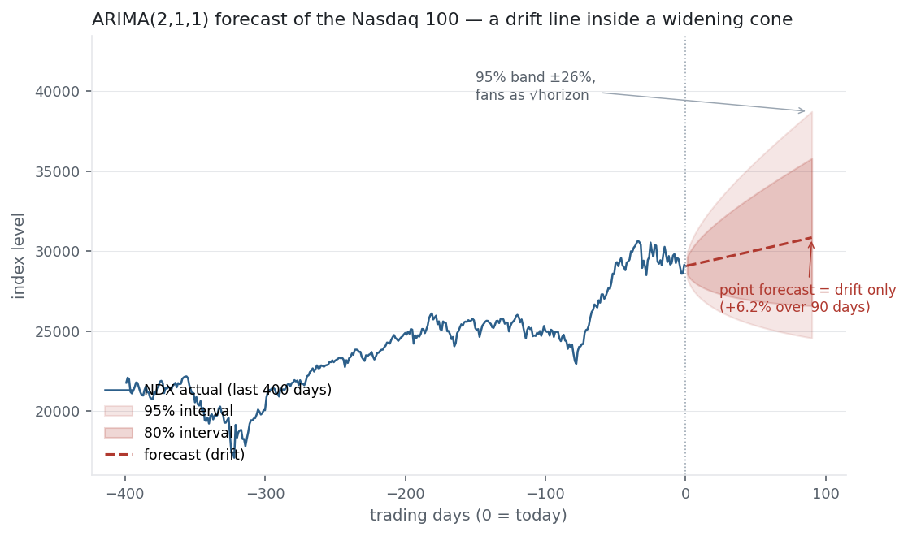

ARIMA is where this section's threads tie together. It stacks the three ideas you've just
met — [autoregression](../ar-model/) on past values, a [moving average](../ma-model/) of
past shocks, and the differencing that turns a wandering price into a
[stationary](../stationarity-adf/) series — into one forecasting model. Its three
parameters $(p, d, q)$ are a recipe: difference $d$ times to kill the trend, then explain
what is left with $p$ autoregressive and $q$ moving-average terms. It is the workhorse of
classical time-series forecasting, and applied honestly to a near-efficient market it
delivers a sobering verdict.

## The equation

ARIMA(p, d, q) applies $d$ differences and then fits an ARMA(p, q):

$$\Delta^d y_t = c + \underbrace{\sum_{i=1}^{p}\phi_i\, \Delta^d y_{t-i}}_{\text{AR: past values}} + \varepsilon_t + \underbrace{\sum_{j=1}^{q}\theta_j\, \varepsilon_{t-j}}_{\text{MA: past shocks}}$$

$\Delta y_t = y_t - y_{t-1}$ is the first difference; $\Delta^d$ applies it $d$ times.

## What each symbol means

| Symbol | Meaning |
|---|---|
| $y_t$ | the original (possibly non-stationary) series |
| $\Delta^d$ | differencing $d$ times — the "I" (integrated) part |
| $p$ | AR order — number of past values |
| $d$ | number of differences needed to reach stationarity |
| $q$ | MA order — number of past shocks |
| $\phi_i,\ \theta_j$ | AR and MA coefficients |
| $c$ | constant / drift term |
| $\varepsilon_t$ | white-noise shock |

The three orders map to three diagnostics: $d$ from a stationarity test, $p$ from the
PACF, $q$ from the ACF.

## Plain-English explanation

ARIMA is a three-step recipe for a series that won't sit still. First the "I": difference
the series $d$ times until it is stationary — for a price, one difference (today minus
yesterday) turns it into returns, which are [stationary](../stationarity-adf/). Then the
"AR" and "MA": model the differenced series as a mix of its own recent values (AR) and its
own recent shocks (MA). Put together, ARIMA(p,d,q) says "difference $d$ times, then explain
the result with $p$ lags of itself and $q$ lags of noise."

The three numbers are chosen, not guessed. $d$ is how many differences the
[ADF test](../stationarity-adf/) needs to call the series stationary (usually 0 for
returns, 1 for prices). Then, on the differenced series, the shape of the correlogram picks
$p$ and $q$: an ACF that cuts off after $q$ and a PACF that cuts off after $p$ — the
identification rule from the [AR](../ar-model/) and [MA](../ma-model/) entries. Fit by
maximum likelihood, compare candidates by AIC, and check the residuals are white noise.
Many familiar models are just corners of this cube: ARIMA(0,1,0) is a random walk with
drift, ARIMA(1,0,0) is AR(1), ARIMA(0,0,1) is MA(1), ARIMA(0,1,1) is exponential smoothing.

## Why it matters in markets

ARIMA is the classical forecasting workhorse — demand, rates, economic series — but its
lesson for markets is the honest capstone of this whole section. Run the full Box-Jenkins
machine on the Nasdaq and it confirms, from the inside, that the index is very close to a
random walk with drift. It will happily fit AR and MA terms to the faint −0.12
autocorrelation the last four entries kept finding, and AIC will even prefer them — but the
forecast it produces is a drift line wrapped in an uncertainty cone that widens as
$\sqrt{\text{horizon}}$ (the same [√time law](../annualisation/)). You can forecast the
expected drift and the range of outcomes; you cannot forecast the path. That is not a
failure of ARIMA — it is ARIMA correctly reporting that the level of a near-efficient price
is unforecastable.

It is also the launchpad for what ARIMA *can't* do. It models the mean of the differenced
series and assumes constant-variance shocks — but returns have clustering volatility (the
[squared-return autocorrelation](../autocorrelation/)). Modelling that time-varying
variance is the job of GARCH, the next entry, which bolts onto an ARIMA mean like a second
engine.

## A simple worked example

The "I" is the only new mechanic, so make it concrete. Prices $[100, 102, 101, 105]$ are
non-stationary (they trend), so difference once: $[+2, -1, +4]$ — the changes, a stationary
series you can model with ARMA. Suppose that ARMA fit forecasts the next change as $+1.5$.
To get back to a price you *integrate* (undo the difference): add it to the last level,
$105 + 1.5 = 106.5$. That round trip — difference to model, integrate to forecast — is the
whole idea of the "I", and it is why a $d=1$ forecast of a level is always "last value plus
the forecast of the change."

## Python implementation

```python
from statsmodels.tsa.arima.model import ARIMA
import numpy as np, pandas as pd

lp = np.log(pd.read_csv("../multi_daily.csv", index_col="Date", parse_dates=True)["NDX"])

fit = ARIMA(lp.values, order=(2, 1, 1), trend="t").fit()   # (p,d,q) on log price
fc  = fit.get_forecast(90)                                  # 90-day-ahead forecast
mean, ci = fc.predicted_mean, fc.conf_int(alpha=0.05)       # point + 95% band
print(round(fit.aic, 1))                                    # -> -16603.6  (AIC)
```

`order=(p,d,q)`; `trend="t"` adds the drift. `pmdarima.auto_arima` automates the order
search, but always eyeball the residual ACF — a good ARIMA leaves white noise behind.

## Manual / Excel calculation

ARIMA isn't a spreadsheet job — the MA part needs maximum likelihood — but the Box-Jenkins
workflow is followable anywhere: (1) difference the series and ADF-test until stationary →
$d$; (2) read the ACF and PACF of the differenced series to pick $q$ and $p$; (3) fit with
`statsmodels` / R and compare AIC; (4) confirm the residuals are white noise (Ljung-Box).
The one piece you can do by hand is differencing and integrating (`=B3-B2`, and a running
total to undo it).

## Financial-market example — Nasdaq 100

Walk the recipe on NDX log price. The [ADF test](../stationarity-adf/) can't reject a unit
root in the level ($p = 0.94$) but crushes it after one difference ($p < 0.001$), so
$d = 1$ — the price is I(1), exactly as the stationarity entry found. Scanning
ARIMA(p,1,q) for $p, q \le 2$, AIC picks **ARIMA(2,1,1)**, beating the plain random walk
ARIMA(0,1,0) by 47 AIC points — the AR and MA terms are real, soaking up the same lag-1
structure this section keeps meeting.

| Model | AIC | reading |
|---|---:|---|
| ARIMA(0,1,0) — random walk + drift | −16,557 | the baseline |
| ARIMA(2,1,1) — best fit | −16,604 | +47 AIC: real but small structure |

And yet look at what the "best" model actually forecasts:

{fig-alt="Nasdaq price history with an ARIMA forecast: a drift line inside a confidence cone widening with horizon"}

The point forecast is just the drift — +6.2% over 90 days (16.6%/yr) — and the 95% band is
±26%, fanning out as $\sqrt{\text{horizon}}$ (9× wider at 90 days than at 1, and
$\sqrt{90} \approx 9.5$). The AR and MA terms AIC liked so much move only the first few days
by a fraction of a percent; by any horizon you'd trade on they have washed out, and the
forecast is indistinguishable from a random walk with drift. That is the efficient-market
hypothesis in the language of forecasting: you can know the drift and the uncertainty, but
the path of a near-efficient index is noise.

::: {.status-note}
Same `multi_daily.csv` as the previous entries (yfinance, adjusted closes); ARIMA via
`statsmodels`, orders scanned by AIC, forecast on log price then mapped back to level. Code
blocks are illustrative — every number was computed and checked.
:::

## Common mistakes

- **Skipping the stationarity check for $d$.** Under-differencing leaves a trend that corrupts the fit; let the ADF test set $d$, don't guess.
- **Over-differencing.** Too high a $d$ injects artefacts (a spurious −1 lag-1 autocorrelation); $d = 1$ is almost always enough for a price.
- **Reading in-sample AIC as forecast skill.** A model can win AIC by 47 points and still forecast the level no better than a random walk — check out-of-sample.
- **Not diagnosing the residuals.** If the residual ACF isn't white noise the order is wrong; a good ARIMA leaves nothing behind.
- **Expecting ARIMA to capture volatility.** It models the mean with constant-variance shocks; clustering volatility needs GARCH.
- **Trusting long-horizon point forecasts.** Beyond a few steps an ARIMA forecast collapses to the drift; the interval, not the point, is the information.
