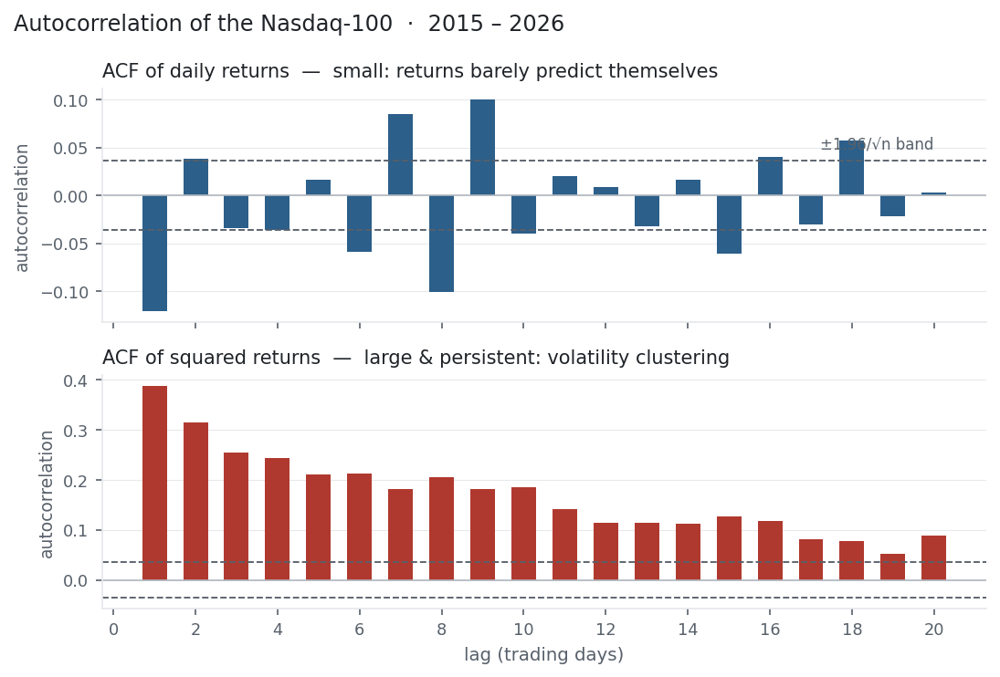

[Correlation](../covariance-correlation/) measured how two *different* series move
together. Autocorrelation asks a stranger question: how does a series move with its
own past? Line a return series up against a copy of itself shifted back a day and
correlate them — that lag-1 autocorrelation says whether today's move carries any
information about tomorrow's. It is the first tool of time-series analysis, and on
markets it delivers two of the most important facts in finance: prices are hard to
predict, but their volatility is not.

## The equation

The lag-$k$ autocorrelation is the correlation of the series with itself $k$ steps
earlier:

$$\rho_k = \frac{\sum_{t=k+1}^{n}(r_t - \bar r)(r_{t-k} - \bar r)}{\sum_{t=1}^{n}(r_t - \bar r)^2}$$

$\rho_0 = 1$ always (a series is perfectly correlated with itself). The whole sequence
$\rho_1, \rho_2, \rho_3, \dots$ is the **autocorrelation function** (ACF).

## What each symbol means

| Symbol | Meaning |
|---|---|
| $\rho_k$ | the lag-$k$ autocorrelation — self-correlation at a distance of $k$ |
| $r_t$ | the value at time $t$ |
| $r_{t-k}$ | the value $k$ steps earlier |
| $\bar r$ | the mean of the series |
| $k$ | the lag, in periods |
| ACF | the sequence of $\rho_k$ across lags |

$\rho_k$ near $+1$ means the series **trends** (highs follow highs); near $-1$ means
it **mean-reverts** (alternates); near $0$ means the past says nothing about the
present.

## Plain-English explanation

Take a return series, shift a copy back by one day, and compute the ordinary
[correlation](../covariance-correlation/) between the two. That is the lag-1
autocorrelation: does an up day tend to be followed by another up day (positive), a
down day (negative), or neither (zero)? Repeat for a shift of 2 days, 3 days, and on,
and you get the ACF — a fingerprint of the series' memory.

To tell whether an autocorrelation is real or just sampling noise, compare it to the
band $\pm 1.96/\sqrt{n}$. For a purely random series, 95% of the ACF should fall
inside it; bars that stick out signal genuine structure. Positive autocorrelation is
momentum; negative is mean reversion; a series with none is a **random walk** — its
future is a coin flip given its past.

## Why it matters in markets

Autocorrelation is where the efficient-market debate becomes measurable, and the
doorway to every time-series model that follows. Two facts run through the rest of
this section:

- **Returns are close to unpredictable.** Their ACF is small — mostly inside the band — the statistical face of the efficient market hypothesis: if you could reliably predict tomorrow's return from the past, the edge would be arbitraged away. The faint deviations that remain are exactly where systematic strategies fish.
- **Volatility is highly predictable.** The ACF of *squared* (or absolute) returns is large and decays slowly: calm follows calm, turbulence follows turbulence. This **volatility clustering** is the single most important stylised fact of returns, and it is what the GARCH models later in this section exist to capture.

Autocorrelation also underlies the [√time rule](../annualisation/): that rule assumes
*zero* autocorrelation, so the mild autocorrelation real returns carry is precisely
why annualised volatility isn't exactly √252 times the daily figure. And it is the
mathematical basis of the AR models, the Hurst exponent, and the stationarity tests
still to come.

## A simple worked example

Two tiny series make the sign obvious. A perfectly alternating series,
$[+2\%, -1\%, +2\%, -1\%, +2\%, -1\%]$, has a lag-1 autocorrelation of $-1.00$: every
value is followed by its opposite — perfect mean reversion. A steadily rising series,
$[1\%, 2\%, 3\%, 4\%, 5\%]$, has a lag-1 autocorrelation of $+1.00$: perfect trend.
Real return series sit near zero, between these extremes, leaning only faintly one way
or the other.

## Python implementation

```python
import numpy as np
import pandas as pd

r = (pd.read_csv("../multi_daily.csv", index_col="Date", parse_dates=True)["NDX"]
       .pct_change().dropna())

print(round(r.autocorr(lag=1), 3))          # -> -0.121   returns: small (mild mean reversion)
print(round((r**2).autocorr(lag=1), 3))     # -> 0.388    squared returns: large (clustering)

band = 1.96 / np.sqrt(len(r))               # -> ±0.036   white-noise significance band
acf  = [r.autocorr(lag=k) for k in range(1, 21)]
```

`statsmodels.tsa.stattools.acf` and `plot_acf` give the full function and the
correlogram in one call.

## Manual / Excel calculation

Lag-1 autocorrelation is just `CORREL` of the series against itself shifted by one
row:

| Task | Formula |
|---|---|
| Lag-1 autocorrelation | `=CORREL(B3:B1000, B2:B999)` |
| Significance band | `=1.96/SQRT(COUNT(range))` |

Shift the second range by $k$ rows for lag $k$; anything smaller than the band is
indistinguishable from noise.

## Financial-market example — Nasdaq 100

Run the ACF on 11 years of NDX daily returns ($n \approx 2{,}900$, so the band is
±0.036):

| Lag | ACF of returns | ACF of squared returns |
|---|---:|---:|
| 1 | −0.12 | +0.39 |
| 2 | +0.04 | +0.32 |
| 5 | +0.02 | +0.21 |
| 10 | −0.04 | +0.19 |

{fig-alt="Two-panel correlogram; returns small around the band, squared returns large and persistent"}

The two columns are different worlds. The returns' autocorrelations hover around the
band — the largest is the lag-1 value of **−0.12**, a real but small one-day
mean-reversion tendency (a down day slightly favours an up day next). It is genuine:
it is the same effect that gave the "buy the dip" rule a positive expectancy in
[Trading Metrics](../trading-metrics/) and pulled weekly volatility below √time in
[Annualisation](../annualisation/). But it is tiny — nowhere near enough to beat costs
easily, which is why markets look so close to a random walk.

The squared returns tell the opposite story: every lag out to 20 days sits far above
the band, decaying only slowly from 0.39. Volatility has a long memory. You cannot
forecast tomorrow's return, but you *can* forecast whether tomorrow will be calm or
wild — and that asymmetry is the foundation of the volatility models that close this
section.

::: {.status-note}
Same `multi_daily.csv` as the previous entries (yfinance, adjusted closes). Code
blocks are illustrative — every figure was computed and checked against that file.
:::

## Common mistakes

- **Running the ACF on prices, not returns.** Prices are hugely autocorrelated (today's ≈ yesterday's) — trivially and uselessly so. Always use returns.
- **Ignoring the significance band.** A ρ of 0.05 looks like a signal but is noise if the band is ±0.06; small samples manufacture spurious autocorrelation.
- **Reading a small return-ACF as "nothing there."** Faint but real autocorrelation (the −0.12 here) is what many systematic strategies exploit — small is not zero.
- **Forgetting to check squared / absolute returns.** Returns can look like white noise while their volatility clusters strongly; test both.
- **Assuming autocorrelation means a tradable edge.** A statistically real ρ can vanish after transaction costs — significance is not profitability.
- **Using it on non-stationary data.** The ACF is only meaningful for a stationary series; a drifting mean corrupts it (see the stationarity entry to come).
