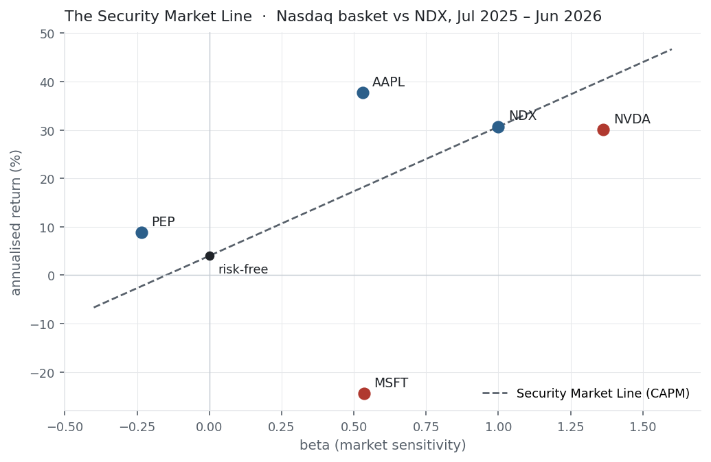
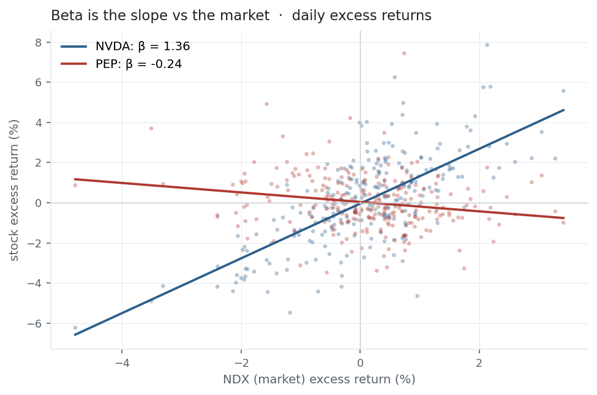

[Covariance](../covariance-correlation/) told us how two assets move together. Beta
specialises that to the one relationship that dominates finance: how an asset moves
with **the market**. From beta, CAPM builds a prediction of what return an asset
*should* earn, and alpha is whatever it earns beyond that. Together they are the
foundation of asset pricing and the whole language of *systematic* versus
*stock-specific* risk.

## The equation

Three linked equations. **Beta** is an asset's covariance with the market over the
market's variance:

$$\beta_i = \frac{\text{Cov}(r_i, r_m)}{\text{Var}(r_m)} = \rho_{im}\,\frac{\sigma_i}{\sigma_m}$$

**CAPM** turns beta into an expected return:

$$\mathbb{E}[r_i] = r_f + \beta_i\left(\mathbb{E}[r_m] - r_f\right)$$

and **alpha** is the actual return minus what CAPM predicted:

$$\alpha_i = \bar r_i - \left[\,r_f + \beta_i(\bar r_m - r_f)\,\right]$$

## What each symbol means

| Symbol | Meaning |
|---|---|
| $\beta_i$ | beta — the asset's sensitivity to the market (slope of its returns on the market's) |
| $r_i,\ r_m$ | the asset's and the market's returns |
| $\rho_{im}$ | their [correlation](../covariance-correlation/) |
| $\sigma_i,\ \sigma_m$ | their [volatilities](../variance-standard-deviation/) |
| $r_f$ | the risk-free rate |
| $\mathbb{E}[r_m] - r_f$ | the market risk premium |
| $\alpha_i$ | alpha — return earned above (or below) CAPM's prediction |

The market's own beta is 1 by construction ($\text{Cov}(r_m, r_m)/\text{Var}(r_m) = 1$).
A beta of 1.3 means the asset tends to move 1.3× the market; 0 means no market link;
negative means it moves *against* the market.

## Plain-English explanation

Beta answers: when the market moves 1%, how much does this asset move? It is the
slope of the asset's returns plotted against the market's. Beta 1 moves with the
market, 2 amplifies it two-for-one, 0.5 dampens it, and below 0 moves opposite — a
hedge.

CAPM then makes a bold claim: the *only* risk you are paid for is market risk (beta),
because everything else — stock-specific risk — you can diversify away for free. So
an asset's fair expected return is the risk-free rate plus its beta times the
market's risk premium. High-beta assets should earn more (they hurt most when the
market falls); a zero-beta asset should earn only the risk-free rate.

Alpha is the verdict: what an asset actually delivered minus what CAPM said it
should. Positive alpha beat the model (skill, luck, or a missing risk factor);
negative fell short. Chasing alpha is the entire active-management industry.

## Why it matters in markets

Beta splits risk into two kinds, and that split is the central idea of portfolio
theory. **Systematic** risk (beta) is shared with the market and cannot be
diversified away, so it must be compensated; **idiosyncratic** risk is
stock-specific and vanishes in a large portfolio, so CAPM says it earns nothing.
$R^2$ — the square of the [correlation](../covariance-correlation/) with the market —
measures how much of an asset's variance is systematic; the rest is its own.

Beta is also the **hedge ratio**: short $\beta$ units of the market against a long
position to neutralise market exposure — the basis of market-neutral strategies.
And alpha, the CAPM residual, is the benchmark every active manager is judged
against — though a positive alpha may simply mean your one-factor model is missing a
factor, which is exactly how multi-factor models (Fama–French and the rest) were
born.

## A simple worked example

A market series $r_m = [-2\%, +1\%, +1\%]$ and an asset $r_i = [-4\%, +1\%, +3\%]$
(both with mean 0):

$$\beta = \frac{\sum (r_i-\bar r_i)(r_m-\bar r_m)}{\sum (r_m-\bar r_m)^2}
= \frac{(-4)(-2)+(1)(1)+(3)(1)}{(-2)^2+1^2+1^2} = \frac{12}{6} = 2.0.$$

The asset amplifies the market two-for-one — a beta of 2. If the risk-free rate is
0 and the market is expected to return 1%, CAPM predicts this asset should earn
$0 + 2\,(1\% - 0) = 2\%$.

## Python implementation

```python
import numpy as np
import pandas as pd

r = (pd.read_csv("../multi_daily.csv", index_col="Date", parse_dates=True)
       .pct_change().loc["2025-07-01":"2026-06-30"])
m = r["NDX"]                                    # market proxy

beta = r["NVDA"].cov(m) / m.var()               # beta = Cov(asset, market) / Var(market)
print(round(beta, 2))                            # -> 1.36

# CAPM expected return and alpha (annualised, rf = 4%)
rf, A = 0.04, 252
prem  = m.mean() * A - rf                         # market risk premium
capm  = rf + beta * prem
alpha = r["NVDA"].mean() * A - capm
print(round(capm * 100, 1), round(alpha * 100, 1))   # -> 40.4  -10.3

# beta is also the slope of the stock regressed on the market
print(round(np.polyfit(m, r["NVDA"], 1)[0], 2))      # -> 1.36  (same number)
```

`cov/var` and the regression slope are the same beta. Alpha is simply what is left
once beta has explained everything it can.

## Manual / Excel calculation

Beta is a slope; CAPM and alpha are one line each. With market returns in `A2:A252`
and the stock in `B2:B252`:

| Task | Formula |
|---|---|
| Beta | `=SLOPE(B2:B252, A2:A252)` &nbsp;(or `=COVARIANCE.P(B2:B252,A2:A252)/VAR.P(A2:A252)`) |
| CAPM expected return | `=0.04 + Beta*(market_annual - 0.04)` |
| Alpha | `=stock_annual - CAPM_expected` |

`SLOPE` regresses the stock on the market — the y-argument is the stock, the x-argument
the market. Get them the wrong way round and you compute the market's beta to the
stock instead.

## Financial-market example — Nasdaq 100

Each basket name regressed on the NDX index (the market), same window. The market
premium was 26.7% over $r_f = 4\%$:

| Ticker | beta | $R^2$ | actual | CAPM | alpha |
|---|---:|---:|---:|---:|---:|
| NVDA | 1.36 | 0.49 | 30.1% | 40.4% | −10.3% |
| MSFT | 0.54 | 0.13 | −24.4% | 18.3% | −42.7% |
| AAPL | 0.53 | 0.17 | 37.7% | 18.1% | +19.6% |
| PEP | −0.24 | 0.04 | 8.8% | −2.3% | +11.1% |
| NDX | 1.00 | 1.00 | 30.7% | 30.7% | 0.0% |

{fig-alt="Beta on the x-axis, annualised return on the y-axis, assets scattered around the CAPM line"}

Three things stand out. NVDA is the only high-beta name (1.36) — it is a huge index
weight, so nearly half its variance ($R^2 = 0.49$) *is* the market and the rest is
its own story. PEP has a **negative beta** (−0.24), a consumer-staples name drifting
against the tech tape — the closest thing here to a hedge. And look at the alphas:
they are enormous and all over the place (AAPL +20%, MSFT −43%). Over a single year,
"alpha" is overwhelmingly noise — with $R^2$ this low the market explains only a
sliver of each stock, and the residual is mostly luck. That is the honest lesson of
CAPM on real data: **beta is estimable, alpha is treacherous.** On the Security
Market Line, CAPM's prediction is the dashed line and each asset's distance from it
is its alpha; the scatter is exactly why one window proves nothing.

To measure how beta is estimated — the slope of the stock's returns against the
market's — here are NVDA (steeply positive) and PEP (slightly negative) on the same
axes:

{fig-alt="Scatter of NVDA and PEP daily excess returns versus the market with regression lines"}

::: {.status-note}
Same `multi_daily.csv` as the previous entries (yfinance, adjusted closes). Code
blocks are illustrative — every figure was computed and checked against that file.
:::

## Common mistakes

- **Reading alpha as skill.** Over short windows alpha is dominated by noise; a year of data can't tell a skilled manager from a lucky one.
- **Forgetting beta needs a benchmark.** Beta is always relative to a chosen market; a stock's beta to the Nasdaq differs from its beta to the S&P or its sector.
- **Treating CAPM as truth.** It is a one-factor model with famously mixed empirical support — low-beta stocks have historically *out*-earned it (the low-beta anomaly), and missing factors masquerade as alpha.
- **Confusing high beta with high return.** Beta predicts sensitivity, not realised return — NVDA's high beta didn't stop it undershooting CAPM here.
- **Ignoring $R^2$.** A beta with $R^2 = 0.04$ (PEP) barely means anything; the market explains almost none of that stock's movement.
- **Estimating from too little.** Beta is computed from returns and drifts over time; a short, noisy sample gives an unstable number.
