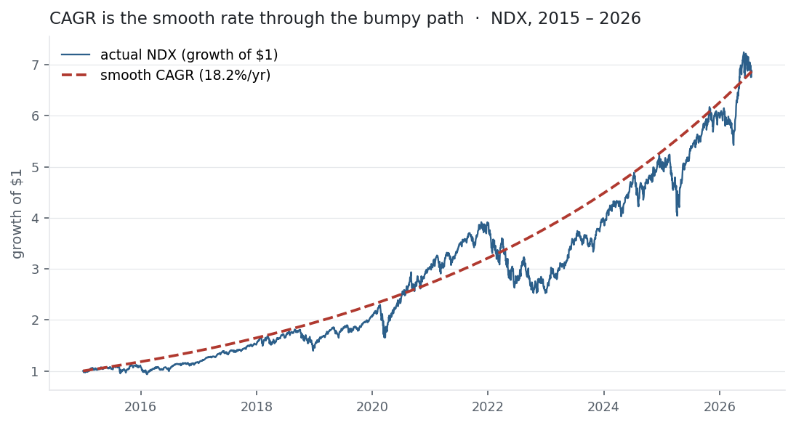

"Total return over ten years" is a useless number on its own — was that 10% a year,
or one lucky spike? CAGR turns any start-to-end growth into a single, comparable
rate: the constant annual return that, compounded smoothly, would have carried you
from here to there. It is the honest headline for a track record — and it is exactly
the *geometric mean* growth rate that [Mean Return](../mean-return/) warned sits
below the arithmetic average.

## The equation

$$\text{CAGR} = \left(\frac{V_{\text{end}}}{V_{\text{begin}}}\right)^{1/T} - 1$$

where $T$ is the number of years. From prices it is just the end-to-start ratio
raised to one-over-the-years, minus one; from a return series it is the geometric
mean of the annual growth factors.

## What each symbol means

| Symbol | Meaning |
|---|---|
| $\text{CAGR}$ | compound annual growth rate — the constant yearly rate |
| $V_{\text{begin}},\ V_{\text{end}}$ | the starting and ending values |
| $T$ | the number of years (the horizon) |
| $V_{\text{end}}/V_{\text{begin}}$ | the total growth multiple over the whole period |

CAGR is the geometric mean: $(1+\text{CAGR})^{T} = V_{\text{end}}/V_{\text{begin}}$,
so raising the total multiple to $1/T$ recovers the per-year rate.

## Plain-English explanation

Suppose \$10,000 became \$20,000 over six years. The naive "average" — 100% total ÷
6 = 16.7% a year — is wrong, because returns *compound*: 16.7% every year would have
made far more than double. The right answer is the CAGR: the rate $r$ with
$(1+r)^6 = 2$, which is $2^{1/6} - 1 = 12.2\%$. That is the constant annual rate that
actually doubles money in six years (and, by the rule of 72, $72/12 \approx 6$ years
— the two agree).

CAGR smooths the whole path into one number. It is the fairest single summary of a
long track record, because it ignores *when* the gains arrived and reports only what
compounded.

## Why it matters in markets

CAGR is how growth is quoted and compared — funds, indices, companies, GDP — because
it is horizon-adjusted and compound-correct. Two properties are worth holding onto.

First, it is the **geometric mean**, so it is what determines terminal wealth, and it
always sits *below* the arithmetic mean annual return by roughly half the variance —
the **volatility drag** from [Mean Return](../mean-return/). A 21% average year, with
big swings, can compound to only 18%.

Second — the warning — CAGR is completely **path-blind**: it depends only on the
endpoints. Two investments with identical CAGR can have wildly different volatility
and drawdowns; a smooth 12%/yr and a terrifying ride that happens to end in the same
place share a CAGR but nothing else. That is why CAGR is never quoted alone — it
rides with [Sharpe](../sharpe-ratio/), volatility, and [maximum
drawdown](../maximum-drawdown/).

## A simple worked example

An investment grows from \$10,000 to \$20,000 over 6 years — it doubled:

$$\text{CAGR} = \left(\frac{20{,}000}{10{,}000}\right)^{1/6} - 1 = 2^{1/6} - 1 = 12.2\%.$$

Not the naive $100\%/6 = 16.7\%$: because 16.7% compounded for six years would turn
\$10,000 into over \$25,000, not \$20,000. Compounding is exactly why the honest
number is lower.

## Python implementation

```python
import pandas as pd

px = pd.read_csv("../multi_daily.csv", index_col="Date", parse_dates=True)["NDX"]

years = (px.index[-1] - px.index[0]).days / 365.25       # 11.55 years
cagr  = (px.iloc[-1] / px.iloc[0]) ** (1 / years) - 1
print(round(cagr * 100, 2))                               # -> 18.16   (%)

# from a return series instead of prices: geometric mean of the growth factors
r = px.pct_change().dropna()
cagr = (1 + r).prod() ** (252 / len(r)) - 1               # 252 trading days per year
print(round(cagr * 100, 2))                               # -> ~18.2
```

Two routes, one answer. The trap is $T$: use actual years (calendar days / 365.25)
for a price series, or the trading-day count for a daily return series — mixing them
mis-scales the rate.

## Manual / Excel calculation

| Task | Formula |
|---|---|
| CAGR from values | `=(End/Begin)^(1/years) - 1` |
| CAGR from prices with dates | `=(End/Begin)^(365/(EndDate-BeginDate)) - 1` |
| Built-in | `=RRI(years, Begin, End)` |

`RRI(n, pv, fv)` returns exactly the CAGR — Excel's purpose-built function for it.

## Financial-market example — Nasdaq 100

Over its full 2015–2026 history, NDX grew one dollar into about **\$6.90** — a 587%
total return — which is a CAGR of **18.2%** a year. The figure shows why the single
number is so useful: the smooth 18.2% curve passes right through the bumpy actual
path, meeting it at both ends.

{fig-alt="NDX cumulative growth versus a smooth exponential CAGR curve, 2015–2026"}

The volatility drag is right there in the numbers. NDX's ten calendar-year returns
(2016–2025) ranged from −33% to +54% and *averaged* 21.4% — but that arithmetic
average is not what an investor earned. Compounded, those same years delivered a CAGR
of only **18.6%**. The 2.9-point gap is almost exactly half the variance of the
annual returns — the volatility drag from [Mean Return](../mean-return/), now at
annual scale.

Across the basket the CAGRs tell the real growth story — NVDA 69%, AAPL 25%, MSFT
22%, NDX 18%, PEP 6% — but recall from [maximum drawdown](../maximum-drawdown/) that
NVDA's 69% came with a 66% peak-to-trough fall. Same kind of number, very different
ride: the rate you compound at is only half the story.

::: {.status-note}
Same `multi_daily.csv` as the previous entries (yfinance, adjusted closes). Code
blocks are illustrative — every figure was computed and checked against that file.
:::

## Common mistakes

- **Dividing total return by years.** 100% over 6 years is not 16.7%/yr — compounding makes the true CAGR 12.2%. The naive average always overstates.
- **Confusing CAGR with the arithmetic mean.** CAGR (geometric) is always ≤ the arithmetic mean annual return, by ≈$\tfrac{1}{2}\sigma^2$. Quoting the arithmetic average as "annual return" flatters a volatile record.
- **Thinking CAGR measures risk.** It is path-blind — endpoints only. Two assets with the same CAGR can have completely different volatility and drawdown.
- **Cherry-picking the endpoints.** CAGR is exquisitely sensitive to the start and end dates; beginning at a trough or ending at a peak inflates it. Always state the window.
- **Using it over too short a horizon.** A one-year CAGR is just the total return; the compounding story needs several years to mean anything.
- **Mixing day-count conventions.** Calendar years versus trading days for $T$ changes the answer — be consistent.
