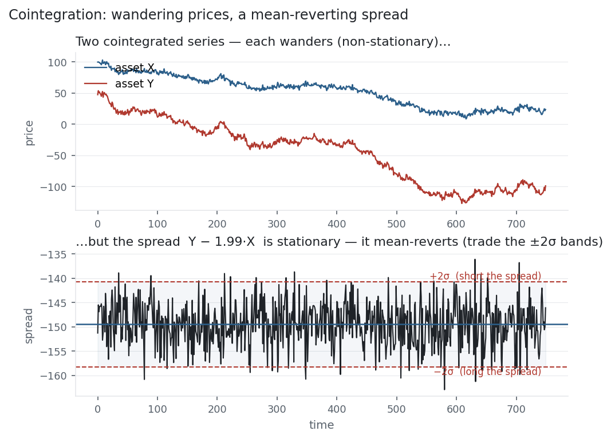

[Correlation](../covariance-correlation/) asks whether two assets move together day to
day. Cointegration asks something deeper and rarer: whether two prices, each free to
wander wherever it likes, are nonetheless tied by an invisible leash — so that some
combination of them never strays far from a fixed level. That combination, the
**spread**, is [stationary](../stationarity-adf/) and mean-reverting, which makes it
tradable. Cointegration is the honest statistical foundation of pairs trading — and, as
the data will show, far rarer than the correlations mistaken for it.

## The equation

Two series $X_t$ and $Y_t$ are **cointegrated** if each is non-stationary (integrated of
order 1) but a linear combination is stationary:

$$X_t \sim I(1), \quad Y_t \sim I(1), \quad \text{but} \quad s_t = Y_t - \beta X_t \sim I(0).$$

$\beta$ is the **hedge ratio** and $s_t$ is the **spread**. The Engle-Granger test finds
$\beta$ by OLS, then runs an [ADF test](../stationarity-adf/) on the residual spread — if
the spread is stationary, the pair is cointegrated.

## What each symbol means

| Symbol | Meaning |
|---|---|
| $X_t,\ Y_t$ | the two price series (both non-stationary) |
| $I(1)$ | "integrated of order 1" — non-stationary, but its *difference* is stationary |
| $I(0)$ | stationary |
| $\beta$ | the hedge ratio — units of $X$ to short against one $Y$ |
| $s_t$ | the spread, $Y_t - \beta X_t$ — stationary when the pair is cointegrated |

Correlation acts on *returns*; cointegration acts on *price levels*. A pair can be one
without the other.

## Plain-English explanation

Picture two drunks leaving a bar, each staggering at random — neither has any idea where
they're going (two random walks, both non-stationary). Now tie them together with a short
rope. Individually they still wander anywhere, but the distance between them can never
grow large: it snaps back. That distance is the spread, and its refusal to wander *is*
cointegration.

For prices, cointegration says two assets share a long-run equilibrium. Each price is a
random walk on its own, but a specific weighted difference — the spread — is stationary,
oscillating around a fixed mean and reverting to it. Find such a pair and you have
something to trade: when the spread stretches unusually wide (say +2σ), you bet on it
snapping back — short the expensive leg, long the cheap one — and close when it returns to
the mean. That is pairs trading, and cointegration is what makes it more than wishful
thinking.

## Why it matters in markets

Cointegration is the difference between a real pairs trade and a data-mined mirage, and
its central lesson is that **correlation is not cointegration**. Correlation measures
whether returns move together in the short run; cointegration measures whether prices stay
tied in the long run. Two stocks can be highly correlated yet drift apart forever
(correlated, not cointegrated), or barely correlated day-to-day yet anchored to the same
level (cointegrated, not correlated). Trading a pair because it's correlated, without
checking cointegration, is how "market-neutral" books blow up when the spread that "always
reverted" simply keeps widening.

The catch is that genuine cointegration is rare and fragile: it needs a real economic link
(the same commodity, a merger, two share classes, a dual listing), it must survive
out-of-sample, and it can break the moment the relationship that caused it changes. The
Engle-Granger recipe — regress for $\beta$, [ADF-test](../stationarity-adf/) the spread —
is the minimum honest check, and even a passing test can be a fluke without an economic
story.

## A simple worked example

Take a shared random-walk trend $W_t$ and build two prices on it:
$X_t = 100 + W_t + \text{noise}$ and $Y_t = 50 + 2W_t + \text{noise}$. Each is
non-stationary — an ADF test can't reject a unit root in either. But because
$Y \approx 2X$, the combination $Y_t - 2X_t$ cancels the shared trend and leaves only
noise: a stationary spread. Regressing $Y$ on $X$ recovers the hedge ratio
$\beta = 1.99$ (essentially the true 2), and an ADF test on the spread gives
$p < 0.001$ — decisively stationary. That is a textbook cointegrated pair, and its spread
(the figure) is what you would trade.

## Python implementation

```python
from statsmodels.tsa.stattools import coint, adfuller
import numpy as np

# X, Y are two price (level) series
pval   = coint(X, Y)[1]                    # Engle-Granger: p < 0.05 => cointegrated
beta   = np.polyfit(X, Y, 1)[0]            # hedge ratio (OLS slope of Y on X)
spread = Y - beta * X
print(round(pval, 4), round(adfuller(spread)[1], 4))   # coint p, spread ADF p

z = (spread - spread.mean()) / spread.std()            # trade |z| > 2, exit near 0
```

`coint` runs the whole Engle-Granger procedure; the manual `polyfit` + `adfuller` on the
residual is the same thing, and shows exactly what the test does.

## Manual / Excel calculation

There is no spreadsheet shortcut — cointegration needs a regression *plus* an ADF test, so
use `statsmodels.coint` (Python) or R's `urca` / `egcm`. The two-step logic you can follow
anywhere: (1) regress $Y$ on $X$ to get $\beta$ and the residual spread; (2) test whether
that spread is stationary. A stationary spread means the pair is cointegrated.

## Financial-market example — Nasdaq 100

Here honesty beats a tidy story. Testing every pair in the basket over 2015–2026 —
highly correlated names included — **not one is cointegrated**:

| Pair | return correlation | cointegration p |
|---|---:|---:|
| NDX ~ MSFT | +0.81 | 1.00 |
| NDX ~ AAPL | +0.78 | 0.19 |
| AAPL ~ MSFT | +0.64 | 0.98 |
| MSFT ~ NVDA | +0.59 | 0.98 |

Every p-value is far above 0.05: no stationary spread exists. NDX and MSFT rise together
with a **0.81** return correlation, yet their price *levels* drift apart over the decade —
correlated, not cointegrated. This is the rule, not the exception: most stock pairs share
no long-run tether, which is exactly why real pairs trading hunts narrow, economically
linked relationships (a company and its tracking stock, two share classes, a commodity and
its producer) rather than "these two charts look similar."

{fig-alt="Two wandering price series above a stationary mean-reverting spread with ±2σ bands"}

The figure shows what the exception looks like — a *constructed* cointegrated pair. Both
prices wander freely, but their spread $Y - 1.99X$ oscillates around a constant mean and
snaps back every time it stretches: stationary, mean-reverting, tradable. That
mean-reverting spread is the whole prize of cointegration — and finding a genuine one in
live markets is the hard part.

::: {.status-note}
Basket pairs from `multi_daily.csv` (yfinance); cointegration via `statsmodels` (Engle-
Granger). The spread figure is a constructed cointegrated pair, since no basket pair
qualifies — which is itself the point.
:::

## Common mistakes

- **Confusing correlation with cointegration.** Correlation is short-run co-movement of returns; cointegration is a long-run tether in prices. High correlation does not imply a stationary spread.
- **Trading a pair without testing the spread.** "It always reverts" is a chart illusion until an ADF test on the spread rejects a unit root — and even then, out-of-sample.
- **Data-mining pairs.** Test enough pairs and some pass by chance; without an economic reason, a passing cointegration test is likely spurious.
- **Assuming cointegration is permanent.** Relationships break (mergers, business shifts); a spread that reverted for years can suddenly trend — how pairs books blow up.
- **Ignoring the hedge ratio.** The spread is $Y - \beta X$, not simply $Y - X$; the wrong $\beta$ leaves a non-stationary, untradable spread.
- **Running it on returns.** Cointegration lives in the non-stationary price *levels*; test it on stationary returns and you're testing the wrong thing.
