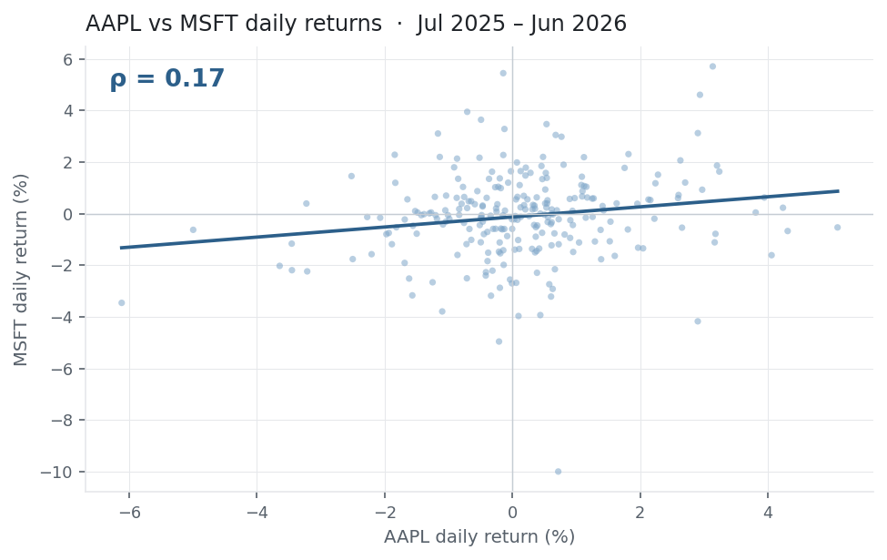
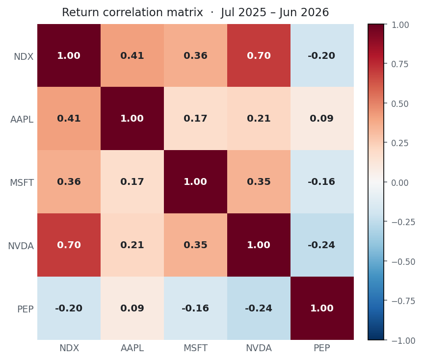

[Variance](../variance-standard-deviation/) describes one asset. Covariance and
correlation describe how *two* assets move together — the statistic diversification
is built on. Covariance gives the direction and raw size of the co-movement;
correlation rescales it into a pure number between −1 and +1 that you can compare
across any pair.

## The equation

$$\sigma_{XY} \;=\; \frac{1}{n-1}\sum_{t=1}^{n}\left(r_{X,t}-\bar r_X\right)\left(r_{Y,t}-\bar r_Y\right)
\qquad
\rho_{XY} \;=\; \frac{\sigma_{XY}}{\sigma_X\,\sigma_Y}$$

**Covariance** averages the product of the two assets' deviations from their means:
positive when they tend to move the same way, negative when they offset.
**Correlation** divides that by the two standard deviations, giving a unitless
number in $[-1, 1]$.

## What each symbol means

| Symbol | Meaning |
|---|---|
| $\sigma_{XY}$ | the sample **covariance** of returns $X$ and $Y$ (in return²) |
| $\rho_{XY}$ | the **correlation** of $X$ and $Y$ — unitless, in $[-1,1]$ |
| $r_{X,t},\, r_{Y,t}$ | the period-$t$ returns of $X$ and $Y$ (simple returns) |
| $\bar r_X,\, \bar r_Y$ | their sample [means](../mean-return/) |
| $\sigma_X,\, \sigma_Y$ | their [standard deviations](../variance-standard-deviation/) |
| $n$ | the number of paired observations |

Covariance is variance's two-asset generalisation: set $Y = X$ and it collapses to
$\sigma_{XX} = \sigma_X^2$.

## Plain-English explanation

For each period, ask whether the two assets were both above their means together,
or one up while the other was down. Covariance multiplies the two deviations and
averages them: it comes out positive when they tend to move the same way, negative
when they offset. But covariance is in "return²" and its size rides on each asset's
volatility, so the raw number is hard to read.

Correlation fixes that. Divide covariance by the two standard deviations and you
get a pure number: $+1$ is lockstep, $-1$ is mirror images, $0$ is no *linear*
relationship. Covariance tells you the direction; correlation makes the strength
comparable across every pair.

## Why it matters in markets

Covariance is the engine of diversification. A portfolio's variance is not the
average of its parts — it is $\mathbf{w}^\top \Sigma\, \mathbf{w}$, where $\Sigma$
is the covariance matrix, so the off-diagonal covariances decide how much risk
cancels out. Two assets at $\rho = 1$ give no risk reduction; at $\rho = -1$ you
can hedge risk away entirely; everything useful happens in between. Correlation is
the input to pairs trading, hedge ratios, factor models, and mean–variance
optimisation.

Like variance, **covariance scales with time** — multiply by 252 to annualise.
**Correlation is scale-free**: annualising, or switching returns from percent to
basis points, leaves $\rho$ unchanged. That invariance is exactly why we quote
correlation rather than covariance.

## A simple worked example

Two assets over three periods — $X = [+2\%, -1\%, +3\%]$ (mean $1.33\%$) and
$Y = [+1\%, 0\%, +2\%]$ (mean $1\%$):

$$\sigma_{XY} = \frac{(0.0067)(0) + (-0.0233)(-0.01) + (0.0167)(0.01)}{3-1}
= \frac{0.0004}{2} = 0.0002.$$

With $\sigma_X = 2.08\%$ and $\sigma_Y = 1.00\%$,

$$\rho_{XY} = \frac{0.0002}{0.0208 \times 0.0100} = 0.96.$$

The covariance alone, 0.0002, is unreadable; the correlation, 0.96, tells you
immediately these two move almost in lockstep.

## Python implementation

```python
import numpy as np
import pandas as pd

X = np.array([0.02, -0.01, 0.03])
Y = np.array([0.01,  0.00, 0.02])

# --- covariance and correlation, spelled out to match the formula ------------
xd, yd = X - X.mean(), Y - Y.mean()             # each asset's deviations from its mean
cov  = (xd * yd).sum() / (len(X) - 1)           # sample covariance (divide by n-1)
corr = cov / (X.std(ddof=1) * Y.std(ddof=1))    # normalise by the two std devs
print(round(cov, 6), round(corr, 4))            # -> 0.0002   0.9608

# --- the whole matrix at once (what you actually use) -----------------------
df = pd.DataFrame({"X": X, "Y": Y})
print(df.cov())     # covariance matrix   (diagonal = each asset's variance)
print(df.corr())    # correlation matrix  (diagonal = 1)
```

A useful consistency note: unlike `std`, both `numpy.cov` and `pandas.cov` default
to the **sample** divisor ($n-1$), and `corrcoef` / `corr` are scale-free — so the
`ddof` trap from [Variance](../variance-standard-deviation/) doesn't bite here.

## Manual / Excel calculation

By hand: (1) each asset's mean, (2) each period's deviations, (3) multiply the
*paired* deviations, (4) sum, (5) ÷ $(n-1)$ → covariance, (6) ÷ $(\sigma_X\sigma_Y)$
→ correlation.

In Excel, with $X$ in `B2:B4` and $Y$ in `C2:C4`:

| Task | Formula |
|---|---|
| Sample covariance | `=COVARIANCE.S(B2:B4, C2:C4)` → `0.0002` |
| Correlation | `=CORREL(B2:B4, C2:C4)` → `0.96` |
| Population covariance | `=COVARIANCE.P(B2:B4, C2:C4)` (÷ n) |

`CORREL` needs no sample-vs-population choice — being scale-free, it gives the same
answer either way.

## Financial-market example — Nasdaq 100

The same window — daily returns of **AAPL, MSFT, NVDA, PEP** and the **^NDX** index,
1 Jul 2025 to 30 Jun 2026, $n = 251$.

```python
import pandas as pd

r = (pd.read_csv("../multi_daily.csv", index_col="Date", parse_dates=True)
       .pct_change().loc["2025-07-01":"2026-06-30"])

print(round(r["AAPL"].cov(r["MSFT"]), 8))    # -> 0.00004367   covariance (return^2)
print(round(r["AAPL"].corr(r["MSFT"]), 4))   # -> 0.1720       correlation
print(r[["NDX","AAPL","MSFT","NVDA","PEP"]].corr().round(2))   # the full matrix
```

{fig-alt="Scatter of AAPL versus MSFT daily returns with a shallow positive fit line, rho 0.17"}

Two things stand out, and both are the whole point of this entry. First, **AAPL and
MSFT correlate only 0.17** over the year — far below the "big tech all moves
together" intuition. Correlation is *empirical*: you measure it, you don't assume
it. Second, the rest of the matrix:

{fig-alt="Correlation matrix heatmap; tech names positive in red, PEP negative in blue"}

**NVDA tracks the index at 0.70** — it is one of the largest weights, so it partly
*is* the index — while **PEP, a consumer-staples name, is negatively correlated
with the tech complex** (−0.16 to −0.24). That negative cell is diversification made
visible: adding PEP to a tech book removes risk in a way that adding another chip
name never could.

::: {.status-note}
Data from `multi_pull.py` (yfinance, adjusted closes) in `multi_daily.csv`. Code
blocks are illustrative — the site doesn't execute them, so every figure was
computed and checked against that file.
:::

## Common mistakes

- **Correlation is not causation.** A high $\rho$ says two series moved together over a window, nothing about why, or whether it lasts.
- **It only measures *linear* association.** Two series can be tightly related (e.g. one tracks the other's magnitude) yet show $\rho \approx 0$. A scatter plot catches what a single number hides.
- **Correlations aren't stable.** They drift with regime and tend to spike toward $+1$ in a crash — right when diversification is supposed to help. A calm-period $\rho$ understates crisis co-movement.
- **Reading covariance's magnitude.** It is scale-dependent and in return²; only correlation is comparable across pairs. Use covariance for portfolio maths, correlation for interpretation.
- **Covariance/correlation of prices, not returns.** Two trending price series look spuriously, near-perfectly correlated. Always use returns.
- **Misaligned or too-short samples.** Different holiday calendars silently misalign pairs — align on dates first — and a few weeks of data give a $\rho$ that is mostly noise.
