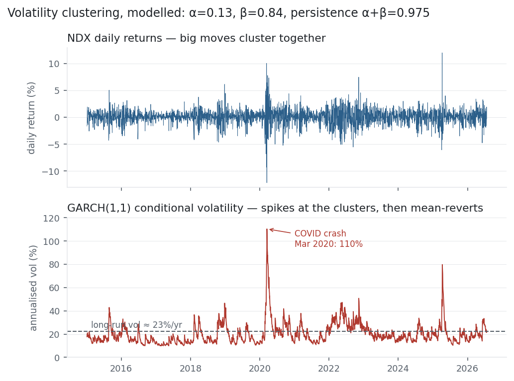

Every model so far has chased the *mean* of returns — and found almost nothing, because
returns are close to unpredictable. GARCH changes the target. It gives up on forecasting the
return and forecasts its *volatility* instead, and there the news is much better: volatility
is highly predictable. The [autocorrelation](../autocorrelation/) entry already showed why —
squared returns have a large, slowly-decaying ACF (calm clusters with calm, turbulence with
turbulence). GARCH is the model built to capture exactly that clustering, and it is the
volatility engine that bolts onto the [ARIMA](../arima/) mean this section just built.

## The equation

A return is a mean plus a shock whose size changes over time; GARCH(1,1) is the recursion
for that size:

$$r_t = \mu + \varepsilon_t, \quad \varepsilon_t = \sigma_t z_t, \quad z_t \sim \mathcal{N}(0,1)$$

$$\sigma_t^2 = \omega + \alpha\,\varepsilon_{t-1}^2 + \beta\,\sigma_{t-1}^2$$

Today's variance is a baseline $\omega$, plus a reaction to yesterday's squared shock
($\alpha$), plus a memory of yesterday's variance ($\beta$).

## What each symbol means

| Symbol | Meaning |
|---|---|
| $r_t$ | the return at time $t$ |
| $\mu$ | the (small, near-constant) mean return |
| $\varepsilon_t$ | the shock / residual — return minus mean |
| $\sigma_t^2$ | the conditional variance at time $t$ — what GARCH forecasts |
| $z_t$ | a standardised random draw (mean 0, variance 1) |
| $\omega$ | omega — the constant / baseline variance |
| $\alpha$ | alpha — reaction to the latest shock (the ARCH term) |
| $\beta$ | beta — persistence of past variance (the GARCH term) |

$\alpha + \beta$ is the persistence of volatility; it must be $< 1$ for a finite long-run
variance $\omega/(1-\alpha-\beta)$.

## Plain-English explanation

GARCH stands for **G**eneralized **A**uto**R**egressive **C**onditional
**H**eteroskedasticity — a mouthful that just means "a model where the variance changes over
time and depends on its own past." Ordinary models assume a return's shock has a fixed size
(constant variance, "homoskedastic"). GARCH lets that size breathe: after a big move, the
next day's expected volatility rises; after a run of calm, it falls. The recursion
$\sigma_t^2 = \omega + \alpha\varepsilon_{t-1}^2 + \beta\sigma_{t-1}^2$ says today's variance
is a blend of three things — a long-run baseline ($\omega$), how violent yesterday actually
was ($\alpha$ times yesterday's squared shock), and how volatile the model already thought
things were ($\beta$ times yesterday's variance).

The two coefficients split the labour. $\alpha$ is the **reaction** — how sharply volatility
jumps when a shock lands. $\beta$ is the **persistence** — how long a raised volatility
lingers. Their sum, $\alpha + \beta$, is the memory of volatility: the closer to 1, the more
slowly a spike decays. For equity indices it is typically around 0.95–0.99, so volatility
shocks fade over weeks, not days — which is exactly the clustering you see on any price chart.

## Why it matters in markets

GARCH matters because volatility, unlike return, is forecastable — and volatility is what
risk is made of. A single [standard deviation](../variance-standard-deviation/) assumes one
fixed volatility for all time; GARCH replaces it with a volatility that updates every day,
which transforms three things. **Risk measures:**
[Value at Risk and Expected Shortfall](../value-at-risk/) computed on a GARCH volatility rise
and fall with the market instead of lagging it, so limits tighten *going into* turbulence
rather than after it. **Fat tails:** because the variance itself varies, GARCH manufactures
the [excess kurtosis](../skewness-kurtosis/) of real returns even when the shocks $z_t$ are
perfectly normal — a mixture of normals with different variances is fat-tailed. And **option
pricing** and **position sizing** both live or die on a volatility forecast.

It also completes this section's division of labour. [ARIMA](../arima/) models the
conditional mean and assumes constant-variance shocks; GARCH models the conditional variance
of exactly those shocks. Run together (an ARIMA-GARCH), one engine forecasts where the series
is heading and the other how uncertain that forecast is — and for a near-efficient market,
the honest finding of the last few entries is that the second engine is the one doing all the
useful work.

## A simple worked example

Take GARCH(1,1) with $\omega = 0.02$, $\alpha = 0.10$, $\beta = 0.88$ (variance in %² per
day). Yesterday delivered a −3% shock while the model's variance stood at
$\sigma^2 = 1.2^2 = 1.44$. Today's variance is:

$$\sigma_t^2 = 0.02 + 0.10\times(-3)^2 + 0.88\times1.44 = 0.02 + 0.90 + 1.27 = 2.19,$$

so $\sigma_t = \sqrt{2.19} \approx 1.48\%$ per day. The 3% shock lifted tomorrow's expected
volatility from 1.2% to 1.48%. Left alone it decays back toward the long-run level
$\sigma = \sqrt{\omega/(1-\alpha-\beta)} = \sqrt{0.02/0.02} = 1.0\%$/day, with a half-life of
$\ln(0.5)/\ln(0.98) \approx 34$ days. Big day today, jumpy tomorrow, slowly calming after —
the arithmetic of clustering.

## Python implementation

```python
from arch import arch_model
import pandas as pd

r = (pd.read_csv("../multi_daily.csv", index_col="Date", parse_dates=True)["NDX"]
       .pct_change().dropna() * 100)             # percent returns (arch prefers scaled)

res = arch_model(r, mean="Constant", vol="GARCH", p=1, q=1).fit(disp="off")
a, b = res.params["alpha[1]"], res.params["beta[1]"]
print(round(a, 3), round(b, 3), round(a + b, 3))    # -> 0.132 0.843 0.975
cond_vol = res.conditional_volatility * (252 ** 0.5)  # annualised volatility series
```

The `arch` package is the standard; `p` is the ARCH order, `q` the GARCH order. Scale returns
by 100 for the optimiser, and remember the fitted variance is in those squared units.

## Manual / Excel calculation

GARCH *fitting* needs maximum likelihood, but the *recursion* is a one-cell spreadsheet
formula once you have $\omega, \alpha, \beta$: `=omega + alpha*E1^2 + beta*F1`, where E is the
shock column and F the previous variance. Seed the first variance with the sample variance and
fill down — you'll reproduce the conditional-variance path exactly. Estimating the three
parameters by hand isn't practical; use the `arch` package or R's `rugarch`.

## Financial-market example — Nasdaq 100

Fit GARCH(1,1) to eleven years of NDX daily returns and it puts hard numbers on volatility
clustering: $\alpha = 0.13$ (a meaningful jump in variance the day after a shock) and
$\beta = 0.84$ (most of yesterday's volatility carries into today), for a persistence of
$\alpha + \beta = 0.975$. That near-1 sum is the whole story — a volatility spike decays with a
half-life of about 27 days, so a turbulent week echoes for a month. The model's long-run
volatility works out to 23%/yr, essentially the 22% sample figure, confirming it is well
specified.

| GARCH(1,1) on NDX | value | meaning |
|---|---:|---|
| $\alpha$ (reaction) | 0.13 | variance jump after a shock |
| $\beta$ (persistence) | 0.84 | yesterday's variance carried over |
| $\alpha + \beta$ | 0.975 | slow decay — vol half-life ≈ 27 days |
| long-run vol | 23%/yr | matches the 22% sample vol |

{fig-alt="Nasdaq daily returns above GARCH conditional volatility that spikes at the return clusters and mean-reverts"}

The figure makes the fit visible. NDX returns obviously cluster — a violent 2020, a jumpy
2022, calm stretches between — and the GARCH conditional volatility tracks it exactly,
spiking to 110%/yr in the March 2020 crash and sinking below 10% in quiet spells, always
pulled back toward the 23% long-run line. This is the predictability the mean models never
had: you can't say whether tomorrow is up or down, but you can say, with real skill, whether
it will be calm or wild. The squared-return autocorrelation of 0.39 that the
[autocorrelation](../autocorrelation/) entry flagged is precisely what GARCH monetises.

::: {.status-note}
Same `multi_daily.csv` as the previous entries (yfinance, adjusted closes); GARCH(1,1) with
normal innovations via the `arch` package. A Student-t fit tightens the tails but pushes
persistence to 0.997 (near-IGARCH) — normal is the cleaner baseline here. Every number was
computed and checked.
:::

## Common mistakes

- **Modelling the mean with GARCH.** GARCH forecasts variance, not direction; it says nothing about whether returns go up or down.
- **Forgetting $\alpha + \beta < 1$.** If the sum hits 1 the long-run variance is undefined (IGARCH); a Student-t fit here drifts to 0.997, where "long-run vol" becomes meaningless — check it.
- **Using raw (unscaled) returns.** The optimiser struggles with tiny numbers; scale returns ×100 and track the variance units.
- **Assuming normal shocks are enough.** GARCH with normal $z$ fattens the tails, but real returns are fatter still — a Student-t often fits better (at the cost of higher persistence).
- **Ignoring asymmetry.** Volatility rises more after down moves than up (the leverage effect); plain GARCH is symmetric — use GJR-GARCH or EGARCH if that matters.
- **Reading conditional vol as a tradable return.** Predicting volatility is not predicting return; you trade it through options or position sizing, not by forecasting direction.
