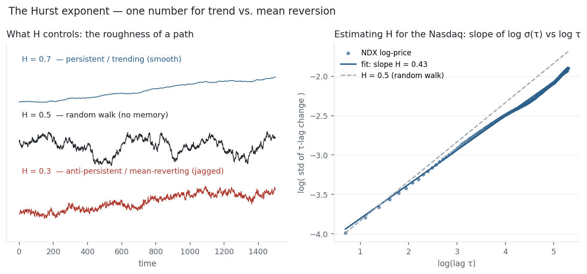

This section has circled one question from every angle: does a series remember its past?
[Autocorrelation](../autocorrelation/) measured it lag by lag; [AR](../ar-model/) and
[ARIMA](../arima/) modelled it; [stationarity](../stationarity-adf/) asked whether it
wanders. The Hurst exponent answers the whole question with a single number. $H$ sits
between 0 and 1 and sorts every series into three worlds: below 0.5 it mean-reverts, at 0.5
it is a random walk, above 0.5 it trends. It is the natural finale for the time-series
section — and applied to the Nasdaq it returns the same verdict everything else did.

## The equation

The Hurst exponent $H$ is defined by how the typical size of a move scales with the
horizon. If $\sigma(\tau)$ is the standard deviation of $\tau$-step changes,

$$\sigma(\tau) \propto \tau^{H}, \qquad H \in (0,1).$$

Equivalently, **rescaled-range (R/S) analysis**: over a window of length $n$, the rescaled
range grows as

$$\mathbb{E}\!\left[\frac{R(n)}{S(n)}\right] \propto n^{H}.$$

$H$ is the slope of $\log(R/S)$ — or of $\log \sigma(\tau)$ — against $\log(\text{horizon})$.

## What each symbol means

| Symbol | Meaning |
|---|---|
| $H$ | the Hurst exponent, in $(0,1)$ |
| $\tau,\ n$ | the horizon / window length |
| $\sigma(\tau)$ | standard deviation of changes over horizon $\tau$ |
| $R(n)$ | the range (max − min of the cumulative deviations) over a window |
| $S(n)$ | the standard deviation over that window |
| $R/S$ | the rescaled range |

$H = 0.5$ is the random walk; $H > 0.5$ is persistent (trending); $H < 0.5$ is
anti-persistent (mean-reverting).

## Plain-English explanation

The Hurst exponent measures memory. Imagine watching how far a series drifts from its start
as time passes. For a pure random walk, the distance grows like the square root of time —
take four times as long and you get twice as far. That √time growth is $H = 0.5$, the
fingerprint of no memory: each step is independent of the last.

$H$ bends that scaling. If moves tend to continue — an up day breeds another up day — the
series covers ground *faster* than √time, and $H$ climbs above 0.5: it trends, it has
positive long memory, it is "persistent." If moves tend to reverse — up today, down tomorrow
— the series covers ground *slower* than √time, and $H$ falls below 0.5: it mean-reverts,
"anti-persistent." The further $H$ is from 0.5, the stronger the memory; the closer, the more
random. The figure shows the three textures: a high-$H$ path is smooth and directional, a
low-$H$ path is jagged and self-cancelling, and $H = 0.5$ sits between.

## Why it matters in markets

The Hurst exponent tells you which kind of strategy *can* possibly work, before you build
one. In an $H > 0.5$ regime, momentum and [trend-following](../moving-averages/) have
something to bite on — moves persist. In an $H < 0.5$ regime, mean-reversion strategies —
pairs trades on a [cointegrated spread](../cointegration/), fading extremes — have the edge,
because moves reverse. At $H = 0.5$ neither does: the series is a random walk and there is no
memory to exploit. One number narrows the whole search.

It also ties this section back to the first: $H = 0.5$ is exactly the
[√time rule](../annualisation/). That rule assumed volatility scales as $\sqrt{\tau}$ — which
is the statement that $H = 0.5$. So the Hurst exponent is the parameter the √time rule
quietly fixed at one-half; measuring $H \ne 0.5$ is measuring the precise way real returns
violate it. A trending market's volatility grows faster than √time ($H > 0.5$); a
mean-reverting one's grows slower ($H < 0.5$). Persistence, mean reversion, and the
annualisation rule are three faces of the same exponent.

## A simple worked example

Suppose a series moves with a typical daily change of 1%. Over 9 days, how far does it
drift? For a random walk ($H = 0.5$) the answer is the √time rule: $1\% \times 9^{0.5} = 3\%$.
If the series trends ($H = 0.7$): $1\% \times 9^{0.7} = 4.7\%$ — persistence compounds the
moves, so it travels farther. If it mean-reverts ($H = 0.3$): $1\% \times 9^{0.3} = 1.9\%$ —
reversion cancels moves, so it stays closer to home. Same daily volatility, three different
multi-day risks, set entirely by $H$. That single exponent is why "scale by √time" is right
only for a random walk.

## Python implementation

```python
import numpy as np, pandas as pd

lp = np.log(pd.read_csv("../multi_daily.csv", index_col="Date", parse_dates=True)["NDX"])

def hurst(series, lags=range(2, 200)):
    s   = np.asarray(series, float)
    tau = [np.std(s[L:] - s[:-L]) for L in lags]              # std of L-lag changes
    return np.polyfit(np.log(list(lags)), np.log(tau), 1)[0]  # slope = H

print(round(hurst(lp.values), 3))      # -> 0.434   (variance-scaling estimate)
```

Estimators disagree at the edges (R/S, DFA, variance-scaling); report the method and a
sanity check — a synthetic random walk should read ≈ 0.5.

## Manual / Excel calculation

The variance-scaling recipe is spreadsheet-friendly: for each lag $\tau$, compute the
standard deviation of the $\tau$-step changes (`=STDEV` of the differenced series), then
regress log(σ) on log(τ) with `=SLOPE(LN(sigmas), LN(taus))`. That slope is $H$. The classic
R/S method is fiddlier by hand (cumulative deviations, range over standard deviation, across
many window sizes) — use a package for it.

## Financial-market example — Nasdaq 100

Estimate $H$ on eleven years of NDX log price and the verdict matches the whole section:
$H \approx 0.43$ by variance-scaling (stable across lag windows, 0.42 to 0.46) and
$\approx 0.51$ by rescaled-range — both hugging the 0.5 random-walk line. The small shortfall
below 0.5 is mostly estimator bias: the same variance-scaling method reads a *synthetic*
random walk at 0.47, not 0.50. So the honest read is $H \approx 0.5$ — the Nasdaq is a random
walk, with at most a faint mean-reverting lean, the same whisper that showed up as the −0.12
lag-1 autocorrelation and is just as untradable.

{fig-alt="Three fractional-Brownian paths beside a log-log plot of the Nasdaq's Hurst estimate near 0.5"}

The right panel is the estimate: NDX's log σ(τ)-vs-log τ points fall almost exactly on the
$H = 0.5$ reference, a hair shallower. The left panel is the point of the whole exercise — a
trending $H = 0.7$ world and a mean-reverting $H = 0.3$ world look nothing alike, and
identifying which one you are in is the first question any strategy should ask. For the
Nasdaq index the answer is "neither" — but for a [cointegrated spread](../cointegration/) it
would be $H < 0.5$, and that is where the mean-reversion trades of this section live.

::: {.status-note}
Same `multi_daily.csv` as the previous entries (yfinance, adjusted closes). $H$ by
variance-scaling on log price, cross-checked with R/S; the three example paths are simulated
fractional Brownian motions. Every number was computed and checked.
:::

## Common mistakes

- **Reading $H$ as constant.** It shifts with regime and horizon; a market can trend intraday and mean-revert weekly. Estimate it on the horizon you trade.
- **Trusting one estimator.** R/S, DFA and variance-scaling can disagree by 0.05+; cross-check and bias-test against a synthetic random walk.
- **Over-interpreting $H$ near 0.5.** Tiny deviations (0.47 vs 0.50) are usually estimation noise, not signal — as with NDX.
- **Confusing persistence with predictable return.** $H > 0.5$ means moves persist statistically, not that the next move is a sure thing or survives costs.
- **Applying it to too little data.** R/S and variance-scaling need long series; short samples give wildly unstable $H$.
- **Running it on the wrong series.** Hurst on a price (levels) answers trend/reversion; on stationary returns it collapses toward 0 — pick the series that matches the question.
