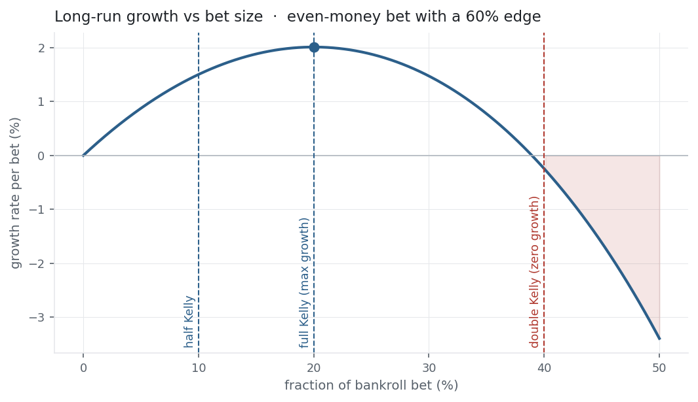

Every other entry *measures* a strategy; Kelly *acts* on one. Given an edge, how
much of your capital should you bet? Too little and you leave growth on the table;
too much and you go broke even with a winning system. The Kelly criterion is the
exact answer — the bet fraction that maximises the long-run
[compound growth rate](../cagr/) of wealth. It is the bridge from "how good is the
edge" to "how much to bet," and it wires straight back to the
[Sharpe ratio](../sharpe-ratio/).

## The equation

For a bet paying net odds $b$ with win probability $p$ (and loss probability
$q = 1-p$), the Kelly fraction is:

$$f^* = \frac{bp - q}{b} = \frac{p(b+1) - 1}{b}$$

For a continuous investment with expected excess return $\mu$ and variance
$\sigma^2$, it becomes a leverage:

$$f^* = \frac{\mu}{\sigma^2}$$

Both maximise the expected *logarithm* of wealth — equivalently, the compound growth
rate.

## What each symbol means

| Symbol | Meaning |
|---|---|
| $f^*$ | the optimal fraction of capital to bet (a leverage if $>1$) |
| $p,\ q$ | win and loss probabilities ($q = 1-p$) |
| $b$ | net odds — the amount won per unit staked on a win |
| $bp - q$ | the **edge** — expected profit per unit staked |
| $\mu$ | expected excess return, over the risk-free rate |
| $\sigma^2$ | the [variance](../variance-standard-deviation/) of returns |

The discrete form is *edge over odds*; the continuous form is *excess return over
variance*. Both say the same thing: bet more when the edge is bigger, less when the
risk is bigger.

## Plain-English explanation

You have a coin that lands heads 60% of the time and pays even money — a real edge.
But how much of your bankroll do you stake each flip? Bet everything and one tail
ruins you; bet nothing and you never grow. Kelly finds the sweet spot that grows
your money fastest over many flips: here $f^* = p - q = 0.6 - 0.4 = 0.2$, so stake
20% each time.

The crucial idea is that Kelly maximises **growth, not expected profit**. Maximising
expected profit would tell you to bet everything (it has the highest average) — but
that "average" is propped up by rare enormous outcomes while the *typical* path goes
to zero. Kelly instead maximises expected log-wealth, which is exactly the
[compound growth rate](../cagr/) that determines where your money actually ends up.

## Why it matters in markets

The library up to here has been diagnosis — return, risk, Sharpe, drawdown. Kelly is
the *prescription*: it turns an edge into a position size. But its real lessons are
about restraint.

The growth-versus-bet-size curve (below) is a hump: growth climbs to a peak at full
Kelly, then falls, and crosses zero at exactly **twice** Kelly. So over-betting is
punished twice over — past the peak you take more risk for *less* growth, and past
$2f^*$ a positive-edge strategy loses money in the long run. Betting beyond Kelly
isn't bold, it's mathematically self-destructive.

That is why practitioners bet **fractional Kelly**, usually half. Half-Kelly captures
about 75% of the growth for roughly a quarter of the variance, and it buys a margin
of safety against the deeper problem: Kelly assumes you *know* $p$, $b$, $\mu$, and
$\sigma$ exactly, and you never do. Overestimate your edge and full Kelly silently
puts you past the peak.

And the connection that ties the whole library together: for a continuous asset
$f^* = \text{SR}/\sigma$, and the maximum achievable growth rate is
$r_f + \tfrac{1}{2}\text{SR}^2$ — half the [Sharpe ratio](../sharpe-ratio/) squared.
Kelly is where the Sharpe ratio stops describing performance and starts dictating
leverage.

## A simple worked example

The 60%-heads, even-money coin: $p = 0.6$, $q = 0.4$, $b = 1$.

$$f^* = \frac{bp - q}{b} = \frac{(1)(0.6) - 0.4}{1} = 0.2 \quad\Rightarrow\quad \text{stake } 20\%.$$

At full Kelly the long-run growth is about **2.01% per flip**; at half-Kelly (10%)
it is **1.50%** — still 75% of the growth, with far smaller swings. Stake *double*
Kelly (40%) and growth turns slightly **negative**: a winning coin that loses money,
purely from over-betting.

## Python implementation

```python
import numpy as np
import pandas as pd

# discrete Kelly: win prob p, net odds b
p, b = 0.60, 1.0
f_star = (b*p - (1 - p)) / b
print(round(f_star, 2))                          # -> 0.2   (stake 20% of bankroll)

# continuous Kelly on NDX (full history)
r = (pd.read_csv("../multi_daily.csv", index_col="Date", parse_dates=True)["NDX"]
       .pct_change().dropna())
A, rf = 252, 0.04
mu  = r.mean() * A - rf                           # annualised excess return
var = (r.std(ddof=1) * np.sqrt(A)) ** 2           # annualised variance
f   = mu / var                                   # Kelly leverage
sharpe = mu / var**0.5
print(round(f, 2), round(sharpe, 2))             # -> 3.1  0.69
print(round(rf + 0.5*sharpe**2, 3))              # -> 0.275   max growth = rf + 0.5*SR^2
```

`f > 1` means Kelly wants leverage. In practice you halve it — and never trust a
single-sample estimate of $\mu$.

## Manual / Excel calculation

Kelly is a single division; the hard part is honest inputs.

| Task | Formula |
|---|---|
| Discrete Kelly | `=(b*p - (1-p)) / b` |
| Continuous Kelly | `=excess_return / variance` |
| Half Kelly | `=0.5 * (the above)` |

## Financial-market example — Nasdaq 100

Treat NDX as one asset. Over its full 2015–2026 history its annualised excess return
(over 4%) was 15.2% and its volatility 22.1%, so:

$$f^* = \frac{\mu}{\sigma^2} = \frac{0.152}{0.221^2} = 3.1.$$

Full Kelly says borrow to hold **3.1× NDX**, and the growth that buys is
$r_f + \tfrac{1}{2}\text{SR}^2 = 4\% + \tfrac{1}{2}(0.69)^2 = 27.5\%$ a year. Two
warnings are baked into those numbers. First, 3.1× leverage through the
[35.6% drawdown](../maximum-drawdown/) of 2022 would have meant a **>100% loss —
ruin**; the theoretical optimum ignores that you have to survive the path. Second,
the estimate sensitivity is savage: run the same formula on just the recent
[high-Sharpe year](../sharpe-ratio/) and it demands **8×** leverage. The edge you
feed in is never as certain as Kelly assumes — which is the entire case for betting
a fraction of it.

{fig-alt="Concave growth curve peaking at full Kelly and turning negative beyond double Kelly"}

::: {.status-note}
Same `multi_daily.csv` as the previous entries (yfinance, adjusted closes). Code
blocks are illustrative — every figure was computed and checked against that file.
:::

## Common mistakes

- **Betting full Kelly.** It maximises growth in theory, but with brutal drawdowns and no margin for estimation error. Half-Kelly is the practical default.
- **Over-betting past $2f^*$.** Beyond twice Kelly a positive-edge strategy has *negative* long-run growth — more aggression, less money.
- **Trusting the inputs.** Kelly assumes $p, b, \mu, \sigma$ are known exactly; overestimating the edge silently pushes you past the peak. Garbage in, ruin out.
- **Confusing it with maximising expected return.** Max expected return says bet everything; Kelly maximises *growth* (expected log-wealth), which is what compounds.
- **Applying it per-trade in isolation.** Correlated bets, fat tails, and the risk of total loss all break the clean formula — real sizing sits well below the naive number.
- **Ignoring your drawdown tolerance.** The right fraction is also the one you can actually survive; an optimal bet you abandon at the bottom was never optimal for you.
