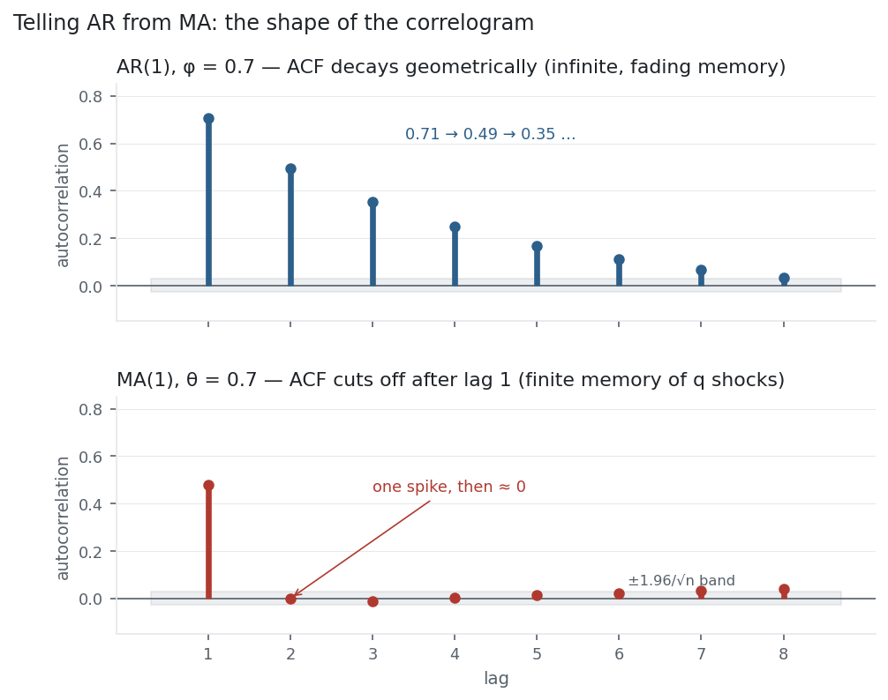

A warning first: the "MA" in an MA *model* is **not** the moving average that
[smooths a price](../moving-averages/). That one averages past *prices*; this one is a
regression on past *shocks* — the random innovations that hit a series. The
moving-average model is the natural partner of the [AR model](../ar-model/): where AR
remembers past *values*, MA remembers past *errors*, and the two combine into the ARIMA
models that follow. Its defining feature is a memory that ends abruptly.

## The equation

An **MA(1)** carries one past shock; the general **MA(q)** carries $q$ of them:

$$y_t = \mu + \varepsilon_t + \theta\,\varepsilon_{t-1} \qquad\qquad y_t = \mu + \varepsilon_t + \sum_{i=1}^{q}\theta_i\,\varepsilon_{t-i}$$

Each $\varepsilon$ is a white-noise shock. The series is a weighted sum of the last $q$
shocks plus today's.

## What each symbol means

| Symbol | Meaning |
|---|---|
| $y_t$ | the series at time $t$ |
| $\mu$ | the mean of the series (an MA process is centred on $\mu$) |
| $\varepsilon_t$ | white-noise shock at time $t$ — the innovation |
| $\theta,\ \theta_i$ | MA coefficient(s) — the weight on past shocks |
| $\varepsilon_{t-i}$ | the shock $i$ periods ago |
| $q$ | the order — how many past shocks feed in |

The key fact: an MA(q) has $\rho_k = 0$ for all $k > q$ — its autocorrelation **cuts off**
after lag $q$. For MA(1), $\rho_1 = \theta/(1+\theta^2)$ and everything beyond is zero.

## Plain-English explanation

An MA model builds today's value out of a run of recent random shocks. A shock
$\varepsilon_t$ arrives, moves the series, and then lingers for exactly $q$ more periods
before dropping out completely. MA(1) keeps a shock for one extra period: today's value is
today's shock plus $\theta$ times yesterday's. Because a shock only survives $q$ steps, the
series has no memory beyond lag $q$ — its autocorrelation is non-zero up to lag $q$ and then
exactly zero. That hard cutoff is the signature of an MA process, and it is the mirror
image of AR, whose memory fades forever but never quite reaches zero.

This gives the two models complementary correlograms (the figure). AR's ACF is a decaying
staircase; MA's ACF is a spike (or $q$ spikes) followed by a flat line of zeros. The rule
that falls out — **ACF cuts off ⇒ MA, ACF decays ⇒ AR** — is the heart of Box-Jenkins
model identification.

## Why it matters in markets

Two practical payoffs. First, MA models are **always stationary**: a finite weighted sum
of white-noise shocks has a constant mean and variance whatever the $\theta$'s are — no
unit-root worry as with AR, and nothing to check for stationarity (only for
*invertibility*, the condition $|\theta| < 1$ that makes the model uniquely recoverable).
Second, MA is how you model a series whose autocorrelation dies quickly — a shock that
washes out after a fixed lag: a microstructure effect that reverses in a day, or a
smoothing artefact from overlapping data.

AR and MA are also two views of the same thing. An invertible MA(1) equals an AR($\infty$),
and a stationary AR(1) equals an MA($\infty$) — in fact the [EMA](../moving-averages/) from
earlier is precisely an MA($\infty$) with geometrically declining weights. Which
representation you pick is about parsimony: whichever needs fewer parameters to describe the
memory you actually see. When neither a pure AR nor a pure MA is compact enough, you
combine them — that is ARMA, and with differencing, ARIMA (the next entry).

## A simple worked example

MA(1) with $\mu = 0$, $\theta = 0.5$, and a run of shocks
$\varepsilon = [1, -2, 0.5, 1, -1]$ (take the pre-sample shock as 0). Each value is this
period's shock plus half of last period's:

$$y_1 = 1,\quad y_2 = -2 + 0.5(1) = -1.5,\quad y_3 = 0.5 + 0.5(-2) = -0.5,$$
$$y_4 = 1 + 0.5(0.5) = 1.25,\quad y_5 = -1 + 0.5(1) = -0.5.$$

Each shock echoes into exactly one later value, then vanishes — the whole memory of the
process is one step deep.

## Python implementation

```python
from statsmodels.tsa.arima.model import ARIMA
import pandas as pd

r = (pd.read_csv("../multi_daily.csv", index_col="Date", parse_dates=True)["NDX"]
       .pct_change().dropna())

fit   = ARIMA(r.values, order=(0, 0, 1)).fit()   # (p,d,q)=(0,0,1) is a pure MA(1)
theta = fit.maparams[0]                           # -> -0.118
print(round(theta, 3))                            # implied lag-1 ACF = theta/(1+theta**2)
```

`order=(0,0,1)` is MA(1); `(0,0,q)` is MA(q). Because the shocks are unobserved, the fit is
maximum likelihood, not OLS. The fitted $\theta$ implies a lag-1 autocorrelation of
$\theta/(1+\theta^2)$ and zero beyond — check it against the sample ACF.

## Manual / Excel calculation

A pure MA can't be fit with a simple regression the way AR can — the shocks $\varepsilon$
aren't observed, so estimation is iterative (maximum likelihood); use `statsmodels` or R's
`arima`. What you *can* do by hand is the identification and the forward simulation: lay the
shocks in a column and build $y_t = \mu + \varepsilon_t + \theta\varepsilon_{t-1}$ with a
single formula (`=theta*E1 + E2`), exactly as in the worked example.

## Financial-market example — Nasdaq 100

Return to the −0.12 that has shadowed this whole section. NDX daily returns have a single
significant autocorrelation, at lag 1, and essentially nothing beyond — an ACF that cuts
off. That is textbook MA(1) territory, and fitting one gives $\theta = -0.118$, implying a
lag-1 autocorrelation of $\theta/(1+\theta^2) = -0.116$ — almost exactly the −0.121 in the
data, with the model forcing lag 2 onward to zero (the sample has +0.04 there, inside the
noise band):

| Model of NDX returns | lag-1 ACF | lag-2 ACF | verdict |
|---|---:|---:|---|
| MA(1), $\theta = -0.118$ | −0.116 | 0 (by construction) | matches |
| AR(1), $\phi = -0.121$ | −0.121 | +0.015 ($\phi^2$) | matches |

The two rival descriptions of the same faint structure are near-identical here — which is
the point. When only lag 1 is significant, AR(1) and MA(1) are almost interchangeable, and
both say the same thing: NDX returns are a hair away from white noise, carrying one day of
mild mean-reversion and no more.

{fig-alt="An AR(1) ACF decaying geometrically above an MA(1) ACF that spikes once then cuts to zero"}

The figure is the reason MA earns its own entry. The AR correlogram decays (memory that
fades); the MA correlogram is a spike then flat zeros (memory that stops). Read a real
correlogram against these two templates and you know which model to reach for.

::: {.status-note}
Same `multi_daily.csv` as the previous entries (yfinance, adjusted closes); MA fit via
`statsmodels` `ARIMA(0,0,1)`. The two correlograms are simulated AR(1) and MA(1) processes
($n = 5{,}000$). Code blocks are illustrative — every number was computed and checked.
:::

## Common mistakes

- **Confusing the MA model with a moving-average filter.** The [SMA/EMA](../moving-averages/) smooth prices; the MA model is a regression on unobserved shocks. Same initials, different objects.
- **Trying to fit MA by OLS.** The shocks aren't observed, so ordinary regression can't estimate $\theta$; it needs maximum likelihood.
- **Forgetting the cutoff rule.** MA(q) cuts off after lag $q$; AR decays. Mixing them up gives the wrong model and order.
- **Ignoring invertibility.** $|\theta| \ge 1$ gives a non-invertible, non-unique model; constrain $|\theta| < 1$ so the AR($\infty$) form exists.
- **Thinking an MA can be non-stationary.** It can't — a finite MA is always stationary; if the series trends or has a unit root, difference it first (the "I" in ARIMA).
- **Over-ordering.** Adding MA terms to soak up noise overfits; let the ACF cutoff and AIC/BIC choose $q$.
