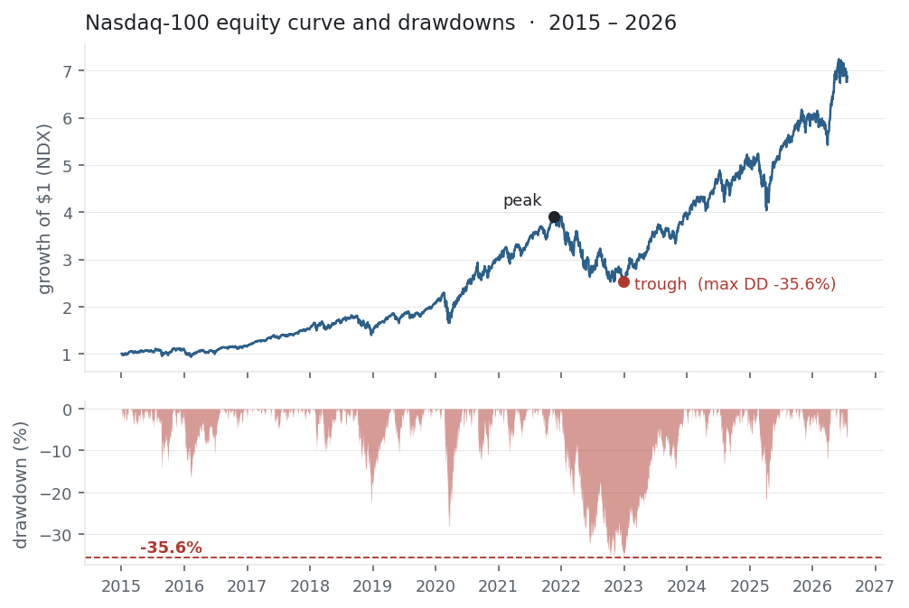

The [Sharpe](../sharpe-ratio/) and [Sortino](../sortino-ratio/) ratios measure
reward per unit of risk — but they *average* risk away, and say nothing about the
single worst moment. Maximum drawdown does. It is the largest peak-to-trough fall
in an equity curve: the number that decides whether you could actually hold a
strategy, or would have been stopped out, margin-called, or simply unable to sleep.
It is the risk you have to *survive*.

## The equation

Drawdown at time $t$ is the decline from the running peak (the high-water mark);
maximum drawdown is the worst one over the period:

$$\text{DD}_t = \frac{V_t}{\max_{s \le t} V_s} - 1,
\qquad
\text{MDD} = \min_{t}\, \text{DD}_t$$

where $V_t$ is the cumulative value — the equity curve. Every $\text{DD}_t \le 0$;
the MDD is the most negative of them.

## What each symbol means

| Symbol | Meaning |
|---|---|
| $V_t$ | the equity-curve value at time $t$ (cumulative return, or portfolio value) |
| $\max_{s \le t} V_s$ | the running peak up to $t$ — the **high-water mark** |
| $\text{DD}_t$ | drawdown at $t$: how far below the peak you are ($0$ at a new high, else negative) |
| $\text{MDD}$ | maximum drawdown — the single deepest $\text{DD}_t$ over the period |

MDD depends on the whole *path*, not the endpoints: an asset can finish up and still
have put you through a brutal decline on the way.

## Plain-English explanation

Track the highest value your portfolio has ever reached — the high-water mark. At
any moment, the drawdown is how far below that high you currently sit: 0% when
you're at a new peak, negative when you're underwater. The maximum drawdown is the
worst that figure ever got — the biggest fall from a top to a later bottom.

It answers the question the ratios can't: *what is the most I would have lost
holding this?* A strategy with a wonderful average Sharpe is worthless if getting
there meant sitting through a 60% loss you'd never actually have tolerated.

## Why it matters in markets

Maximum drawdown is the **survival constraint**. Two properties make it the risk
number practitioners lose sleep over: it is *path-dependent* — it captures the
sequence of losses, not their average or their endpoint — and it maps straight onto
real-world ruin, because leverage limits, margin calls, redemptions, and
stop-losses all trigger on drawdown, not volatility. It also drives behaviour: the
deeper the hole, the more likely an investor abandons a sound strategy at the exact
bottom.

The related **Calmar ratio**, annualised return $/\;|\text{MDD}|$, turns it into a
risk-adjusted measure alongside [Sharpe](../sharpe-ratio/) and
[Sortino](../sortino-ratio/) — reward per unit of worst-case pain. And *recovery*
matters as much as depth: a −50% drawdown needs a +100% gain just to break even, so
deep drawdowns cost time as well as money.

## A simple worked example

Take an equity path $V = [100,\ 110,\ 105,\ 120,\ 90,\ 100]$. The running peak is
$[100,\ 110,\ 110,\ 120,\ 120,\ 120]$, so the drawdowns are
$[0\%,\ 0\%,\ -4.5\%,\ 0\%,\ -25\%,\ -16.7\%]$. The worst is at $V = 90$, down from
the peak of 120:

$$\text{MDD} = \frac{90}{120} - 1 = -25\%.$$

Notice the path *ends* at 100 — above where it started, a positive total return —
yet it endured a 25% drawdown along the way. The final number never shows the pain
in the middle.

## Python implementation

```python
import pandas as pd

px = pd.read_csv("../multi_daily.csv", index_col="Date", parse_dates=True)["NDX"]

peak = px.cummax()               # running high-water mark
dd   = px / peak - 1.0           # drawdown series (0 at highs, negative below)
mdd  = dd.min()                  # maximum drawdown

trough    = dd.idxmin()          # date of the worst point
peak_date = px.loc[:trough].idxmax()   # the peak it fell from

print(round(mdd * 100, 1))                      # -> -35.6   (%)
print(peak_date.date(), "->", trough.date())    # 2021-11-19 -> 2022-12-28
```

The whole calculation is `px / px.cummax() - 1`; everything else is just locating
the dates. It works on any equity curve — a price series, or `(1 + returns).cumprod()`
for a strategy.

## Manual / Excel calculation

Build the running peak, then the drawdown, then take the minimum. With values in
`A2:A252`:

| Task | Formula |
|---|---|
| Running peak (B2) | `=MAX(A$2:A2)` — fill down |
| Drawdown (C2) | `=A2/B2 - 1` — fill down |
| Maximum drawdown | `=MIN(C2:C252)` |

The `A$2:A2` anchor makes column B a *running* maximum that grows as you drag it
down.

## Financial-market example — Nasdaq 100

Over the full **2015–2026** history — a longer window than the ratios used, because
a drawdown needs a real down-cycle to show itself — NDX's worst drawdown was
**−35.6%**: from the peak on **19 Nov 2021** to the trough on **28 Dec 2022**. That
was **404 days** of decline, then another **352** to reclaim the old high (recovered
Dec 2023) — nearly two years underwater for a −36% fall. Within the recent one-year
window the ratios used, the worst drawdown was only −12%: an up-year hides its
drawdowns.

{fig-alt="NDX equity curve 2015–2026 above an underwater drawdown chart bottoming near −36%"}

Across the basket, drawdown separates the survivable from the stomach-churning:

| Ticker | max drawdown | CAGR | Calmar |
|---|---:|---:|---:|
| NVDA | −66.3% | 69.1% | 1.04 |
| AAPL | −38.5% | 25.2% | 0.65 |
| MSFT | −37.2% | 21.9% | 0.59 |
| NDX | −35.6% | 18.2% | 0.51 |
| PEP | −30.3% | 6.3% | 0.21 |

NVDA compounded at a phenomenal 69% a year — but only for an investor who could hold
through a **two-thirds loss**. Its Calmar (1.04) is the highest, so the return did
justify the pain; the drawdown is simply the reason most people would have sold at
the bottom and never seen the recovery. PEP is the mirror image — the shallowest
drawdown, but so little return that its Calmar is the worst. The diversified index
sits between them, with a smaller drawdown than any single tech name. Maximum
drawdown is the number that decides whether a return is one you could actually have
lived through to earn.

::: {.status-note}
Same `multi_daily.csv` as the previous entries (yfinance, adjusted closes). Code
blocks are illustrative — every figure was computed and checked against that file.
:::

## Common mistakes

- **Judging by endpoints.** A strategy up 200% can have suffered a 60% drawdown mid-way; only the path reveals it.
- **Confusing depth with recovery.** A −50% drawdown needs +100% to break even (−36% needs +55%); deep holes cost years, not just percent.
- **Comparing drawdowns over different windows.** Longer histories contain deeper drawdowns — MDD isn't comparable unless the periods match.
- **Treating a small backtested drawdown as a ceiling.** The worst drawdown is almost always still ahead of you; in-sample MDD understates live risk.
- **Ignoring drawdown because the Sharpe is high.** Averaged risk measures miss the single loss that ends the game — always read MDD alongside them.
- **Using only daily closes.** Intraday drawdowns can be deeper than close-to-close; know which your number reflects.
