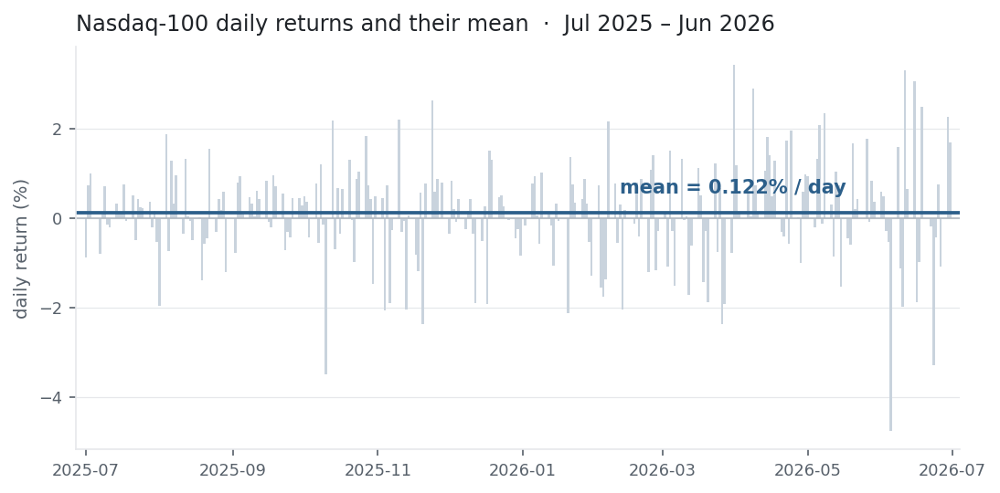

## The equation

$$\bar r \;=\; \frac{1}{n}\sum_{t=1}^{n} r_t$$

The sample **arithmetic mean** of a return series — the estimator of the first raw
moment $\mathbb{E}[r]$. Sum the per-period returns and divide by their count.
Throughout this entry $r_t$ is a **simple** return, $r_t = P_t/P_{t-1} - 1$; the
arithmetic mean of *log* returns is a related but distinct object (it annualises
additively and equals $\ln$ of the geometric mean of simple returns). The
**geometric / compound** mean — what governs multi-period growth — is deferred to
its own entry; here we stay with the arithmetic mean and signpost the difference
where it bites.

## What each symbol means

| Symbol | Meaning |
|---|---|
| $\bar r$ | the **sample** mean return — our estimate of $\mathbb{E}[r]$ |
| $r_t$ | the return in period $t$, a **simple** return $r_t = P_t/P_{t-1}-1$ |
| $n$ | the number of return observations |
| $\sum_{t=1}^{n}$ | sum over all $n$ observations |
| $\mathbb{E}[r]$ | the true (population) expected one-period return |

$\bar r$ is a *statistic* computed from a sample; $\mathbb{E}[r]$ is the
*population parameter* it estimates. Keeping the two apart is what the later
Core-statistics entries — standard error, $t$-statistic, confidence interval —
are built on.

## Plain-English explanation

Add up every period's return and divide by how many there are. That average is the
mean return: the "typical" return per period and the simplest forecast of the
next one. Formally it is the **first moment** of the return distribution — its
centre of mass.

Two clarifications that save trouble later. It is an average of *returns*, not of
*prices* — averaging price levels tells you nothing about performance. And it is
*arithmetic*: a flat average, not the compound rate at which money actually grows
(that is the geometric mean, and it is always a little lower).

## Why it matters in markets

The mean return is the atom nearly everything else is built from: the numerator of
the Sharpe ratio ($\bar r - r_f$ over $\sigma$), the expected-return term in CAPM,
the drift in a return model, and — stacked into a vector — the
$\mathbf{w}^\top \bar{\mathbf r}$ that gives a portfolio's expected return. Under
i.i.d. returns it is an *unbiased* estimate of $\mathbb{E}[r]$, the right quantity
for a one-period decision.

What it is **not** is the growth rate of your capital. Over many periods wealth
compounds, and terminal wealth is governed by the geometric mean

$$g \;=\; \left(\prod_{t=1}^{n}(1+r_t)\right)^{1/n} - 1 \;\approx\; \bar r - \tfrac{1}{2}\sigma^2 .$$

The arithmetic mean always sits above the geometric mean by roughly half the
variance — the **volatility drag**. So $\bar r$ is the correct input for
*expected* return and risk-adjusted ratios, and the wrong input for *what you
actually compounded*. Confusing the two is the most common error in return
maths — which is why this entry leads the library.

## A simple worked example

Three periods with returns $+2\%$, $-1\%$, $+3\%$:

$$\bar r = \frac{0.02 + (-0.01) + 0.03}{3} = \frac{0.04}{3} = 0.0133 = 1.33\%.$$

The average period return is **1.33%**. Compounding the same three returns
instead gives $1.02 \times 0.99 \times 1.03 - 1 = 4.01\%$ total, a geometric mean
of $1.32\%$ per period — already a touch below the arithmetic $1.33\%$. With these
tiny returns the gap is trivial; with volatile daily returns it is not.

## Python implementation

```python
import numpy as np                        # fast vectorised arrays and reductions

# --- the definition, on a tiny return series --------------------------------
r = np.array([0.02, -0.01, 0.03])         # three period returns as decimals (2%, -1%, 3%)
mean_return = r.mean()                     # (1/n) * sum(r_t): the equation in one call
print(mean_return)                         # -> 0.013333333333333334   (1.33%)

# --- spelled out, to match the formula symbol for symbol --------------------
mean_return = r.sum() / r.size             # sum of returns divided by n
print(round(mean_return * 100, 4))         # -> 1.3333   (as a percentage)

# --- from prices: form returns first, THEN average --------------------------
prices  = np.array([100.0, 102.0, 100.98, 104.0094])  # a short price path
returns = prices[1:] / prices[:-1] - 1     # simple return each step: P_t / P_{t-1} - 1
print(returns)                             # -> [ 0.02  -0.01   0.03 ]
print(returns.mean())                      # -> 0.013333...   same mean, from prices

# --- on a real series (pandas), the everyday one-liner ----------------------
import pandas as pd
close = pd.Series(prices)                  # e.g. a column of daily closing prices
mean_daily = close.pct_change().mean()     # pct_change(): P_t/P_{t-1}-1 per row; .mean() skips the leading NaN
print(round(mean_daily * 100, 4))          # -> 1.3333
```

`pct_change()` leaves a `NaN` in the first row (no prior price to divide by);
`.mean()` skips it automatically. A hand-rolled loop must not — divide by the
number of *returns*, not the number of prices.

## Manual / Excel calculation

By hand it is one line: sum the returns, divide by the count —
$0.02 + (-0.01) + 0.03 = 0.04$, then $0.04 / 3 = 0.0133$.

In Excel, with the three returns in `B2:B4`:

| Task | Formula |
|---|---|
| Mean return | `=AVERAGE(B2:B4)` → `0.0133` (format as %) |
| The same, spelled out | `=SUM(B2:B4)/COUNT(B2:B4)` |
| Returns from prices in `A2:A5` | `=A3/A2-1` in `B3`, fill down |
| Mean straight from prices | `=AVERAGE(A3:A5/A2:A4-1)` (array; `Ctrl+Shift+Enter` in legacy Excel) |
| Geometric mean, for contrast | `=GEOMEAN(1+B2:B4)-1` (array) |

`GEOMEAN` multiplies the $(1+r_t)$ growth factors and takes the $n$-th root, so
feed it `1+B2:B4`, not the raw returns.

## Financial-market example — Nasdaq 100

Daily simple returns on the Nasdaq-100 (`^NDX`) over the twelve months from
**1 Jul 2025 to 30 Jun 2026** — $n = 251$ trading days, the index moving from a
base close of **22,679.01** (30 Jun 2025) to **30,276.35** (30 Jun 2026).

{fig-alt="Bar chart of Nasdaq-100 daily returns with a horizontal line at the 0.122% daily mean"}

```python
import pandas as pd

px = pd.read_csv("ndx_daily.csv", parse_dates=["Date"]).set_index("Date")["Close"]
r  = px.pct_change().loc["2025-07-01":"2026-06-30"]   # daily returns, the 1-year window
n  = r.size                                            # 251 trading days

mean_daily = r.mean()                                  # arithmetic mean daily return
ann_arith  = mean_daily * 252                          # annualised by linear scaling (x252)
geo_daily  = (1 + r).prod() ** (1 / n) - 1             # geometric (compound) mean daily return

print(round(mean_daily * 100, 4))   # -> 0.1217   % per day (arithmetic)
print(round(ann_arith  * 100, 2))   # -> 30.68    % annualised (x252)
print(round(geo_daily  * 100, 4))   # -> 0.1152   % per day (geometric)
print(round((px["2026-06-30"] / px["2025-06-30"] - 1) * 100, 2))  # -> 33.50  % actual move
```

The arithmetic mean daily return is **0.1217%**, which annualises (×252) to
**30.7%** — the *expected-return* convention, and the number you would feed a
Sharpe ratio. The geometric mean is **0.1152%** per day, and the index's actual
compound move was **+33.50%** (a 33.65% CAGR).

The arithmetic mean sits **0.0066 pp/day** above the geometric mean, and that gap
is almost exactly $\tfrac{1}{2}\sigma^2 = 0.0066\%$ (daily variance) — the
volatility drag, made visible. The trap in one line: compounding the *arithmetic*
daily mean over the 251 days, $(1.001217)^{251}-1 = +35.7\%$, overstates the
**+33.5%** the index actually delivered, while compounding the geometric mean
reproduces it to the basis point.

::: {.status-note}
Data pulled with `ndx_pull.py` (yfinance, `^NDX`) into `ndx_daily.csv`. The site
doesn't execute code, so every figure here was computed and checked against that
file rather than rendered live.
:::

## Common mistakes

- **Treating the mean as growth.** Terminal wealth follows the geometric mean, lower by ≈$\tfrac{1}{2}\sigma^2$. Projecting multi-year growth from the arithmetic mean overstates it — and the more volatile the series, the bigger the overstatement.
- **Sloppy annualisation.** Multiplying by 252 scales the *expected* one-period return (right for Sharpe numerators and expected P&L); compounding gives CAGR (right for growth). Different numbers — in the NDX window above they land on opposite sides, 30.7% vs 33.65%, purely because one is linear and one compounds.
- **Averaging prices, not returns.** The mean of a price series is meaningless for performance. Convert to returns first.
- **Mixing simple and log returns.** Log returns add across time and annualise cleanly by ×N; simple returns compound. The arithmetic mean of log returns equals the *log of the geometric mean* of simple returns — so don't average logs and quote it as a simple mean.
- **Trusting a mean from too few points.** The standard error of the mean is $\sigma/\sqrt{n}$, so a great-looking mean over 30 days is mostly noise. Short-sample means are estimates, not facts.
- **Forgetting the mean is not robust.** One earnings-day gap, or a single unadjusted split in the data, can swing it. Sanity-check for bad ticks and corporate actions first.
