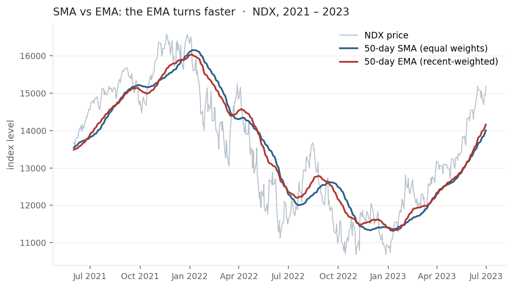

Price is noisy; trend is what you actually want to see. A moving average is the
simplest way to extract it — average the last few prices and the day-to-day jitter
cancels, leaving the drift. There are two flavours: the **simple** moving average
weights every day in its window equally, and the **exponential** moving average fades
older days out geometrically so recent prices count more. They are the workhorses of
technical trading and the first building block of the models later in this section —
but, as [autocorrelation](../autocorrelation/) warned, smoothing a near-random walk
produces signals weaker than they look.

## The equation

The simple moving average is the mean of the last $k$ prices; the exponential moving
average is a recursive, weighted update:

$$\text{SMA}_t = \frac{1}{k}\sum_{i=0}^{k-1} P_{t-i}
\qquad
\text{EMA}_t = \alpha P_t + (1-\alpha)\,\text{EMA}_{t-1}, \quad \alpha = \frac{2}{k+1}$$

The SMA gives each of the last $k$ prices weight $1/k$; the EMA gives *today* weight
$\alpha$ and decays every older day by a factor $(1-\alpha)$.

## What each symbol means

| Symbol | Meaning |
|---|---|
| $\text{SMA}_t$ | simple moving average at time $t$ |
| $\text{EMA}_t$ | exponential moving average at time $t$ |
| $P_t$ | the price at time $t$ |
| $k$ | the window length (the "period") |
| $\alpha$ | the EMA smoothing factor, $2/(k+1)$ — the weight on the newest price |
| $1-\alpha$ | the decay applied to the running average each step |

A larger $k$ (smaller $\alpha$) means more smoothing and more lag; a smaller $k$ hugs
price but stays noisy.

## Plain-English explanation

Prices wobble; a moving average smooths the wobble to show where price is heading. The
**simple** moving average just takes the mean of the last $k$ closes — a 50-day SMA is
the average of the last 50 days, redrawn daily. Because every day in the window counts
equally and the window is a hard cutoff, the SMA **lags**: it is centred on price
about $k/2$ days ago, so it turns well after price does.

The **exponential** moving average trims the lag by weighting recent prices more. Each
day it nudges the previous average a fraction $\alpha$ of the way towards today's
price. Older prices never fully vanish — they fade geometrically — so the EMA has an
infinitely long but rapidly shrinking memory. It reacts faster to turns (the figure),
at the cost of a slightly bumpier line. The choice is always the same trade-off:
smoother and slower (long SMA), or responsive and jumpier (short EMA).

## Why it matters in markets

Moving averages are everywhere in trading: as trend filters ("only go long above the
200-day"), as support and resistance, and above all in **crossovers** — when a fast MA
crosses a slow one, the "golden cross" (50 above 200) and "death cross" flag trend
changes. They are also the smoothing kernel inside AR and ARIMA models, and the EMA's
recursive form is exactly the update rule reused in GARCH volatility and in the
momentum term of ML optimisers.

But there is a catch this library keeps returning to. A moving average can only profit
from *trend* — persistent, positive [autocorrelation](../autocorrelation/) — and
returns have almost none. So MA-crossover strategies look compelling on a chart and
disappoint in a backtest. The honest test is below: on the Nasdaq, a classic 50/200
crossover did not beat buy-and-hold; it merely traded return for a smaller drawdown. A
moving average describes the past — it does not predict the future.

## A simple worked example

Five prices: $[10, 12, 11, 13, 14]$. The 3-day **SMA** on the last day is
$(11 + 13 + 14)/3 = 12.67$. The 3-day **EMA** uses $\alpha = 2/(3+1) = 0.5$; starting
from 10 it updates $10 \to 11 \to 11 \to 12 \to 13$. On the final day the EMA reads
**13** against the SMA's **12.67** — pulled higher because it weights the recent jump
to 14 more heavily. Same data, but the EMA leans towards the present.

## Python implementation

```python
import pandas as pd

px = pd.read_csv("../multi_daily.csv", index_col="Date", parse_dates=True)["NDX"]

sma50 = px.rolling(50).mean()                     # simple: equal weights
ema50 = px.ewm(span=50, adjust=False).mean()      # exponential: alpha = 2/(50+1)
print(round(2/(50+1), 4))                         # -> 0.0392   the smoothing factor

# a 50/200 crossover signal (long when the fast SMA is above the slow)
signal = (px.rolling(50).mean() > px.rolling(200).mean()).astype(int)
strat  = signal.shift(1) * px.pct_change()        # shift(1) avoids look-ahead bias
```

`ewm(span=k)` uses $\alpha = 2/(k+1)$; `adjust=False` gives the recursive form above.
The `shift(1)` is the most important line — trading today on today's close is
look-ahead bias.

## Manual / Excel calculation

| Task | Formula |
|---|---|
| Simple moving average | `=AVERAGE(B2:B51)` (fill down for a 50-period SMA) |
| EMA smoothing factor | `=2/(k+1)` |
| EMA (recursive) | `=α*B2 + (1-α)*[previous EMA cell]` |

The first EMA cell is usually seeded with the SMA, and the recursion takes over from
there.

## Financial-market example — Nasdaq 100

The figure shows NDX through its 2021 top and 2022 fall with a 50-day SMA and a 50-day
EMA. Both smooth the noise, but the EMA turns sooner at the top and the bottom — it
weights the latest prices more, so it lags less (for a slightly bumpier line). A 50-day
average sits about 24 days behind price; that lag is unavoidable, and it is why a
moving average always *confirms* a trend rather than predicting it.

{fig-alt="NDX price with 50-day SMA and EMA overlaid, the EMA reacting faster at reversals"}

Does trading it pay? A textbook 50/200 crossover — hold NDX when the 50-day SMA is
above the 200-day, sit in cash otherwise — over the full history:

| Strategy | CAGR | Sharpe | max drawdown |
|---|---:|---:|---:|
| Buy and hold | 18.2% | 0.87 | −35.6% |
| 50/200 crossover | 15.4% | 0.86 | −28.0% |

The crossover (13 trades, invested 76% of the time) shaved the worst
[drawdown](../maximum-drawdown/) from −36% to −28% — but gave up nearly three points of
annual return to do it, landing at essentially the same [Sharpe](../sharpe-ratio/). It
did not beat holding; it swapped some upside for a smoother ride. That is the typical
verdict for trend-following a market with little return autocorrelation: useful for
shaping risk, not for manufacturing an edge.

::: {.status-note}
Same `multi_daily.csv` as the previous entries (yfinance, adjusted closes). Code
blocks are illustrative — every figure was computed and checked against that file.
:::

## Common mistakes

- **Expecting crossovers to beat buy-and-hold.** On weakly-autocorrelated markets they usually don't; they reshape the risk profile, not the edge.
- **Look-ahead bias.** Trading on the same bar's close that formed the signal inflates every backtest — lag the signal by one period.
- **Forgetting the lag.** A $k$-period MA is centred ~$k/2$ periods back; it confirms trends late, so its signals always trail the move.
- **Over-optimising the windows.** 50/200 "works" in hindsight; searching thousands of window pairs for the best backtest is textbook overfitting.
- **Treating SMA and EMA as interchangeable.** Same period, different behaviour — the EMA reacts faster and is noisier; choose for the job.
- **Modelling on raw non-stationary prices.** Fine for a visual trend, but AR/ARIMA want returns or a differenced, stationary series (entries to come).
