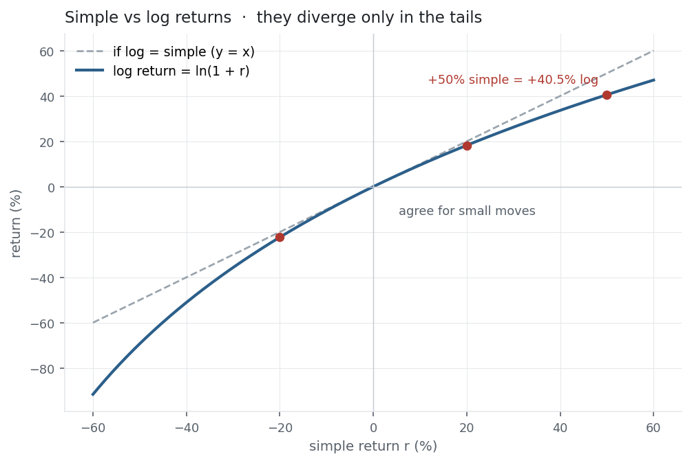

Everything else in this library is built on returns, so it is worth being precise
about what a "return" even is. Three of them come up constantly: the **simple**
return (the percentage change everyone means), the **log** return (the modeller's
choice, because it adds across time), and the **cumulative** return (the total over
a whole period). They are close cousins — but knowing which to use, and where they
diverge, prevents a surprising number of bugs.

## The equation

Three definitions, all from the price $P_t$:

$$r_t = \frac{P_t}{P_{t-1}} - 1 \qquad\text{(simple)}$$

$$\ell_t = \ln\frac{P_t}{P_{t-1}} = \ln(1 + r_t) \qquad\text{(log)}$$

$$R_{0:n} = \prod_{t=1}^{n}(1 + r_t) - 1 = \frac{P_n}{P_0} - 1 \qquad\text{(cumulative)}$$

Simple is the percentage change; log is the natural log of the price ratio;
cumulative compounds the single-period returns into one total.

## What each symbol means

| Symbol | Meaning |
|---|---|
| $P_t$ | the price at time $t$ |
| $r_t$ | the **simple** return over period $t$ |
| $\ell_t$ | the **log** (continuously compounded) return over period $t$ |
| $R_{0:n}$ | the **cumulative** return from time $0$ to $n$ |
| $\prod$ | product over the periods |
| $\ln$ | natural logarithm |

## Plain-English explanation

The **simple return** is what everyone means by "return": the percentage change in
price. Up 10% means $r = 0.10$. It is intuitive, and it is what you actually earn.

The **log return** is $\ln(1+r)$ — the return under continuous compounding. For small
moves it is almost identical to the simple return (a 1% day is 0.995% in logs), but
it has one magic property: **log returns add across time.** The log return over a
year is just the sum of the daily log returns. Simple returns don't add — they
compound.

The **cumulative return** is the total over a whole stretch: multiply all the
$(1+r_t)$ growth factors and subtract 1, which is the same as $P_n/P_0 - 1$. It is
the equity-curve number — what a buy-and-hold investor actually made.

## Why it matters in markets

The distinction that saves you: **simple returns aggregate across assets, log
returns aggregate across time.** A portfolio's simple return is the weighted average
of its holdings' simple returns (exactly), so simple returns are right for
portfolio and cross-sectional work. A multi-period return is the *sum* of the log
returns, so log returns are right for time-series modelling, annualising, and
anything involving compounding. Reach for the wrong one and your portfolio maths or
your time aggregation quietly breaks.

Two more reasons log returns dominate in modelling: they are roughly symmetric and
unbounded below (a +50% move and the −33% that undoes it are +40.5% and −40.5% in
logs — mirror images), and their summing to the total return makes the geometric
mean and [CAGR](../cagr/) fall straight out (mean log return $= \ln(1 + \text{geometric
mean})$). This is the same simple-vs-log fork flagged back in [Mean
Return](../mean-return/), now made concrete.

## A simple worked example

A stock goes 100 → 110 → 99 over two days.

- **Simple:** day 1 is $110/100 - 1 = +10\%$; day 2 is $99/110 - 1 = -10\%$.
- **Cumulative:** $\tfrac{99}{100} - 1 = -1\%$ — *not* $10\% + (-10\%) = 0\%$. You cannot add simple returns: a 10% gain then a 10% loss leaves you down 1%.
- **Log:** $\ln(1.10) = +9.53\%$ and $\ln(0.90) = -10.54\%$, and these *do* add: $9.53\% - 10.54\% = -1.01\%$, which is exactly $\ln(99/100)$. Exponentiate and you are back at −1%.

## Python implementation

```python
import numpy as np
import pandas as pd

px = pd.read_csv("../multi_daily.csv", index_col="Date", parse_dates=True)["NDX"]

simple = px.pct_change()                          # P_t / P_{t-1} - 1
log_r  = np.log(px / px.shift(1))                 # ln(P_t / P_{t-1})
cumret = (1 + simple).prod() - 1                  # product of growth factors, minus 1

print(round(cumret * 100, 1))                     # -> 587.0   (%)  = P_end/P_0 - 1
print(round(log_r.sum(), 4))                      # -> 1.9271       sum of logs = ln(P_end/P_0)
print(round((np.exp(log_r.sum()) - 1) * 100, 1))  # -> 587.0   same cumulative, via logs
```

`pct_change()` gives simple returns; `np.log(px/px.shift(1))` gives log returns; the
cumulative return is `(1+r).prod()-1`, or equivalently `exp(sum of logs) - 1`.

## Manual / Excel calculation

With prices in column B:

| Task | Formula |
|---|---|
| Simple return | `=B3/B2 - 1` |
| Log return | `=LN(B3/B2)` |
| Cumulative return | `=PRODUCT(1+returns) - 1` (or `=EndPrice/StartPrice - 1`) |

Never `SUM` simple returns to get a cumulative — that is the classic error. Sum the
*log* returns, or take the *product* of the $(1 + r)$ factors.

## Financial-market example — Nasdaq 100

Over 2015–2026 NDX went from 4,230 to 29,061 — a cumulative (simple) return of
$29{,}061 / 4{,}230 - 1 = 587\%$. The daily log returns over that span sum to
exactly **1.9271**, which is $\ln(29{,}061/4{,}230)$ — and $e^{1.9271} - 1 = 587\%$
recovers the same total. That equality is the whole point of log returns: the messy
product of ~2,900 daily growth factors collapses into a single sum.

{fig-alt="Curve of log return versus simple return with a y=x reference line, diverging in the tails"}

On any single day the two are almost indistinguishable — a −0.32% simple day is a
−0.32% log day. They part company only in the tails: a +50% move is +40.5% in logs,
a −50% move is −69.3%. That asymmetry — a −100% simple return is $-\infty$ in logs —
is exactly why log returns are the natural coordinate for modelling extremes.

::: {.status-note}
Same `multi_daily.csv` as the previous entries (yfinance, adjusted closes). Code
blocks are illustrative — every figure was computed and checked against that file.
:::

## Common mistakes

- **Adding simple returns across time.** +10% then −10% is −1%, not 0%. Compound them (product of $1+r$), or use log returns, which *do* add.
- **Averaging log returns across assets.** A portfolio's return is the weighted average of the *simple* returns, not the log returns. Use simple for cross-sectional work.
- **Treating log and simple as interchangeable.** Fine for a single small day; wrong for big moves or long horizons, where the gap compounds.
- **Mixing conventions in one calculation.** A mean or Sharpe on log returns isn't directly comparable to one on simple returns — pick one and stay with it.
- **Thinking cumulative return is a sum.** The equity curve is `(1+r).cumprod()`, never a running sum of returns.
- **Forgetting the −100% floor.** A simple return can't fall below −100%; a log return can go to $-\infty$ — realistic for continuous modelling, but not for a bounded P&L.
