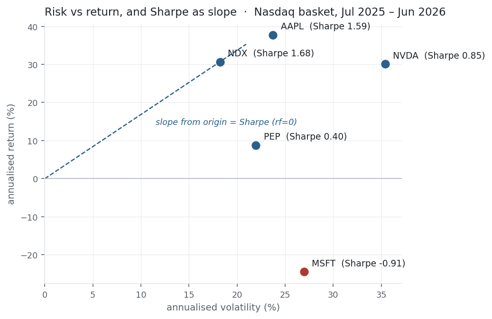

This is where the library turns from *describing* returns to *judging* them. A
return on its own says nothing: 30% earned by taking wild risk is worse than 20%
earned smoothly. The Sharpe ratio divides return by the risk taken to earn it, and
it is the single most-quoted number in performance evaluation. It is also, quietly,
just the [mean return](../mean-return/) over the
[volatility](../variance-standard-deviation/) — the first two moments, combined.

## The equation

$$\text{Sharpe} = \frac{\bar r - r_f}{\sigma}$$

The mean return in **excess** of the risk-free rate, divided by the volatility of
returns. Because both the numerator and denominator scale with the length of the
window, the per-period figure is annualised by multiplying by $\sqrt{252}$.

## What each symbol means

| Symbol | Meaning |
|---|---|
| $\text{Sharpe}$ | the Sharpe ratio — excess return per unit of volatility |
| $\bar r$ | the mean [return](../mean-return/) of the asset or strategy |
| $r_f$ | the risk-free rate over the same period (e.g. a T-bill yield) |
| $\sigma$ | the [standard deviation](../variance-standard-deviation/) of returns — the risk |
| $\sqrt{252}$ | the annualisation factor for daily returns (σ scales with $\sqrt{\text{time}}$) |

$\bar r - r_f$ is the **excess return** — the reward for taking risk over the
risk-free alternative. The Sharpe ratio pays you only for that.

## Plain-English explanation

A return figure alone can't tell you whether a strategy is good; you have to know
how much risk bought it. The Sharpe ratio does exactly that: take the average
return above what a risk-free asset would have paid, and divide by the volatility.
A high Sharpe means lots of reward for the wobble you endured; a low — or negative
— Sharpe means you weren't paid for the risk.

As a rough guide, an annualised Sharpe near 1 is respectable, 2 is very good, and 3
is exceptional (and worth double-checking for overfitting). Because it is a ratio
of two quantities that both grow with the window length, you annualise it so
figures are comparable — daily Sharpe $\times \sqrt{252}$.

## Why it matters in markets

The Sharpe ratio is the lingua franca of performance: allocators rank funds by it,
risk teams budget by it, and every backtest reports it. It puts strategies of
different volatilities on one axis — return per unit of risk — which is why it is
the y-axis of manager selection. Two properties make it powerful: it is the
**slope** of the line from the risk-free asset to your strategy in risk-return
space (the figure below), and it is **leverage-invariant** — double your position
and both excess return and volatility double, leaving Sharpe unchanged. So it
measures the *quality* of a return stream, not its size.

Its blind spots matter just as much. It uses σ, so it penalises upside volatility
as heavily as downside (the Sortino ratio fixes this), and it implicitly assumes
returns are roughly normal — but the [fat tails and negative
skew](../skewness-kurtosis/) we just measured mean a high Sharpe can still hide
catastrophic tail risk. A short-volatility book can post a Sharpe of 3 for years
and then lose everything in a week.

## A simple worked example

Using the running three-return set $[+2\%, -1\%, +3\%]$, with $\bar r = 1.33\%$ and
$\sigma = 2.08\%$ (from [Variance](../variance-standard-deviation/)), and taking
$r_f = 0$ for simplicity:

$$\text{Sharpe} = \frac{1.33\% - 0}{2.08\%} = 0.64 \text{ per period.}$$

If these were daily returns, annualising would give $0.64 \times \sqrt{252} =
10.2$ — an absurd number, because three hand-picked returns are not a real sample.
Which is precisely the point: a Sharpe ratio is only ever as trustworthy as the
return series behind it.

## Python implementation

```python
import numpy as np
import pandas as pd

r = (pd.read_csv("../multi_daily.csv", index_col="Date", parse_dates=True)
       .pct_change().loc["2025-07-01":"2026-06-30"])["NDX"]

rf_annual = 0.04
rf_daily  = rf_annual / 252
excess    = r - rf_daily                                     # daily excess return
sharpe    = np.sqrt(252) * excess.mean() / r.std(ddof=1)     # annualised Sharpe
print(round(sharpe, 2))                                      # -> 1.46   (rf = 4%)

# rf = 0 shortcut (common on high-frequency data)
print(round(np.sqrt(252) * r.mean() / r.std(ddof=1), 2))    # -> 1.68
```

Two things to get right: annualise by $\sqrt{252}$ (volatility's factor), **not**
252, and use `ddof=1`. A Sharpe quoted without its window, its risk-free rate, and
its return frequency is close to meaningless.

## Manual / Excel calculation

By hand: take the mean and σ of the returns (as in the earlier entries), subtract
the per-period risk-free from the mean, divide, then multiply by $\sqrt{252}$.

In Excel, with daily returns in `B2:B252`:

| Task | Formula |
|---|---|
| Daily excess mean | `=AVERAGE(B2:B252) - 0.04/252` |
| Daily volatility | `=STDEV.S(B2:B252)` |
| Annualised Sharpe | `=(AVERAGE(B2:B252)-0.04/252)/STDEV.S(B2:B252)*SQRT(252)` |

## Financial-market example — Nasdaq 100

The same window and basket, ranked by Sharpe — annualised return, volatility, and
Sharpe at $r_f = 0$ and $r_f = 4\%$:

| Ticker | ann. return | ann. vol | Sharpe (rf 0) | Sharpe (rf 4%) |
|---|---:|---:|---:|---:|
| NDX | 30.7% | 18.2% | **1.68** | 1.46 |
| AAPL | 37.7% | 23.7% | 1.59 | 1.42 |
| NVDA | 30.1% | 35.4% | 0.85 | 0.74 |
| PEP | 8.8% | 22.0% | 0.40 | 0.22 |
| MSFT | −24.4% | 27.0% | −0.91 | −1.05 |

{fig-alt="Scatter of annualised volatility versus return for five names, with a Sharpe-slope line through NDX"}

Read the **Sharpe** column instead of the return column and the ranking changes.
NVDA earned almost exactly the index's return (30.1% vs 30.7%) but at nearly double
the volatility (35% vs 18%), so its Sharpe is barely half — same reward, far more
risk. MSFT's negative return makes its Sharpe negative: it wasn't merely risky, it
lost money. And the diversified index beats *every* individual name on Sharpe — the
clearest possible illustration that [diversification](../covariance-correlation/)
buys risk-adjusted return. In the figure, Sharpe is the slope from the origin to
each point; steeper is better, and MSFT is the lone point below the axis.

::: {.status-note}
Same `multi_daily.csv` as the previous entries (yfinance, adjusted closes).
Code blocks are illustrative — every figure was computed and checked against that
file.
:::

## Common mistakes

- **Annualising with ×252 instead of ×√252.** Sharpe scales like σ (√time), not like the mean; the wrong factor inflates it roughly 16×.
- **Ignoring the risk-free rate.** In a 4–5% rate environment $r_f \neq 0$ moves the number materially — 1.68 → 1.46 here. Always state which rate you used.
- **Trusting a high Sharpe from a short or cherry-picked sample.** The best Sharpe across many trials grows like $\sqrt{2\ln N}$ even with zero real edge — see [the backtest-overfitting experiment](../../quant-lab/backtest-overfitting/).
- **Forgetting Sharpe assumes normality.** Fat tails and negative skew mean a high Sharpe can coexist with severe tail risk; pair it with skew/kurtosis and drawdown.
- **Penalising upside.** σ treats big gains as "risk" too; for asymmetric strategies the Sortino ratio (downside deviation) is fairer.
- **Comparing across frequencies.** Daily, monthly, and annual Sharpes are not directly comparable unless every one is annualised the same way.
