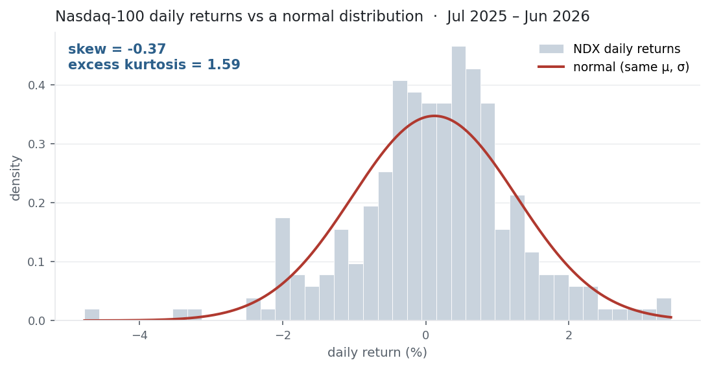

[Mean](../mean-return/) and [variance](../variance-standard-deviation/) fix a
distribution's location and width. Skewness and kurtosis describe its *shape* —
whether it leans, and how heavy its tails are. For returns this is where the
danger hides: variance treats a −3σ crash and a +3σ rally as equivalent and
assumes both are rare. The third and fourth moments are how you see that they
aren't.

## The equation

$$\text{skew} = \frac{1}{n}\sum_{t=1}^{n}\left(\frac{r_t-\bar r}{\sigma}\right)^3
\qquad
\text{kurt} = \frac{1}{n}\sum_{t=1}^{n}\left(\frac{r_t-\bar r}{\sigma}\right)^4$$

Skewness is the average **cubed** standardised return; kurtosis the average
**fourth power**. Because a normal distribution has kurtosis exactly 3, we usually
quote **excess kurtosis** $= \text{kurt} - 3$, so that $0$ means "normal-tailed."

## What each symbol means

| Symbol | Meaning |
|---|---|
| $\text{skew}$ | skewness — the 3rd standardised moment; its **sign** is the direction of the longer tail |
| $\text{kurt}$ | kurtosis — the 4th standardised moment; **tail heaviness** (normal $=3$) |
| excess kurtosis | $\text{kurt} - 3$ (normal $= 0$) |
| $r_t$ | the period-$t$ return |
| $\bar r,\ \sigma$ | the [mean](../mean-return/) and [standard deviation](../variance-standard-deviation/) |
| $n$ | the number of observations |

Standardising by $(r_t-\bar r)/\sigma$ makes both quantities unitless, so they
describe shape independent of scale.

## Plain-English explanation

Once you know where a distribution sits (mean) and how wide it is (variance), two
questions remain.

*Is it lopsided?* Skewness answers that. Cubing keeps the sign, so a few large
**negative** returns dominate and drag skew negative — a longer left tail — while
a few large gains push it positive. Zero means symmetric.

*How heavy are the tails?* Kurtosis answers that. The fourth power is enormous for
returns far from the mean and negligible for those near it, so kurtosis is almost
entirely about extremes. A normal sits at 3; anything higher (positive excess
kurtosis) means **fatter tails** — big moves more often than a bell curve allows.
Returns are famously fat-tailed.

## Why it matters in markets

This is where "risk $=\sigma$" breaks. Standard deviation, Gaussian
Value-at-Risk, and mean–variance optimisation all assume a bell curve, under which
a 3σ day should show up about once in three years. Real markets deliver them
several times a year. Negative skew says your losses arrive as fewer, larger
drops; positive excess kurtosis says the extremes on *both* sides are heavier than
σ implies.

The sharpest case is a strategy that looks wonderful on mean and Sharpe while
hiding a short-volatility payoff — small steady gains, rare catastrophic losses.
Its variance is tiny, but its skew is very negative and its kurtosis very high.
The higher moments are the early warning that the normal-based numbers are lying.

## A simple worked example

Skewness is easiest to feel through its sign. A symmetric set
$[-2\%,\, 0\%,\, +2\%]$ has skew $= 0$: the negative and positive cubes cancel
exactly. Replace it with one big loss and several small gains,
$[-4\%,\, +1\%,\, +1\%,\, +2\%]$ (mean $0$):

$$\text{skew} = \frac{\tfrac{1}{4}\left[(-4)^3+1^3+1^3+2^3\right]}{\left(\tfrac{1}{4}\left[(-4)^2+1^2+1^2+2^2\right]\right)^{3/2}}
= \frac{-13.5}{5.5^{3/2}} = -1.05.$$

The single −4% return, cubed, swamps the three small gains and pulls skew firmly
negative — one crash outweighs many quiet up-days. (Kurtosis needs the fourth
power and a real sample to mean much; on four points it is only illustration — the
Nasdaq example below supplies the real numbers.)

## Python implementation

```python
import pandas as pd

r = (pd.read_csv("../multi_daily.csv", index_col="Date", parse_dates=True)
       .pct_change().loc["2025-07-01":"2026-06-30"])

print(round(r["NDX"].skew(), 4))   # -> -0.3731   negative: the left tail is heavier
print(round(r["NDX"].kurt(), 4))   # -> 1.5863    EXCESS kurtosis (pandas subtracts 3 for you)

# the whole basket at once
print(r[["NDX","AAPL","MSFT","NVDA","PEP"]].agg(["skew", "kurt"]).round(2))
```

Two gotchas. `pandas.kurt()` returns **excess** kurtosis (normal $= 0$), not raw
kurtosis (normal $= 3$) — as does Excel's `KURT` and `scipy.stats.kurtosis` by
default. And both `.skew()` / `.kurt()` apply a small-sample bias correction, so
they differ from the raw moment formulas above — noticeably on tiny samples,
negligibly for $n$ in the hundreds.

## Manual / Excel calculation

By hand: standardise each return, $(r_t-\bar r)/\sigma$; average the **cubes** for
skewness and the **fourth powers** for kurtosis; subtract 3 from the latter for
excess.

In Excel, with returns in `B2:B252`:

| Task | Formula |
|---|---|
| Skewness | `=SKEW(B2:B252)` |
| Excess kurtosis | `=KURT(B2:B252)` |

Excel's `SKEW` and `KURT` match pandas — both are sample bias-corrected, and
`KURT` already returns *excess* kurtosis.

## Financial-market example — Nasdaq 100

NDX daily returns over the same window, drawn against a normal distribution of
identical mean and σ:

{fig-alt="NDX return histogram versus a normal curve, showing a taller peak, fatter tails, and a longer left tail"}

NDX has **skew −0.37** and **excess kurtosis +1.6**. The negative skew is the
heavier left tail — the market's worst days are worse than its best days are good.
The positive excess kurtosis is the peak-plus-fat-tails you can read straight off
the chart: more days bunched near zero, and more days far out, than the red normal
curve allows. Concretely, the index had **2 days beyond ±3σ where a normal
predicts 0.68** — while the ±2σ band matched the normal almost exactly (11 days vs
11.4). The fatness lives in the *extreme* tail, which is exactly where it hurts.

Across the basket the shapes differ, but the tails never thin out:

| Ticker | skew | excess kurtosis |
|---|---:|---:|
| NDX | −0.37 | +1.59 |
| AAPL | +0.00 | +2.16 |
| MSFT | −0.59 | +5.03 |
| NVDA | +0.07 | +0.50 |
| PEP | +0.82 | +3.53 |

Every name has **positive excess kurtosis** — fat tails are universal in equity
returns. Skew is mixed: MSFT and the index lean negative, PEP leans positive, AAPL
and NVDA are near-symmetric. Nothing here is "normal," and it rarely is.

::: {.status-note}
Same `multi_daily.csv` as Covariance & Correlation (yfinance, adjusted closes).
Code blocks are illustrative — every figure was computed and checked against that
file.
:::

## Common mistakes

- **Assuming normality.** σ, Sharpe, and Gaussian VaR all assume skew 0 and excess kurtosis 0; returns have neither, so "1-in-100-year" losses show up every few years.
- **Excess vs raw kurtosis.** pandas / Excel / scipy return *excess* (normal 0); the raw moment is 3 for a normal. Know which your tool gives before comparing figures.
- **Too little data.** The 3rd and 4th moments are dominated by the few most extreme observations, so they are very noisy in small samples — a year is barely enough to trust them.
- **Reading skew as "usually up or down."** Skew is about tail asymmetry, not the typical day; a positively skewed asset can still lose money most days.
- **A single bad tick.** One erroneous print moves kurtosis enormously (fourth power). Clean the data before trusting the number.
- **Ignoring skew in strategy P&L.** A premium-selling / short-vol book shows tiny variance but large negative skew and high kurtosis — the higher moments expose the tail risk that mean and Sharpe hide.
