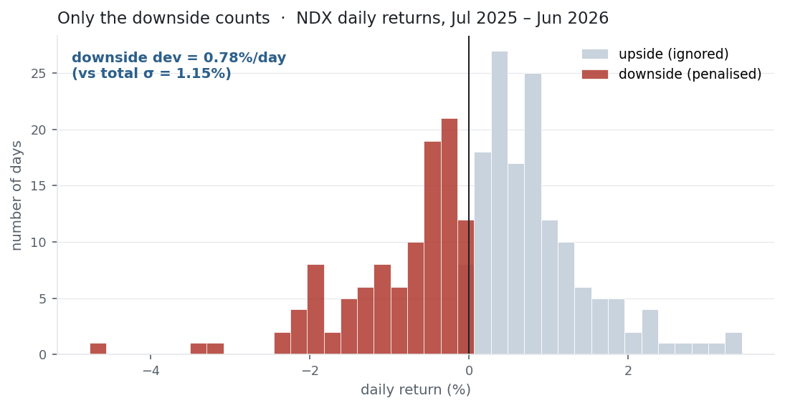
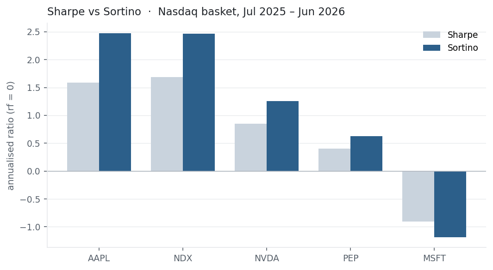

The [Sharpe ratio](../sharpe-ratio/) has one awkward feature: it treats a big
up-day as "risk," penalising the volatility you actually want. The Sortino ratio
fixes that — it divides excess return not by total volatility but by **downside
deviation**, the spread of only the returns that fell short of a target. It is the
right tool whenever returns are asymmetric.

## The equation

$$\text{Sortino} = \frac{\bar r - r_f}{\sigma_d},
\qquad
\sigma_d = \sqrt{\frac{1}{n}\sum_{t=1}^{n}\min\!\left(r_t - \tau,\; 0\right)^2}$$

Same numerator as Sharpe — excess return — but the denominator is the **downside
deviation** $\sigma_d$: take each return's shortfall below a target $\tau$ (returns
above target contribute zero), square it, average over all $n$ periods, and root.

## What each symbol means

| Symbol | Meaning |
|---|---|
| $\text{Sortino}$ | reward per unit of *downside* risk |
| $\bar r - r_f$ | excess return (the same numerator as [Sharpe](../sharpe-ratio/)) |
| $\sigma_d$ | downside deviation — the "harmful" volatility only |
| $\tau$ | the target / minimum acceptable return (MAR); usually $0$ or $r_f$ |
| $\min(r_t - \tau,\,0)$ | the shortfall — negative below target, zero above |
| $n$ | number of periods — **all** of them, not just the losing ones |

The detail that trips people up is that $n$: you divide by the *total* number of
periods, not the count of losing days. Dividing by only the losers is a different,
non-standard statistic.

## Plain-English explanation

Standard deviation counts a +5% day and a −5% day as equally "risky," even though
only one of them hurts. The Sortino ratio keeps everything else the same but
measures risk with downside deviation: it looks only at returns below your target
(usually zero, or the risk-free rate), squares those shortfalls, and averages.
Upside volatility is simply ignored.

So an asset that jumps around but mostly *upward* is rewarded, while one that
grinds down is punished. Because downside deviation is always smaller than total
volatility, a profitable asset's Sortino is always higher than its Sharpe — and
the interesting information is in *how much* higher.

## Why it matters in markets

Sortino matters most exactly where Sharpe is weakest: [asymmetric
returns](../skewness-kurtosis/). For a positively skewed strategy — small frequent
losses, occasional big wins (trend-following, long options) — Sharpe unfairly
penalises the upside spikes that are the whole point; Sortino doesn't. For a
negatively skewed one — steady gains, rare crashes (selling options, carry) — a
Sortino that stays high while the return stream quietly builds tail risk is a cue
to go look at drawdown and kurtosis.

{fig-alt="Histogram of NDX daily returns with below-zero days shaded red and above-zero days grey"}

In practice allocators quote both: Sharpe for the overall risk-adjusted picture,
Sortino for whether the risk being penalised is the risk that actually matters. The
gap between them is a quick read on the *shape* of the returns.

## A simple worked example

The running set $[+2\%, -1\%, +3\%]$ has only one losing return. With target
$\tau = 0$, the downside deviation uses just that −1% — the other two contribute
zero — divided across all three periods:

$$\sigma_d = \sqrt{\tfrac{1}{3}\left(0^2 + (-0.01)^2 + 0^2\right)}
= \sqrt{\tfrac{0.0001}{3}} = 0.58\%.$$

So $\text{Sortino} = 1.33\% / 0.58\% = 2.31$ per period, against a Sharpe of
$1.33\%/2.08\% = 0.64$. Ignoring the two up-days shrinks the denominator sharply,
and Sortino rewards the asset for having mostly gained.

## Python implementation

```python
import numpy as np
import pandas as pd

r = (pd.read_csv("../multi_daily.csv", index_col="Date", parse_dates=True)
       .pct_change().loc["2025-07-01":"2026-06-30"])["NDX"]

target   = 0.0                                    # MAR; use rf/252 for a risk-free target
downside = np.minimum(r - target, 0.0)            # shortfalls (0 when above target)
dd       = np.sqrt((downside**2).mean())          # downside deviation: divide by ALL n
sortino  = np.sqrt(252) * (r.mean() - target) / dd
print(round(sortino, 2))                           # -> 2.46

# Sharpe, for comparison
print(round(np.sqrt(252) * r.mean() / r.std(ddof=1), 2))   # -> 1.68
```

The trap is the denominator: `(downside**2).mean()` divides by the full sample.
Dividing by `(downside < 0).sum()` instead — a common error — inflates the ratio
and breaks comparability with anyone else's Sortino.

## Manual / Excel calculation

By hand: for each return take $\min(r_t - \tau, 0)$; square it; average over **all**
rows; square-root → downside deviation. Then $(\bar r - r_f)/\sigma_d \times
\sqrt{252}$.

Excel has no built-in downside-deviation function, so build it. With returns in
`B2:B252` and shortfalls `=MIN(B2-0,0)` in `C2:C252`:

| Task | Formula |
|---|---|
| Downside deviation | `=SQRT(SUMSQ(C2:C252)/COUNT(B2:B252))` |
| Annualised Sortino (rf 0) | `=AVERAGE(B2:B252)/SQRT(SUMSQ(C2:C252)/COUNT(B2:B252))*SQRT(252)` |

`SUMSQ` sums the squared shortfalls (up-days add zero), and dividing by `COUNT`
of *all* rows keeps the correct $n$.

## Financial-market example — Nasdaq 100

The same basket, target $\tau = 0$ and $r_f = 0$, Sharpe alongside Sortino
(annualised), ranked by Sortino:

| Ticker | Sharpe | Sortino | Sortino / Sharpe |
|---|---:|---:|---:|
| AAPL | 1.59 | **2.48** | 1.56 |
| NDX | 1.68 | 2.46 | 1.46 |
| NVDA | 0.85 | 1.26 | 1.48 |
| PEP | 0.40 | 0.63 | 1.57 |
| MSFT | −0.91 | −1.19 | 1.31 |

{fig-alt="Grouped bars of Sharpe and Sortino for AAPL, NDX, NVDA, PEP, MSFT"}

Every profitable name's Sortino sits above its Sharpe, because downside deviation
is smaller than total volatility (for NDX, 12.5% vs 18.2% annualised). But the size
of the lift — and even the order — changes. On **Sharpe** the index leads (1.68 vs
AAPL's 1.59); on **Sortino** AAPL edges ahead (2.48 vs 2.46), because more of
AAPL's volatility is to the upside, exactly the volatility Sortino refuses to
punish. MSFT is the mirror image: its Sortino (−1.19) is *worse* than its Sharpe
(−0.91), because for a money-loser the damage is all downside. For the same
returns, the two ratios can rank a book differently — and the difference is the
shape of the risk.

::: {.status-note}
Same `multi_daily.csv` as the previous entries (yfinance, adjusted closes). Code
blocks are illustrative — every figure was computed and checked against that file.
:::

## Common mistakes

- **Dividing by the number of losing periods.** Standard downside deviation divides by the total $n$; using only the loss count changes the statistic and breaks comparability with published Sortinos.
- **Not stating the target.** $\tau$ can be 0 or $r_f$; changing it changes which returns count as downside, and so the ratio. Always say which you used.
- **Annualising with ×252.** Downside deviation scales like σ (√time) — use $\sqrt{252}$.
- **Treating a high Sortino as "safe."** It still says nothing about the *size* of the rare loss; pair it with maximum drawdown and kurtosis.
- **Reading Sortino on Sharpe's scale.** A higher Sortino is expected (the denominator is smaller by construction), not impressive on its own — compare like with like.
- **Bothering with it for symmetric returns.** If skew ≈ 0, Sortino ≈ $\sqrt{2}\times$ Sharpe and adds little; its value is entirely in asymmetric strategies.
