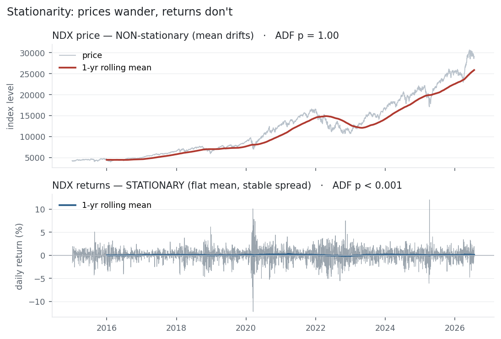

Almost every time-series model — [autocorrelation](../autocorrelation/), AR, ARIMA,
regression — quietly assumes the series is **stationary**: that its statistical
character does not change over time. Break that assumption and the models do not just
lose accuracy, they *lie* — you can "prove" a strong relationship between two things
that have nothing to do with each other. Stationarity is the licence to model, and the
Augmented Dickey-Fuller test is how you check for it.

## The equation

A series is (weakly) **stationary** if its mean, variance, and autocovariances do not
depend on time:

$$\mathbb{E}[y_t] = \mu, \quad \text{Var}(y_t) = \sigma^2, \quad \text{Cov}(y_t, y_{t-k}) = \gamma_k \quad \text{for all } t.$$

The **ADF test** checks the opposite — whether the series has a *unit root* — by
regressing the change on the level and testing $\gamma = 0$:

$$\Delta y_t = \alpha + \beta t + \gamma\, y_{t-1} + \sum_{i=1}^{p}\delta_i\, \Delta y_{t-i} + \varepsilon_t.$$

The ADF statistic is the t-ratio on $\gamma$; a sufficiently negative value rejects the
unit root and declares the series stationary.

## What each symbol means

| Symbol | Meaning |
|---|---|
| $y_t$ | the series at time $t$ |
| $\mu,\ \sigma^2$ | the *constant* mean and variance under stationarity |
| $\gamma_k$ | the autocovariance at lag $k$ (depends only on $k$, not $t$) |
| $\Delta y_t$ | the first difference, $y_t - y_{t-1}$ |
| $\gamma$ | the coefficient ADF tests; $\gamma = 0$ means a unit root |
| unit root | the fingerprint of a random walk — non-stationarity |
| $p$ | number of lagged differences added to absorb autocorrelation ("augmented") |

The ADF **null hypothesis** is "non-stationary" (has a unit root); a small p-value
rejects it in favour of stationarity.

## Plain-English explanation

A stationary series looks statistically the same wherever you stand on it: the same
average level, the same amount of wobble, the same short-term memory. A non-stationary
one drifts — its mean or variance changes over time. **Prices** are the classic
non-stationary series: a stock at 400 has a completely different "average level" than
when it was at 40, and its swings grow with its price. **Returns** are roughly
stationary: whatever the price, daily returns hover around a small constant mean with a
fairly stable spread. That is why the whole toolkit runs on returns, not prices.

The Augmented Dickey-Fuller test formalises the check. It asks whether the series has a
**unit root** — the fingerprint of a random walk, where shocks never fade and the
series wanders with no fixed home. Its null is "unit root / non-stationary"; if the ADF
statistic is negative enough ($p < 0.05$), you reject that and call the series
stationary. The "augmented" part just adds lagged differences so ordinary
autocorrelation doesn't fool it. One quirk: because a random walk's statistics aren't
normal, ADF uses its own (Dickey-Fuller) critical values — more negative than the usual
±1.96, around **−2.86 at 5%**.

## Why it matters in markets

Stationarity is the line between analysis and self-deception, and its most dangerous
violation is **spurious regression**. Take two completely unrelated non-stationary
series — two independent random walks — regress one on the other, and you will usually
find a "highly significant" relationship with a big $R^2$. It is an illusion, created
entirely by two things wandering, not by any real link. In a simulation of 2,000 such
regressions, **84% came back significant at the 5% level** — where only 5% should.
Ignore stationarity and your t-statistics and p-values become meaningless.

This is why the standard workflow is: difference prices into [returns](../returns/)
(which are stationary), model those, and ADF-test anything before trusting a regression
on it. It is also the gateway to *cointegration* (the next entry) — the rare case where
two non-stationary series share a stationary combination, which is what makes honest
pairs trading possible.

## A simple worked example

The prices $[100, 102, 101, 105, 108, 112]$ climb — their mean over the first three
points (101) is nothing like the mean over the last three (108.3). **Non-stationary**:
the average level depends on when you look. Difference them into changes,
$[+2, -1, +4, +3, +4]$, and there is no trend in the level — just fluctuation around a
small positive mean. Differencing is the standard cure, and a single difference turns a
random-walk price into a stationary return series. The ADF test is what tells you
whether you have differenced enough.

## Python implementation

```python
from statsmodels.tsa.stattools import adfuller
import pandas as pd

px = pd.read_csv("../multi_daily.csv", index_col="Date", parse_dates=True)["NDX"]

stat_p, p_p = adfuller(px, autolag="AIC")[:2]                        # on prices
stat_r, p_r = adfuller(px.pct_change().dropna(), autolag="AIC")[:2]  # on returns
print(round(stat_p, 2), round(p_p, 3))      # -> 1.39   0.997   prices: unit root (non-stationary)
print(round(stat_r, 2), round(p_r, 3))      # -> -18.09  0.0    returns: stationary
```

A p-value above 0.05 means "can't reject a unit root" — treat the series as
non-stationary and difference it.

## Manual / Excel calculation

There is no clean spreadsheet formula for ADF — it needs a regression with special
critical values, so use `statsmodels` (Python) or R's `tseries::adf.test`. What you
*can* do in Excel: plot a rolling mean and a rolling standard deviation. If either
trends, the series is non-stationary and needs differencing before any modelling.

## Financial-market example — Nasdaq 100

The two panels are the whole idea. NDX's price wanders from ~4,500 to ~26,000 over the
decade — its one-year rolling mean drifts the entire way, and the ADF test agrees
emphatically: statistic **+1.39**, p-value **0.997**, nowhere near rejecting a unit
root. A textbook random walk with drift.

{fig-alt="NDX price with drifting mean above NDX returns with a flat mean"}

Its returns are the opposite: the one-year rolling mean sits flat against zero (ranging
only −0.15% to +0.27%), the spread is broadly stable, and the ADF statistic is
**−18.1** with a p-value below 0.001 — decisively stationary. Same asset, two completely
different statistical worlds, separated by a single difference. This is exactly why
every earlier entry computed returns first: [mean](../mean-return/),
[volatility](../variance-standard-deviation/), [autocorrelation](../autocorrelation/) —
all of them are meaningful only on the stationary return series, never on the wandering
price.

::: {.status-note}
Same `multi_daily.csv` as the previous entries (yfinance, adjusted closes). ADF via
`statsmodels`; the spurious-regression figure of 84% is a 2,000-run simulation of
independent random walks.
:::

## Common mistakes

- **Modelling raw prices.** Prices are non-stationary; regressions and AR models on them are unreliable. Difference to returns first.
- **Trusting a regression without an ADF test.** A high $R^2$ between two non-stationary series is very likely spurious — 84% of the time in the simulation above.
- **Using normal critical values for ADF.** The statistic doesn't follow the t-distribution under the null; use the Dickey-Fuller values (≈ −2.86 at 5%) or the reported p-value.
- **Reading "fail to reject" as "proven non-stationary."** The ADF test has low power; failing to reject can also mean too little data. It is evidence, not proof.
- **Over-differencing.** Differencing an already-stationary series adds artefacts (spurious negative autocorrelation); difference just enough.
- **Assuming stationarity is permanent.** Regimes shift; a series stationary in-sample can drift out-of-sample. Re-test.
