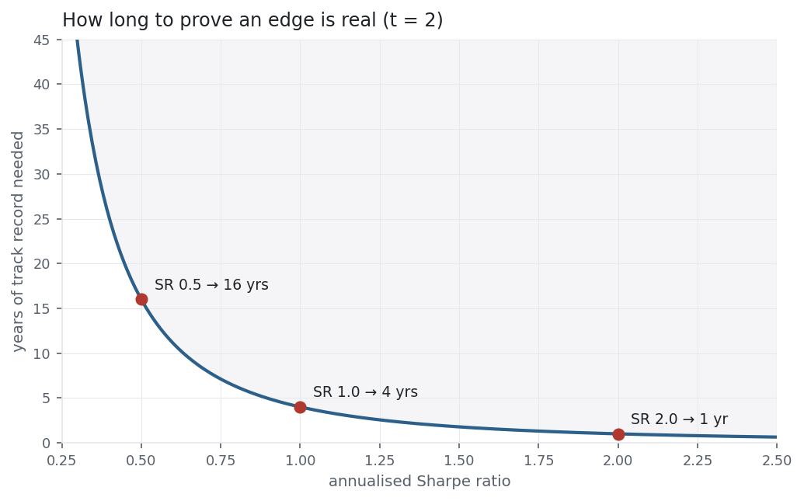

Every backtest produces a number — a [mean return](../mean-return/), an alpha, a
Sharpe. The only question that matters is whether it is a real edge or a lucky draw.
Statistical inference answers it with three linked quantities: the **t-statistic**
(how many standard errors your estimate sits from "no effect"), the **p-value** (the
probability of a result this extreme by chance), and the **confidence interval** (the
range of values the truth plausibly takes). All three rest on one humble number — the
standard error — and together they are the immune system against fooling yourself.

## The equation

The standard error of the mean, the t-statistic against a null $\mu_0$, and the 95%
confidence interval:

$$\text{SE} = \frac{\sigma}{\sqrt{n}}
\qquad
t = \frac{\bar x - \mu_0}{\text{SE}}
\qquad
\text{CI}_{95\%} = \bar x \pm 1.96\,\text{SE}$$

The **p-value** is the tail probability beyond $|t|$ — the chance of a $t$ this large
if the null were true.

## What each symbol means

| Symbol | Meaning |
|---|---|
| $\text{SE}$ | standard error — the standard deviation of the *estimate* itself |
| $\sigma$ | the sample [standard deviation](../variance-standard-deviation/) |
| $n$ | the number of observations |
| $\bar x$ | the sample mean (the estimate) |
| $\mu_0$ | the null-hypothesis value — usually 0 ("no edge") |
| $t$ | the t-statistic — estimate over its standard error |
| $1.96$ | the 95% two-sided value (from the normal; use the t-value for small $n$) |

The standard error is the key: it shrinks like $1/\sqrt{n}$, so more data sharpens
every estimate — the statistical reason more history is always better.

## Plain-English explanation

An average from data is only an *estimate* — a different sample would give a slightly
different number. The **standard error** measures how much that estimate wobbles:
$\sigma/\sqrt{n}$. It is the noise around your signal.

The **t-statistic** is signal-to-noise: how many standard errors your estimate sits
above zero. A $t$ of 2 means "two standard errors from no-effect" — the rough
threshold for significance. The **p-value** turns that into a probability: $p = 0.05$
means a result this strong would occur 5% of the time even with no real effect; below
0.05, by convention, you call it significant. The **confidence interval** flips it
around — instead of one number it gives a range, the band of true values consistent
with your data. If the 95% CI excludes zero, the effect is significant; if it contains
zero, you cannot rule out "nothing."

## Why it matters in markets

This is the machinery that separates a discovery from a fluke, and in quant finance
the news is sobering. The t-statistic of a mean return is exactly the
[Sharpe ratio](../sharpe-ratio/) times the square root of the number of periods:

$$t = \frac{\bar r}{\sigma/\sqrt{n}} = \frac{\bar r}{\sigma}\sqrt{n} = \text{SR}_{\text{period}}\sqrt{n}.$$

Over one year of daily data that makes $t$ equal to the *annualised* Sharpe. So a
Sharpe of 2 gives a barely-significant $t$ of 2 after a whole year; a Sharpe of 0.5
needs **sixteen years** to clear the bar (the figure). Most "edges" simply cannot be
proven from the data available — which is why an out-of-sample t-stat matters more
than a backtested return, and why testing thousands of strategies (as in the
[backtest-overfitting experiment](../../quant-lab/backtest-overfitting/)) makes
p-values almost meaningless: run 100 dead strategies and about 5 will look
"significant" at $p = 0.05$ by pure chance. Significance is necessary, not
sufficient — and far harder to earn than it looks.

## A simple worked example

A strategy with 100 trades, average trade +0.5%, trade standard deviation 2%:

$$\text{SE} = \frac{2\%}{\sqrt{100}} = 0.2\%,
\qquad
t = \frac{0.5\%}{0.2\%} = 2.5.$$

A $t$ of 2.5 gives a two-sided p-value of about **0.012** — below 0.05, so significant.
The 95% confidence interval is $0.5\% \pm 1.96(0.2\%) = [0.11\%,\ 0.89\%]$, which
excludes zero. The edge is real at the 5% level. Halve the sample to 25 trades and the
SE doubles, $t$ falls to 1.25, and the *same* edge is no longer significant — nothing
changed but the evidence.

## Python implementation

```python
import numpy as np
import pandas as pd
from math import erf, sqrt

r = (pd.read_csv("../multi_daily.csv", index_col="Date", parse_dates=True)["NDX"]
       .pct_change().loc["2025-07-01":"2026-06-30"].dropna())

n  = len(r)
se = r.std(ddof=1) / np.sqrt(n)              # standard error of the mean
t  = r.mean() / se                           # t-stat against "mean = 0"
Phi = lambda x: 0.5 * (1 + erf(x / sqrt(2)))
p  = 2 * (1 - Phi(abs(t)))                    # two-sided p-value (normal approx, large n)
ci = (r.mean() - 1.96*se, r.mean() + 1.96*se)
print(round(t, 2), round(p, 3))              # -> 1.68  0.093   (NOT significant at 5%)
print([round(c*100, 3) for c in ci])         # -> [-0.02, 0.264]   the 95% CI contains 0
```

`scipy.stats.ttest_1samp` does this in one call using the exact t-distribution.

## Manual / Excel calculation

| Task | Formula |
|---|---|
| Standard error | `=STDEV.S(range)/SQRT(COUNT(range))` |
| t-statistic | `=AVERAGE(range)/(STDEV.S(range)/SQRT(COUNT(range)))` |
| p-value (two-sided) | `=T.DIST.2T(ABS(t), COUNT(range)-1)` |
| 95% CI half-width | `=CONFIDENCE.T(0.05, STDEV.S(range), COUNT(range))` |

## Financial-market example — Nasdaq 100

NDX rose about 30% over the year — an annualised Sharpe of 1.68. Is its daily mean
return statistically greater than zero? The daily mean was 0.122% with a standard
error of 0.072% (σ = 1.15%, n = 251), so

$$t = \frac{0.122\%}{0.072\%} = 1.68, \qquad p = 0.093.$$

**Not significant** at the 5% level — and note $t = 1.68$ is exactly the annualised
Sharpe. The 95% confidence interval for the daily mean is $[-0.02\%,\ +0.26\%]$, which
annualises to a staggering **−5% to +66%**: after a *full year*, the data cannot even
rule out that NDX's true expected return is negative.

{fig-alt="Curve of years-to-significance falling steeply as the annualised Sharpe rises"}

That is not a quirk of this window; it is the rule. The figure shows how many years of
track record a strategy needs before its Sharpe clears $t = 2$: a Sharpe of 1 takes
four years, a Sharpe of 0.5 takes sixteen. Returns are so noisy that even a genuinely
good strategy spends years indistinguishable from luck — the single strongest reason
to distrust a short, glossy backtest.

::: {.status-note}
Same `multi_daily.csv` as the previous entries (yfinance, adjusted closes). Code
blocks are illustrative — every figure was computed and checked against that file.
:::

## Common mistakes

- **Reading $p < 0.05$ as "probably true."** It is the chance of the data under the null, not the chance the effect is real — and 0.05 is an arbitrary convention.
- **Ignoring multiple testing.** Test many strategies and some clear $p = 0.05$ by chance; the more you try, the less any single "significant" result means.
- **Forgetting SE shrinks like √n.** Quadruple the data to halve the standard error — significance is bought with sample size, and short samples prove little.
- **Confusing statistical and economic significance.** A tiny edge can be statistically significant with enough data yet worthless after costs.
- **Treating the CI as "95% chance the truth is in here."** Strictly it is a statement about the procedure over repeated samples; what matters practically is whether it contains zero.
- **Using the normal for small $n$.** For few observations use the t-distribution (fatter tails); and returns' own fat tails make even the t optimistic.
