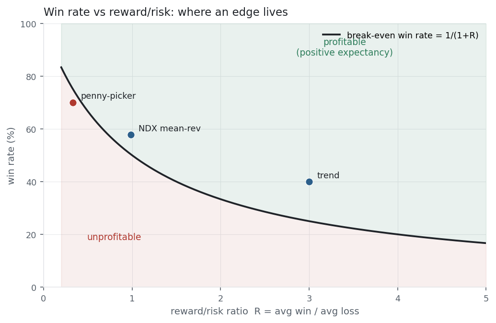

A trading system produces a stream of trades, and three numbers summarise whether it
is any good. The seductive one is the **win rate** — the fraction of trades that make
money — but on its own it is nearly useless, because it ignores how *big* the wins and
losses are. **Profit factor** and, above all, **expectancy** fix that. Expectancy is
the average profit per trade — the real edge, and exactly the quantity
[Kelly](../kelly-criterion/) turns into a bet size.

## The equation

$$\text{Win rate} = \frac{\text{wins}}{\text{total trades}}
\qquad
\text{Profit factor} = \frac{\text{gross profit}}{\text{gross loss}}$$

$$\text{Expectancy} = p\,W - (1-p)\,L$$

Win rate is the fraction of profitable trades; profit factor is total money won over
total money lost; expectancy is the average P&L per trade — the win rate $p$ combined
with the average win $W$ and average loss $L$.

## What each symbol means

| Symbol | Meaning |
|---|---|
| $p$ | win rate — the fraction of trades that are profitable |
| $W$ | average win (size of a winning trade) |
| $L$ | average loss (size of a losing trade, as a positive number) |
| $R = W/L$ | reward/risk ratio — average win over average loss |
| gross profit | the summed P&L of all winning trades |
| gross loss | the absolute summed P&L of all losing trades |

Profit factor $> 1$ and expectancy $> 0$ both mean "profitable" — the aggregate and
the per-trade views of the same fact.

## Plain-English explanation

Three questions about a system:

- **Win rate** — how often do I win? 60% means 6 trades in 10 are green. Intuitive, and the number beginners fixate on.
- **Profit factor** — for every dollar I lose, how many do I make? A profit factor of 1.5 means \$1.50 won per \$1 lost. Above 1 is profitable; 2 or more is strong.
- **Expectancy** — what is the average trade worth? This is the one that matters: (how often you win × how much you win) − (how often you lose × how much you lose). A positive expectancy *is* the definition of an edge.

The trap is judging by win rate alone. A system that wins 70% of the time but whose
rare losses are huge can have *negative* expectancy — it loses money while looking
like a winner. A system that wins only 40% of the time but whose wins dwarf its losses
can be very profitable. Win rate without win/loss size is half the story.

## Why it matters in markets

Expectancy is the bridge from "signal" to "money": a positive expectancy is what makes
a strategy worth trading, and its size times the number of trades is your expected
profit. It also dismantles the win-rate illusion through the **break-even win rate** —
to profit, your win rate must clear

$$p_{\text{break-even}} = \frac{L}{W+L} = \frac{1}{1+R}.$$

With a 3:1 reward/risk ratio you need to win only 25% of the time; with a 1:3 ratio you
need 75%. The figure plots that line: every system above it has positive expectancy,
every one below it bleeds — no matter how flattering the win rate looks alone. This is
also why negative-skew strategies (high win rate, occasional catastrophic loss — the
ones flagged in [Skewness & Kurtosis](../skewness-kurtosis/)) are so dangerous: they
sit just above the line until one giant loss drags the average below it. Expectancy is
what [Kelly](../kelly-criterion/) sizes and what a healthy [Sharpe](../sharpe-ratio/)
reflects; win rate is what fools you.

## A simple worked example

Two systems, opposite shapes:

- **Trend system** — wins 40% of the time, average win \$300, average loss \$100. Expectancy $= 0.4(300) - 0.6(100) = +\$60$ per trade; profit factor $= \tfrac{0.4 \times 300}{0.6 \times 100} = 2.0$. Break-even win rate is just 25%, so 40% is comfortably profitable.
- **"Penny-picker"** — wins 70% of the time, average win \$50, average loss \$150. Expectancy $= 0.7(50) - 0.3(150) = -\$10$ per trade; profit factor $= \tfrac{0.7 \times 50}{0.3 \times 150} = 0.78$. It needs a 75% win rate to break even, so 70% *loses* money.

The 40%-win system profits; the 70%-win system loses. Win rate ranked them backwards.

## Python implementation

```python
import pandas as pd

trades = pd.Series([...])          # per-trade returns (or P&L)

wins   = trades[trades > 0]
losses = trades[trades < 0]

win_rate      = len(wins) / len(trades)
profit_factor = wins.sum() / -losses.sum()
expectancy    = trades.mean()                       # = p*avg_win - (1-p)*avg_loss
reward_risk   = wins.mean() / -losses.mean()
print(round(win_rate, 3), round(profit_factor, 2), round(expectancy, 4))
```

Expectancy is simply the *mean* of the trade returns — the most honest one-line summary
of an edge.

## Manual / Excel calculation

With per-trade P&L in `B2:B500`:

| Task | Formula |
|---|---|
| Win rate | `=COUNTIF(B2:B500, ">0") / COUNT(B2:B500)` |
| Profit factor | `=SUMIF(B2:B500, ">0") / -SUMIF(B2:B500, "<0")` |
| Expectancy | `=AVERAGE(B2:B500)` |

Expectancy is just the average of the trade P&L — that single number is the edge.

## Financial-market example — Nasdaq 100

A concrete system: buy NDX at the close after any down day and exit at the next close —
a simple one-day mean-reversion. Over the full 2015–2026 history it fired **1,277
trades**:

| Metric | Value |
|---|---:|
| Win rate | 57.7% |
| Avg win / avg loss | 1.07% / 1.09%  (R = 0.98) |
| Profit factor | 1.34 |
| Expectancy | +0.158% per trade |
| Break-even win rate | 50.4% |

{fig-alt="Break-even win-rate curve with three example systems plotted above and below it"}

The edge is real but modest, and where it comes from is instructive. The average win and
average loss are almost identical ($R \approx 1$), so this system makes money almost
entirely by winning slightly more than half the time — 57.7% against a 50.4%
break-even. Held against simply owning NDX every day (56.0% win rate, 0.076% expectancy),
the "buy the dip" timing roughly *doubles* the per-day edge. On the break-even chart it
sits just above the line — a genuine but thin edge, exactly the kind transaction costs
can erase. Whether it survives costs and out-of-sample testing is a
[Quant Lab](../../quant-lab/) question, not an equation one.

::: {.status-note}
Same `multi_daily.csv` as the previous entries (yfinance, adjusted closes). Code blocks
are illustrative — every figure was computed and checked against that file.
:::

## Common mistakes

- **Chasing win rate.** A high win rate with fat losing trades has *negative* expectancy. Always pair it with the reward/risk ratio.
- **Confusing profit factor with expectancy.** Profit factor is the aggregate (gross win / gross loss); expectancy is per-trade. A high profit factor built on one lucky trade isn't a repeatable edge.
- **Ignoring the number of trades.** Expectancy × trades = profit; a great per-trade edge over five trades is just noise.
- **Forgetting costs and slippage.** Commissions and spread come straight off expectancy — a 0.1% edge can vanish entirely.
- **Trusting in-sample metrics.** Win rate and expectancy measured on the data you built the rule on are optimistic; only out-of-sample numbers count.
- **Mistaking a high win rate for safety.** Negative-skew systems (selling options, martingales) win often and blow up rarely — high win rate, catastrophic tail.
