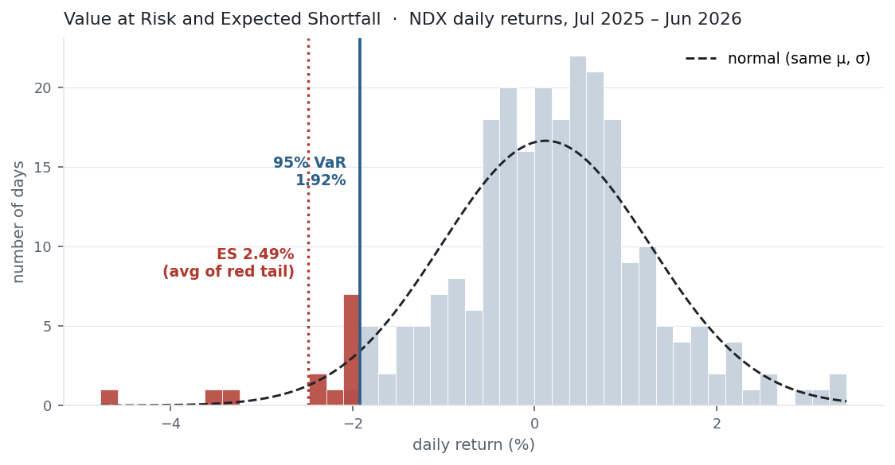

[Maximum drawdown](../maximum-drawdown/) measures the worst loss that already
happened; **Value at Risk** asks a forward question — how bad could an ordinary bad
day be? VaR is the loss a portfolio won't exceed with a given confidence;
**Expected Shortfall** is the average loss on the days it does. Together they are
the standard language of tail risk — and, as the [fat
tails](../skewness-kurtosis/) we measured warn, the method you use to estimate them
matters enormously.

## The equation

VaR at confidence $c$ is the loss threshold breached only with probability $1-c$ —
the negative of the lower quantile of returns. Expected Shortfall is the average
return in that tail:

$$\text{VaR}_c = -\,Q_{1-c}(r),
\qquad
\text{ES}_c = -\,\mathbb{E}\!\left[\,r \mid r \le Q_{1-c}(r)\,\right]$$

where $Q_{1-c}(r)$ is the $(1-c)$ quantile of returns (e.g. the 5th percentile for
95% confidence). Both are quoted as positive numbers — losses.

## What each symbol means

| Symbol | Meaning |
|---|---|
| $\text{VaR}_c$ | Value at Risk at confidence $c$ — the loss you won't exceed with probability $c$ |
| $\text{ES}_c$ | Expected Shortfall (a.k.a. CVaR) — the average loss *given* a breach of VaR |
| $c$ | the confidence level (e.g. 95%, 99%) |
| $Q_{1-c}(r)$ | the $(1-c)$ quantile of returns — the tail cutoff |
| $r$ | the return series, over the chosen horizon |

VaR is a *point* (the cutoff); ES is an *average* (of everything worse than the
cutoff). So $\text{ES}_c \ge \text{VaR}_c$ always.

## Plain-English explanation

Pick a confidence level, say 95%. The 95% VaR is the loss such that only 5% of days
are worse — the edge of the "bad but not disastrous" zone. If your one-day 95% VaR
is 2%, then on 19 days out of 20 you expect to lose less than 2%; on the 20th, more.

VaR's fatal flaw is that it says nothing about *how* bad that 20th day is: a 2% VaR
is identical whether the bad days average −2.1% or −20%. Expected Shortfall repairs
this — it is the average of all the returns beyond VaR, so it measures how deep the
tail actually runs. **VaR is "how often"; ES is "how bad when it happens."**

There are two ways to compute them. *Historical*: just look at what happened — sort
the returns and read off the percentile. *Parametric*: assume a bell curve and use
its formula. The two agree only if returns are normal, and they never are.

## Why it matters in markets

VaR is everywhere — the number on the risk report, the basis of position limits,
and for two decades the regulatory capital standard. But it has two deep flaws that
ES repairs. First, **VaR ignores tail severity**: it is the doorway, not the room,
so a book can show a modest VaR and catastrophic losses just beyond it — the blind
spot that helped hide risk in 2008. Second, **VaR is not coherent**: it can violate
subadditivity, so a diversified portfolio can post a *higher* VaR than the sum of
its parts, perversely penalising diversification. Expected Shortfall is coherent and
tail-sensitive, which is why Basel moved bank capital rules from VaR to ES.

And both live or die by the tail assumption. For the [fat-tailed, negatively
skewed](../skewness-kurtosis/) returns markets actually produce, a Gaussian VaR is
dangerously optimistic: it prices the rare disaster as rarer than it is.

## A simple worked example

Ten daily returns, sorted: $[-6\%,\, -4\%,\, -2\%,\, -1\%,\, 0\%,\, 1\%,\, 1\%,\, 2\%,\, 3\%,\, 5\%]$.
At **80% confidence**, the worst 20% is the two returns $-6\%$ and $-4\%$. The
**VaR** is the cutoff — the least bad of the tail, $-4\%$, i.e. an 80% VaR of
**4%**. The **ES** is the average of the whole tail, $\tfrac{-6\% + (-4\%)}{2} =
-5\%$, i.e. an ES of **5%**. ES exceeds VaR because it counts the −6% day that VaR
simply ignores.

## Python implementation

```python
import numpy as np
import pandas as pd

r = (pd.read_csv("../multi_daily.csv", index_col="Date", parse_dates=True)
       .pct_change().loc["2025-07-01":"2026-06-30"])["NDX"].dropna()

c = 0.95
q = np.percentile(r, (1 - c) * 100)      # the 5th-percentile return (a loss)
hist_var = -q                             # historical VaR
hist_es  = -r[r <= q].mean()              # historical ES: average of the tail beyond VaR
print(round(hist_var * 100, 2), round(hist_es * 100, 2))   # -> 1.92  2.49

# parametric (Gaussian) VaR assumes a normal distribution
z = 1.6449                                # 95% z-score
par_var = z * r.std(ddof=1) - r.mean()
print(round(par_var * 100, 2))            # -> 1.77   (smaller: the normal ignores fat tails)
```

Two traps: `np.percentile(r, 5)` returns the loss quantile, and VaR is its
*negative*; and the Gaussian version needs `z = 2.3263` for 99%, not 1.645.

## Manual / Excel calculation

Historical: sort the returns; VaR is the $(1-c)$ percentile; ES is the average of
everything at or below it. With returns in `B2:B252`:

| Task | Formula |
|---|---|
| Historical 95% VaR | `=-PERCENTILE.INC(B2:B252, 0.05)` |
| Historical 95% ES | `=-AVERAGEIF(B2:B252, "<="&PERCENTILE.INC(B2:B252,0.05))` |
| Parametric 95% VaR | `=1.645*STDEV.S(B2:B252) - AVERAGE(B2:B252)` |

## Financial-market example — Nasdaq 100

NDX daily returns, same window — one-day VaR and ES, historical against the Gaussian
model:

| Confidence | historical VaR | historical ES | Gaussian VaR | Gaussian ES |
|---|---:|---:|---:|---:|
| 95% | 1.92% | 2.49% | 1.77% | 2.25% |
| 99% | 2.84% | **3.85%** | 2.55% | **2.94%** |

{fig-alt="Histogram of NDX daily returns, left tail shaded, with VaR and ES lines and a normal overlay"}

On a \$1,000,000 position, the one-day 95% VaR is about **\$19,200** — you'd expect
to lose more than that on roughly 1 day in 20 (over the year there were 13 such days
out of 251, bang on 5%). Expected Shortfall says that when you *do* breach it, the
average loss is about **\$24,900**.

The fat-tail warning from [Skewness & Kurtosis](../skewness-kurtosis/) surfaces
exactly where it should — deep in the tail. At 99%, the Gaussian model puts ES at
2.94%, but the returns actually delivered **3.85%**: the bell curve underestimates
the average disaster by nearly a full percentage point (about \$29,400 vs \$38,500
on the million). VaR looks almost fine under the normal assumption; **ES is where
the model's optimism turns dangerous**, because that is where the fat tail lives.

::: {.status-note}
Same `multi_daily.csv` as the previous entries (yfinance, adjusted closes). Code
blocks are illustrative — every figure was computed and checked against that file.
:::

## Common mistakes

- **Trusting Gaussian VaR on fat-tailed returns.** The normal understates the tail; use historical or a fat-tailed model. At 99% the gap is material.
- **Reading VaR as a maximum loss.** VaR is a threshold you breach $(1-c)$ of the time; losses beyond it are unbounded — which is the whole reason ES exists.
- **Forgetting VaR isn't coherent.** It can penalise diversification (violate subadditivity); ES doesn't, which is why regulators switched to it.
- **Dropping the horizon or confidence.** VaR scales with $\sqrt{\text{horizon}}$ (like σ) and is meaningless without stating both the horizon and the confidence level.
- **Too little data for the tail.** A 99% VaR from one year rests on ~2–3 observations; tail estimates are desperately data-hungry.
- **Confusing VaR and ES.** VaR is the cutoff, ES the average beyond it — quote which, and never compare a VaR to an ES.
