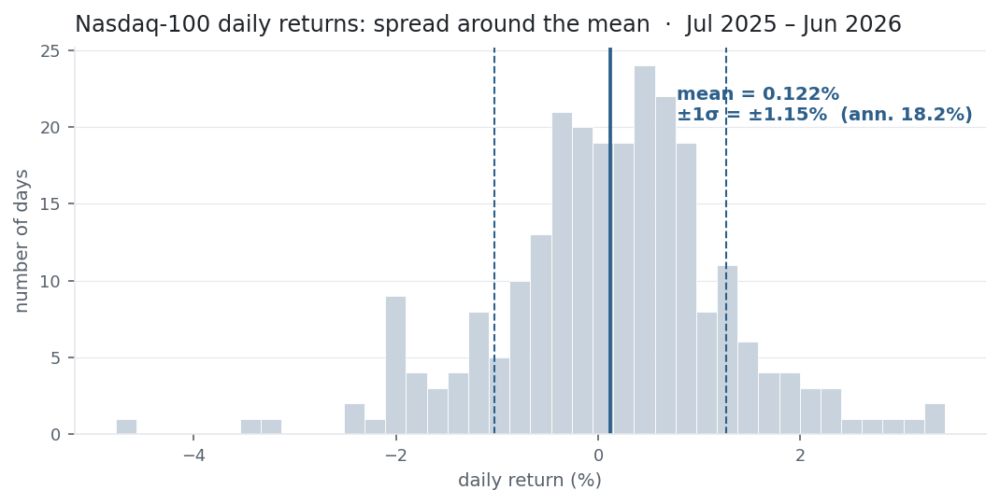

Where [the mean](../mean-return/) is the reward, variance and standard deviation
are the risk. They measure how far a return series scatters around its mean — the
difference between a calm asset and a wild one that share the same average. This
is the second thing you compute about any strategy, and the denominator of almost
every risk-adjusted number that follows.

## The equation

$$\sigma^2 \;=\; \frac{1}{n-1}\sum_{t=1}^{n}\left(r_t - \bar r\right)^2
\qquad\qquad
\sigma \;=\; \sqrt{\sigma^2}$$

Sample **variance** is the average squared deviation of returns from their mean,
dividing by $n-1$ rather than $n$. **Standard deviation** is its square root —
back in the original return units, and in finance the per-period **volatility**.

## What each symbol means

| Symbol | Meaning |
|---|---|
| $\sigma^2$ | the sample **variance** of returns (spread, in return²) |
| $\sigma$ | the sample **standard deviation** / volatility (spread, in return units) |
| $r_t$ | the return in period $t$ — a simple return, as in [Mean Return](../mean-return/) |
| $\bar r$ | the sample mean return, $\tfrac{1}{n}\sum_t r_t$ |
| $n$ | the number of return observations |
| $n-1$ | Bessel's correction — dividing by $n-1$ makes $\sigma^2$ an *unbiased* estimate of the true variance |

Variance is measured as squared distance from $\bar r$, so you must compute the
mean first — the two statistics are joined at the hip.

## Plain-English explanation

Variance asks: on average, how far do the returns land from their mean — squared?
Take each return's distance from the mean, square it (so pluses and minuses don't
cancel, and big misses count for more), and average. Those squared distances are
in "return²", a unit nobody thinks in, so take the square root to get the standard
deviation, back in plain return terms. Annualised, that number is what the market
calls volatility — the standard measure of risk.

Two assets can share a mean and still feel nothing alike; σ is what separates the
steady one from the one that lurches. The mean is the reward; σ is the risk.

## Why it matters in markets

σ is the denominator of the entire risk-adjusted-return apparatus: the Sharpe
ratio, the $\sigma$ in the volatility-drag relation $g \approx \bar r -
\tfrac{1}{2}\sigma^2$ from [Mean Return](../mean-return/), the scale of a
Value-at-Risk estimate, the key input to option pricing, and the risk term in
mean–variance portfolio construction. Size a position, model risk, or compare two
strategies, and you are leaning on σ.

One property matters constantly: **variance adds over time; volatility scales with
its square root.** Over $h$ independent periods variance grows like $h\sigma^2$, so
σ grows like $\sqrt{h}$. That is why you annualise volatility by $\sqrt{252}$, not
$252$ — the exact opposite of how the mean scales. Mean return is linear in time;
volatility is square-root-of-time.

## A simple worked example

The three returns from Mean Return, $+2\%,\,-1\%,\,+3\%$, with mean $\bar r = 1.33\%$:

$$\sigma^2 = \frac{(0.02-0.0133)^2 + (-0.01-0.0133)^2 + (0.03-0.0133)^2}{3-1}
= \frac{0.000867}{2} = 0.000433,$$

so $\sigma = \sqrt{0.000433} = 0.0208 = 2.08\%$. The returns sit on average about
2.1 percentage points from their 1.33% mean — a spread bigger than the mean
itself, which is precisely why the mean alone tells you so little.

## Python implementation

```python
import numpy as np
import pandas as pd

r = np.array([0.02, -0.01, 0.03])          # the three returns from the Mean Return entry

# --- sample variance and std, spelled out to match the formula ---------------
mean   = r.mean()                          # r-bar: compute the mean FIRST
sq_dev = (r - mean) ** 2                    # squared distance of each return from the mean
var    = sq_dev.sum() / (r.size - 1)        # divide by n-1 (Bessel) -> SAMPLE variance
std    = var ** 0.5                         # standard deviation = sqrt(variance)
print(round(var, 6), round(std * 100, 4))   # -> 0.000433   2.0817   (sigma = 2.08%)

# --- the catch: numpy and pandas disagree on the DEFAULT divisor -------------
print(round(np.std(r), 4))                  # -> 0.017    numpy default ddof=0 (POPULATION, /n)
print(round(np.std(r, ddof=1), 4))          # -> 0.0208   ddof=1 gives the SAMPLE std (/n-1)
print(round(pd.Series(r).std(), 4))         # -> 0.0208   pandas already defaults to ddof=1
```

That default mismatch is a genuine bug source: annualise a `numpy` σ computed with
its default and you understate risk by a factor of $\sqrt{n/(n-1)}$. For daily
data with large $n$ the error is tiny; for small samples it is not. For returns,
you almost always want the sample version (`ddof=1`).

## Manual / Excel calculation

By hand: (1) mean, (2) each return's deviation from the mean, (3) square them,
(4) sum, (5) divide by $n-1$, (6) square root.

In Excel, with returns in `B2:B4`:

| Task | Formula |
|---|---|
| Sample variance | `=VAR.S(B2:B4)` → `0.000433` |
| Sample std (volatility) | `=STDEV.S(B2:B4)` → `0.0208` |
| Population versions | `=VAR.P(B2:B4)`, `=STDEV.P(B2:B4)` (divide by n) |
| Annualised volatility | `=STDEV.S(B2:B4)*SQRT(252)` |

`.S` = sample (÷ $n-1$), `.P` = population (÷ $n$). Match the divisor to your
Python/pandas choice or the numbers won't reconcile.

## Financial-market example — Nasdaq 100

The same window as Mean Return — daily `^NDX` returns, **1 Jul 2025 to 30 Jun
2026**, $n = 251$.

{fig-alt="Histogram of Nasdaq-100 daily returns with mean and plus/minus one sigma bands"}

```python
import pandas as pd, numpy as np

r = (pd.read_csv("../ndx_daily.csv", parse_dates=["Date"])
       .set_index("Date")["Close"].pct_change()
       .loc["2025-07-01":"2026-06-30"])

var = r.var()                      # pandas -> SAMPLE variance (ddof=1)
sd  = r.std()                      # daily volatility (ddof=1)
ann = sd * np.sqrt(252)            # annualised volatility: sigma * sqrt(252)

print(round(var, 8))               # -> 0.00013169   daily variance (return^2)
print(round(sd * 100, 4))          # -> 1.1475       % per day
print(round(ann * 100, 2))         # -> 18.22        % annualised
```

Daily volatility is **1.15%**, i.e. **18.2% annualised** ($1.15\% \times
\sqrt{252}$). The daily variance, 0.00013, is in return² — meaningless to eyeball,
which is the whole reason we quote σ instead.

The histogram shows two things. σ is a **width**: about **72.5%** of days fall
within ±1σ of the mean and **95.6%** within ±2σ — close to the 68% / 95% a normal
distribution predicts, but not equal. And that gap is informative: the extra mass
in the tails (that −4.7% day) is the fat-tailedness a single σ can't see. Note
also $\tfrac{1}{2}\sigma^2 \approx 0.0066\%$ per day here — exactly the volatility
drag that split the arithmetic and geometric means in [Mean
Return](../mean-return/).

::: {.status-note}
Same `ndx_daily.csv` as Mean Return (yfinance, `^NDX`). Code blocks are
illustrative — the site doesn't execute them, so every figure was computed and
checked against that file.
:::

## Common mistakes

- **Wrong divisor (n vs n−1).** `numpy.std` defaults to `ddof=0` (population, ÷n); `pandas.std` defaults to `ddof=1` (sample, ÷n−1). Mix them and your σ won't reproduce. For returns, use the sample version.
- **Annualising σ with ×252 instead of ×√252.** Variance scales with time, volatility with its square root; ×252 overstates annual vol by ~16×. (Mean return *does* scale by ×252 — σ does not.)
- **Trusting one σ for fat-tailed returns.** Real returns have heavier tails than the normal, so σ underweights the rare large move. Pair it with skew/kurtosis, VaR, or drawdown before calling it "risk."
- **σ of prices instead of returns.** The standard deviation of a trending price series mostly measures the trend, not risk. Always compute σ on returns.
- **Confusing variance and volatility units.** Variance is in return²; only σ is comparable to returns. Quote σ, reconcile in variance.
- **Too short a sample.** σ from a few weeks is noisy and regime-dependent — a calm month badly understates the σ of the next crisis.
