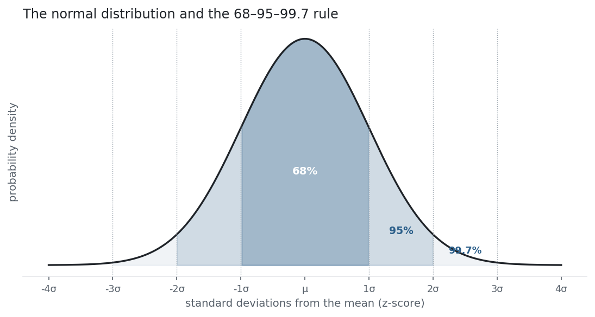

A great deal of this library leans on one distribution: the normal. [Gaussian
VaR](../value-at-risk/), the interpretation of a [Sharpe ratio](../sharpe-ratio/),
confidence intervals — all assume the bell curve. The **z-score** is how you speak to
it: it re-expresses any value as "how many standard deviations from the mean," so you
can look up how unusual it is. Together they are the backbone of statistical
reasoning — and, in markets, a persistent source of overconfidence, because returns
are fatter-tailed than the bell curve allows.

## The equation

The z-score standardises a value; the normal distribution is the bell curve it maps
onto:

$$z = \frac{x - \mu}{\sigma}
\qquad
f(x) = \frac{1}{\sigma\sqrt{2\pi}}\,e^{-\frac{1}{2}\left(\frac{x-\mu}{\sigma}\right)^2}$$

The z-score measures distance from the mean in standard-deviation units; the normal
density $f(x)$ is fully determined by just $\mu$ and $\sigma$.

## What each symbol means

| Symbol | Meaning |
|---|---|
| $z$ | the z-score — number of standard deviations from the mean |
| $x$ | the value being standardised |
| $\mu$ | the mean |
| $\sigma$ | the [standard deviation](../variance-standard-deviation/) |
| $f(x)$ | the normal probability density at $x$ |
| $e,\ \pi$ | the usual constants (≈2.718, ≈3.142) |

A z of 0 sits at the mean; $z = +2$ is two σ above it. Standardising any normal gives
the **standard normal**: $\mu = 0$, $\sigma = 1$.

## Plain-English explanation

The z-score answers *how unusual is this?* Subtract the mean, divide by the standard
deviation, and any number becomes a count of standard deviations. A test score, a
daily return, and a person's height all become comparable once they are z-scores — a
z of 2 is equally rare in each, *if* each is normal.

The normal distribution is the bell curve those z-scores fall on. It is the most
important distribution in statistics for two reasons: it is fully described by just
its mean and standard deviation, and — via the **central limit theorem** — sums of
many small independent effects drift towards it, which is why it appears everywhere.
Its signature is the **68-95-99.7 rule**: about 68% of observations land within ±1σ
of the mean, 95% within ±2σ, and 99.7% within ±3σ (the figure). A z beyond ±3 should
be genuinely rare.

## Why it matters in markets

The normal is the default assumption baked into a huge amount of finance:
[parametric VaR](../value-at-risk/) uses $z = 1.645$ for its 95% loss, option pricing
assumes log-normal prices, and the whole language of "a 3-sigma move" treats σ as if
the world were Gaussian. The z-score is the currency of that world — it turns a raw
return into a probability through the normal's tables.

The catch, and the reason this entry carries a warning, is that returns are *not*
normal. [Skewness and kurtosis](../skewness-kurtosis/) already showed the tails are
fat; z-scores make it visceral. Under a normal a −4σ day is roughly a
once-in-a-lifetime event, yet markets produce them every few years. When a risk model
quietly assumes normality, it prices those disasters as essentially impossible —
which is precisely how "impossible" losses keep arriving. The normal is an
indispensable baseline and a treacherous literal model.

## A simple worked example

NDX rises 3% on a day. With a mean daily return of 0.12% and a daily σ of 1.15%:

$$z = \frac{3\% - 0.12\%}{1.15\%} = 2.5.$$

A 2.5σ day. Under a normal, the chance of a move that large or larger is about 0.6% —
roughly 1 trading day in 160. The z-score turned "up 3%" into "a 1-in-160 event,"
which is exactly what makes it useful.

## Python implementation

```python
import pandas as pd
from math import erf, sqrt

r = (pd.read_csv("../multi_daily.csv", index_col="Date", parse_dates=True)["NDX"]
       .pct_change().loc["2025-07-01":"2026-06-30"].dropna())

z = (r - r.mean()) / r.std(ddof=1)          # standardise every day
print(round(z.min(), 2))                     # -> -4.26   the worst day, in sigmas

Phi = lambda x: 0.5 * (1 + erf(x / sqrt(2)))  # standard-normal CDF (= scipy.stats.norm.cdf)
print(round(1 / Phi(z.min())))               # -> 98753   1 in ~98,753 days, if normal
```

`scipy.stats.norm.cdf` / `.ppf` do the same lookups; the `erf` version is
dependency-free.

## Manual / Excel calculation

| Task | Formula |
|---|---|
| z-score | `=(x - AVERAGE(range)) / STDEV.S(range)` |
| Normal probability below z | `=NORM.S.DIST(z, TRUE)` |
| Value for a given probability | `=NORM.S.INV(p)` |

`NORM.S.DIST` and `NORM.S.INV` are the standard-normal CDF and its inverse — the
lookup tables as functions.

## Financial-market example — Nasdaq 100

Turn every NDX day of the year into a z-score and count how they fall:

| Band | NDX | Normal |
|---|---:|---:|
| within ±1σ | 72.5% | 68.3% |
| within ±2σ | 95.6% | 95.4% |
| within ±3σ | 99.2% | 99.7% |

{fig-alt="Standard normal bell curve with shaded 68, 95 and 99.7 percent bands"}

It looks like a near-match, and through the middle it is. But read the ±3σ row: a
normal keeps 99.7% of days inside ±3σ, NDX only 99.2% — more days escaped beyond 3σ
than the bell curve permits. The proof is the single worst day, a −4.77% drop: a
z-score of **−4.26**. Under a normal, a day that bad or worse should appear about
**once every 98,753 trading days — nearly four centuries.** NDX served one up inside a
single year. The distribution is *more peaked in the middle and far fatter in the
tails* than the normal — excess kurtosis made concrete. The z-score is still the right
tool; the normal's probability for it is simply wrong.

::: {.status-note}
Same `multi_daily.csv` as the previous entries (yfinance, adjusted closes). Code
blocks are illustrative — every figure was computed and checked against that file.
:::

## Common mistakes

- **Assuming normality by default.** Real returns are fat-tailed and skewed; the normal understates extremes badly. Use it as a baseline, not a truth.
- **Reading a z-score as a normal probability.** $z$ is just a distance in σ units; converting it to a probability only works if the data really is normal.
- **Standardising with the wrong σ.** Sample vs population ($n$ vs $n-1$) changes the z, and a σ estimated from few points is itself uncertain.
- **Treating "3-sigma" as impossible.** Under fat tails, 3σ+ events are many times more common than 0.3%; risk limits built on the normal get breached routinely.
- **Forgetting the mean.** A z-score is distance from the *mean*, not from zero — with a non-zero drift they differ.
- **Confusing the standard normal with any normal.** Only after standardising do the 1.645 / 1.96 / 2.576 lookup values apply.
