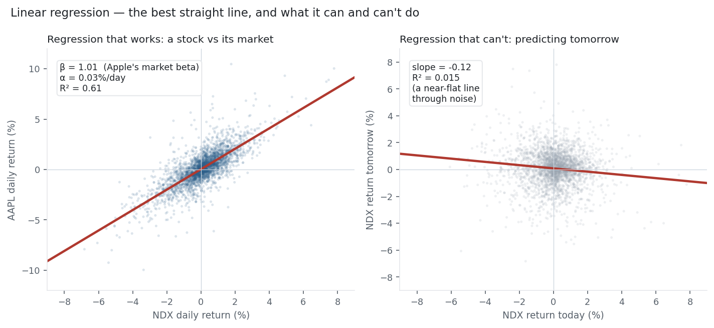

Linear regression is the oldest and simplest supervised model, and the one every other model in
this library is measured against. It fits a straight line (or hyperplane) through the data by
choosing the slope and intercept that minimise the squared error — the
[MSE cost](../../equations/mean-squared-error/) from the maths library — and its coefficients are
directly interpretable as "how much $y$ moves when $x$ moves by one." In finance it is no toy: it
is the machinery behind CAPM, factor models, and hedge ratios. It is also the honest baseline that
exposes how little of a market is actually linear *and* predictable.

## 1. What problem does it solve?

Supervised **regression**: predict a continuous target $y$ from one or more features $x$, assuming
the relationship is (approximately) linear, $\hat y = \beta_0 + \beta_1 x_1 + \dots + \beta_p x_p$.
With one feature it is a line; with many, a hyperplane. It equally answers the *descriptive*
question "how are these variables related?" — the coefficients are the answer.

## 2. What assumptions does it make?

The classical (Gauss-Markov / OLS) assumptions: **linearity** (the mean of $y$ is a linear
function of the features); **independent errors** (residuals uncorrelated with each other);
**homoscedasticity** (constant error variance); **no perfect multicollinearity** (no feature is an
exact combination of others); and, for inference, **normally distributed errors**. Break these and
the point estimates can stay unbiased, but the standard errors — and the significance tests built
on them — become unreliable. Markets break the independence and homoscedasticity assumptions
routinely (autocorrelated returns, [volatility clustering](../../equations/garch/)), which is why
naive regression $t$-stats on returns are not to be trusted (see
[t-statistic](../../equations/t-stat-p-value/) and [stationarity](../../equations/stationarity-adf/)).

## 3. What data does it need?

Numeric features and a continuous numeric target; more rows than columns (ideally many more);
features on comparable scales if you plan to regularise or read the coefficients as importances.
Categorical inputs must be encoded. It is happiest with a genuinely linear signal and low
multicollinearity — it does not need much data to *fit*, but it needs the linearity assumption to
roughly hold to be *right*.

## 4. How does it learn?

It minimises the mean squared error between predictions and truth — the same
[cost function](../../equations/cost-function/) and [MSE](../../equations/mean-squared-error/) from
the maths library. Two routes reach the minimum: the closed-form **normal equations**
$\beta = (X^\top X)^{-1}X^\top y$ (exact and instant for modest feature counts), or
[gradient descent](../../equations/gradient-descent/) (iterative, for when there are too many
features to invert the matrix). For a single feature the closed form is just
$\beta = \text{Cov}(x,y)/\text{Var}(x)$ and $\beta_0 = \bar y - \beta\bar x$ — the slope is the
covariance normalised by the feature's variance. There is no iteration or randomness in the OLS
solution; it is a formula.

## 5. What are its strengths?

- **Interpretable.** Each coefficient is an effect size ("a 1% market move ≈ a 1.01% Apple move") — the thing regulators, risk committees, and supervisors all want.
- **Fast and exact.** Closed-form solution, no hyperparameters, trains in milliseconds.
- **Low variance.** Hard to overfit with few features; a strong, honest baseline.
- **Fully understood statistically.** Confidence intervals, hypothesis tests, and diagnostics are all standard.
- **The foundation of finance's workhorses.** CAPM, Fama-French factors, and cointegration hedge ratios are all linear regressions.

## 6. What are its weaknesses?

- **Only linear.** It cannot capture curves or interactions unless you hand-build them (polynomial / interaction features).
- **Outlier-sensitive.** Squared error lets a few extreme points dominate the fit — the [MSE fat-tail problem](../../equations/mean-squared-error/), acute on returns.
- **Assumption-fragile on time series.** Autocorrelation and heteroscedasticity break the inference and inflate apparent significance (the [spurious-regression trap](../../equations/stationarity-adf/)).
- **Multicollinearity.** Correlated features make coefficients unstable — the problem [Ridge / L2](../../equations/l1-l2-penalties/) exists to fix.
- **Extrapolates blindly.** The line keeps going outside the data's range, where it has no support.

## 7. How could it apply to markets?

Linear regression is everywhere in quant finance — but for *description*, not *prediction*. Regress
a stock's returns on the market's and the slope is its [beta, the intercept its alpha](../../equations/beta-capm/)
(CAPM); add more factors and it is a Fama-French or custom factor model; regress one asset on
another and the slope is the [hedge ratio for a pairs trade](../../equations/cointegration/). All
of these describe a relationship that genuinely exists. What it cannot do is manufacture a forecast
where there is no signal — as the figure shows.

{fig-alt="Apple-vs-Nasdaq returns with a strong regression line beside a near-flat next-day prediction line"}

The left panel is the good news: regress Apple's daily return on the Nasdaq's and the fit is strong
— β = 1.01 (Apple moves almost one-for-one with the index), α = 0.03%/day, and R² = 0.61, so 61% of
Apple's daily variance is explained by the market. That is a real, stable, tradeable relationship —
the number every risk model uses. The right panel is the honest news: regress the Nasdaq's return
*tomorrow* on its return *today* and the line is nearly flat — slope −0.12, R² = 0.015. The same
tool that captured Apple's beta finds essentially nothing to predict about the market's own next
move. Linear regression measures the relationships that are there; it does not invent the ones that
are not.

## 8. What does the Python code look like?

```python
from sklearn.linear_model import LinearRegression
import numpy as np

# beta of Apple to the Nasdaq (X = market returns, y = stock returns)
model = LinearRegression().fit(X, y)
print(model.coef_[0], model.intercept_)     # -> 1.01 (beta), 0.03 (alpha, %/day)
print(model.score(X, y))                     # -> 0.61 (R^2)

# the same numbers, closed form, for one feature:
beta  = np.cov(x, y)[0, 1] / np.var(x, ddof=1)   # slope = cov / var
alpha = y.mean() - beta * x.mean()               # intercept
```

For inference (confidence intervals and $p$-values on the coefficients) use `statsmodels.OLS`, which
prints the full regression table — but treat those $p$-values with suspicion on autocorrelated
return data.

## 9. How would I explain it to a supervisor?

"Linear regression finds the straight line that minimises squared error, and for one feature its
slope is just the covariance of $x$ and $y$ over the variance of $x$. Its coefficients are
interpretable effect sizes, which is why it underpins CAPM and factor models. I use it as the
baseline every more complex model must beat, and as a diagnostic: on the Nasdaq it recovers Apple's
beta cleanly (R² = 0.61), but it also shows — with an R² of 0.015 on next-day returns — that there
is almost no linear signal to predict direction, exactly the efficient-market result. And I am
careful with its inference on time series, because autocorrelation and volatility clustering violate
its assumptions and inflate significance."

::: {.status-note}
Nasdaq-100 basket from the same `multi_daily.csv` used across the Equation Library (yfinance,
adjusted closes). Both regressions (Apple-on-Nasdaq, and Nasdaq tomorrow-on-today) and the closed-
form β = cov/var were computed and checked against the data.
:::
