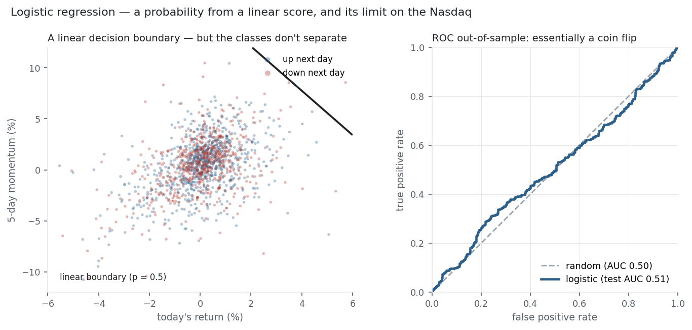

Logistic regression is [linear regression's](../linear-regression/) classifier cousin: it takes
the same linear score $w\cdot x + b$ and, instead of using it as a prediction, squashes it through
the [sigmoid](../../equations/sigmoid/) into a probability between 0 and 1. Train it by minimising
[cross-entropy](../../equations/cross-entropy/) and you have the workhorse baseline for
classification — interpretable, fast, and probabilistic. The name is a historical quirk (it does
classification, not regression), but the machinery is exactly the maths from the Equation Library,
assembled into a model.

## 1. What problem does it solve?

Binary (and, via [softmax](../../equations/softmax/), multi-class) **classification**: output the
*probability* that an example belongs to a class, $\hat p = \sigma(w\cdot x + b)$, then threshold it
(usually at 0.5) for a hard label. It answers "how likely is this to be class 1, given the
features?" — and, because it is a probability, it also says how *confident* the model is.

## 2. What assumptions does it make?

That the **log-odds are linear in the features**: $\ln\frac{p}{1-p} = w\cdot x + b$. That gives a
straight-line (hyperplane) decision boundary. It also assumes independent observations and no
perfect multicollinearity. Notably it does *not* assume the features are normally distributed or
have equal variance — the assumptions are on the boundary's shape, not the inputs' distribution.
The one thing it hates is **perfect separation**: if a feature splits the classes cleanly, the
optimal weights run to infinity, which is why regularisation is standard.

## 3. What data does it need?

Features and a binary (or categorical) target; enough examples of each class; features scaled if you
will regularise or compare coefficients. Categorical inputs must be encoded. It tolerates
correlated and non-normal features, but a genuinely linear separation in log-odds space has to
roughly exist for it to classify well.

## 4. How does it learn?

It computes a probability $\hat p = \sigma(w\cdot x + b)$ and minimises the
[cross-entropy loss](../../equations/cross-entropy/) between those probabilities and the true
labels. Unlike linear regression there is **no closed form** — the loss is minimised by
[gradient descent](../../equations/gradient-descent/), and here the maths is especially clean: the
gradient of cross-entropy through the sigmoid is exactly $(\hat p - y)$, predicted minus actual,
the same cancellation that made [softmax + cross-entropy](../../equations/cross-entropy/) universal.
Each coefficient $w_j$ is the change in **log-odds** per unit of feature $j$, so $e^{w_j}$ is an
**odds ratio** — a $w_j$ of 0.7 means a one-unit rise roughly *doubles* the odds ($e^{0.7} = 2.0$).

## 5. What are its strengths?

- **Probabilistic and calibrated.** It outputs a genuine probability, not just a label — essential for sizing bets or ranking risk.
- **Interpretable.** Coefficients are log-odds effects; $e^{w}$ is an odds ratio a supervisor or regulator can read.
- **Fast and convex.** The cross-entropy loss is convex, so gradient descent finds the global optimum; no tuning drama.
- **A strong linear baseline.** The classification counterpart of linear regression — what every fancier classifier must beat.
- **Regularisable.** [L1/L2 penalties](../../equations/l1-l2-penalties/) plug straight in for selection and stability.

## 6. What are its weaknesses?

- **Linear boundary only.** It can only separate classes with a hyperplane; curved boundaries need engineered features or a different model.
- **Fragile under separation.** Perfectly separable classes send the weights to infinity — regularisation or early stopping is required.
- **Outlier- and scale-sensitive.** Extreme feature values distort the boundary; standardise inputs.
- **Assumes log-odds linearity.** If the true relationship is non-monotonic, the fit is biased.
- **Not a probability oracle.** Well-calibrated only if the linear-in-log-odds assumption roughly holds; check calibration.

## 7. How could it apply to markets?

The obvious use is **direction**: classify tomorrow as up or down from today's features. It is also
the standard tool for **credit default probability**, **regime classification** (calm vs. turbulent),
and any "will this event happen?" question where a calibrated probability beats a yes/no. The catch,
as ever, is that predicting the direction of a liquid index is close to hopeless — and logistic
regression, being honest and probabilistic, shows exactly how hopeless.

{fig-alt="A linear decision boundary over overlapping up/down days beside a ROC curve near the random diagonal"}

Fit logistic regression to predict the Nasdaq's next-day direction from two features — today's
return and 5-day momentum — and the figure tells the story twice. On the left, the up-days and
down-days are the same overlapping cloud: there is no line that separates them, because the classes
aren't separable. On the right, the out-of-sample ROC curve lies almost exactly on the diagonal,
with a test **AUC of 0.51** — a coin flip. The single-feature version fares no better: its
[cross-entropy](../../equations/cross-entropy/) log loss (0.6854) barely undercuts the base-rate
constant (0.6859). Logistic regression works perfectly as a model; it simply reports, in calibrated
probabilities, that yesterday's returns carry no usable signal about tomorrow's direction — the
efficient-market result once more, this time as a classifier.

## 8. What does the Python code look like?

```python
from sklearn.linear_model import LogisticRegression
from sklearn.metrics import roc_auc_score, log_loss

clf = LogisticRegression().fit(X_train, y_train)      # fits by cross-entropy (gradient descent)
p   = clf.predict_proba(X_test)[:, 1]                  # P(up) per day
print(roc_auc_score(y_test, p))                        # -> 0.51  (≈ random)
print(clf.coef_, clf.intercept_)                       # log-odds effects; exp(coef) = odds ratios
```

`LogisticRegression` is L2-regularised by default (`C` is the inverse strength); set `penalty="l1"`
for sparse coefficients. Always scale features first when regularising.

## 9. How would I explain it to a supervisor?

"Logistic regression is a linear score passed through a sigmoid to produce a probability, and it's
trained by minimising cross-entropy — which, through the sigmoid, has the clean predicted-minus-
actual gradient. Its coefficients are log-odds effects, so their exponentials are odds ratios you
can interpret directly. I treat it as the classification baseline, the counterpart to linear
regression. On the Nasdaq it's also a clean honesty check: asked to classify the next day's
direction, it lands at a test AUC of 0.51 and a log loss no better than the base rate — the
efficient market showing up in a confusion matrix. When I need a nonlinear boundary I move to trees
or a network, but I always benchmark against this."

::: {.status-note}
Nasdaq-100 basket from the same `multi_daily.csv` as the Equation Library (yfinance, adjusted
closes). Single-feature log loss, two-feature ROC/AUC (70/30 time split), and the odds-ratio
arithmetic were all computed and checked against the data.
:::
