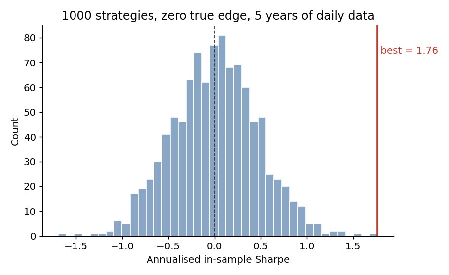
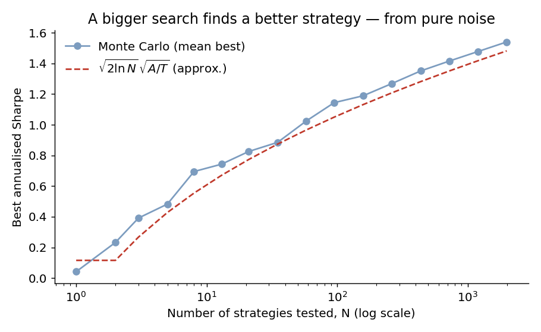

## The problem in one sentence

If you search over enough strategies, you are guaranteed to find one with an
excellent in-sample Sharpe ratio — *even when none of them has any real edge* —
because you are reporting the maximum of a large number of noisy estimates, and
the maximum of noise is not zero.

This is the single most common way a backtest lies. Below I make it concrete
with a simulation, derive how fast the problem grows with the number of trials,
and summarise the standard correction.

## A minimal simulation

Take $N$ candidate strategies. Give every one of them **zero true edge**: daily
returns drawn i.i.d. from $\mathcal{N}(0, \sigma^2)$ with mean exactly zero.
Nothing here can predict anything. Now compute each strategy's annualised
in-sample Sharpe and keep the best — exactly what a naive strategy search does.

```python
import numpy as np

RNG = np.random.default_rng(42)
A, T = 252, 1260          # 252 trading days/yr; T = 5 years of daily data

def ann_sharpe(returns):  # returns shape (T, N) -> (N,)
    mu = returns.mean(axis=0)
    sd = returns.std(axis=0, ddof=1)
    return np.sqrt(A) * mu / sd

N = 1000
sr = ann_sharpe(RNG.standard_normal((T, N)))   # every strategy has TRUE Sharpe 0
print(sr.mean(), sr.max())   # ~0.01,  1.76
```

The average strategy sits at a Sharpe of ~0, as it should. But the **best** of
the thousand posts an annualised Sharpe of **1.76** over a five-year backtest —
the kind of number that gets a strategy funded — purely from sampling noise.



## Why it scales like √(2 ln N)

There's a clean way to see how bad this gets. Under the null of zero edge, the
estimated Sharpe over $T$ i.i.d. observations is approximately normal,

$$
\widehat{SR} \;\sim\; \mathcal{N}\!\left(0,\; \tfrac{1}{T}\right)
\quad\text{(per-period)},\qquad
\widehat{SR}_{\text{ann}} \;\sim\; \mathcal{N}\!\left(0,\; \tfrac{A}{T}\right),
$$

so the standard error of an annualised Sharpe is $\sqrt{A/T}$. For $T=1260$ that
is $\sqrt{252/1260}\approx 0.45$ — already a wide band around zero.

Now the punchline. The expected maximum of $N$ i.i.d. standard normals grows
like $\sqrt{2\ln N}$. Mapping back to annualised Sharpe units, the best spurious
Sharpe from $N$ independent trials scales as

$$
\mathbb{E}\!\left[\max_{i\le N}\widehat{SR}_{\text{ann}}^{(i)}\right]
\;\approx\; \sqrt{\tfrac{A}{T}}\;\sqrt{2\ln N}.
$$

It grows without bound in $N$ — slowly, but relentlessly. Simulating the mean
best Sharpe across many draws tracks this curve closely:



Put in a table, the expected best Sharpe from **zero-edge** strategies over five
years of daily data is:

| Strategies tested $N$ | Expected best annualised Sharpe |
|---:|:---:|
| 10        | ~0.6 |
| 100       | ~1.1 |
| 1,000     | ~1.4 |
| 10,000    | ~1.7 |

A grad student trying a few hundred feature combinations is already in
Sharpe-1 territory before adding a single unit of real signal.

## The correction: the Deflated Sharpe Ratio

The fix is not to distrust all backtests — it's to judge an observed Sharpe
*against the distribution of the best you'd expect under the null, given how many
things you tried.* Bailey and López de Prado formalise this as the **Deflated
Sharpe Ratio (DSR)**. The key input is the expected maximum Sharpe across $N$
trials,

$$
\mathbb{E}\!\left[\max_n SR\right]
\approx \sqrt{\operatorname{Var}(SR_n)}\,
\Big[(1-\gamma)\,\Phi^{-1}\!\left(1-\tfrac1N\right)
+ \gamma\,\Phi^{-1}\!\left(1-\tfrac1{N e}\right)\Big],
$$

where $\gamma\approx 0.5772$ is the Euler–Mascheroni constant, $\Phi^{-1}$ is the
inverse normal CDF, and $\operatorname{Var}(SR_n)$ is the variance of Sharpe
estimates *across the trials you ran*. The DSR then asks how far your observed
Sharpe sits above this benchmark, correcting for sample length, and for the skew
and kurtosis of the strategy's returns (both of which make extreme Sharpes more
likely than the normal approximation suggests). My $\sqrt{2\ln N}$ expression
above is just the leading-order version of the bracket.

In practice the corrections that matter are mundane:

- **Count your trials honestly.** Every feature, parameter, and universe you
  tried is a trial — including the ones you discarded. The effective $N$ is
  almost always larger than you think.
- **Hold out data you never touch**, and treat a strategy as unproven until it
  survives a clean out-of-sample window.
- **Prefer fewer, hypothesis-driven tests** to brute-force search. Lower $N$ is
  the cheapest variance reduction available.
- **Report the deflated number**, not the cherry-picked one.

## Limitations of this demonstration

This is a deliberately clean caricature, and it overstates realism in two
directions. The trials here are **independent**; real candidate strategies are
highly correlated, so the *effective* number of independent trials is smaller
than the raw count — the honest $N$ for the DSR is nearer the number of
independent bets. Conversely, real return series have **fat tails and serial
dependence**, which the i.i.d. normal draw ignores and which push extreme
Sharpes *higher* than shown. The $\sqrt{2\ln N}$ result is also asymptotic; at
small $N$ the finite-sample expected maximum sits a little below it. None of
this changes the qualitative conclusion — it only shifts where the curve sits.

## References

- Bailey, D. H., & López de Prado, M. (2014). *The Deflated Sharpe Ratio:
  Correcting for Selection Bias, Backtest Overfitting, and Non-Normality.*
  Journal of Portfolio Management, 40(5).
- Bailey, D. H., Borwein, J., López de Prado, M., & Zhu, Q. J. (2017). *The
  Probability of Backtest Overfitting.* Journal of Computational Finance, 20(4).
- Harvey, C. R., & Liu, Y. (2015). *Backtesting.* Journal of Portfolio
  Management, 42(1).
- Harvey, C. R., Liu, Y., & Zhu, H. (2016). *… and the Cross-Section of Expected
  Returns.* Review of Financial Studies, 29(1).

::: {.callout-note appearance="simple"}
Full script: [`code/backtest_overfitting.py`](https://github.com/davidolivermaguire-ai/davidmaguire.ai/blob/main/code/backtest_overfitting.py).
Reproduce the figures with `python code/backtest_overfitting.py`.
:::
